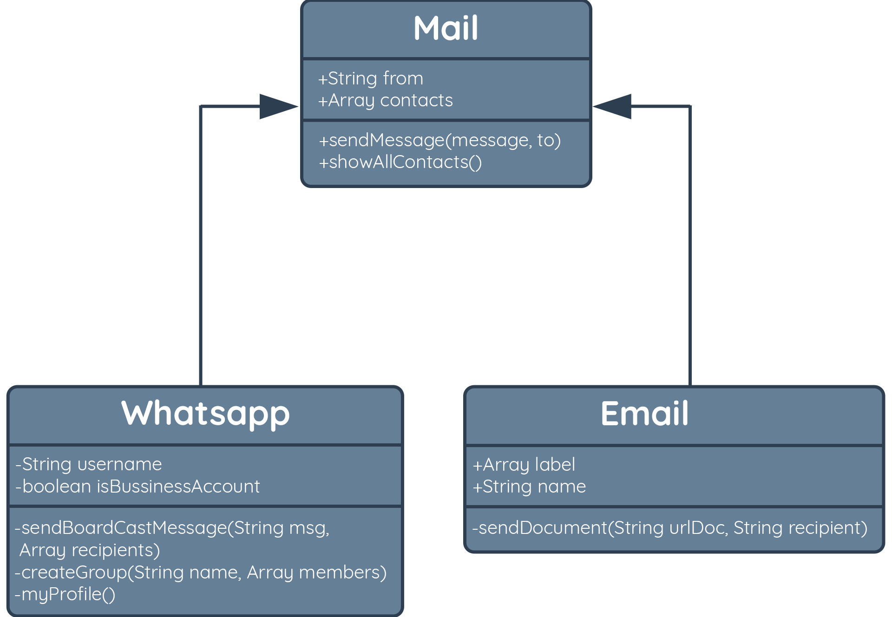
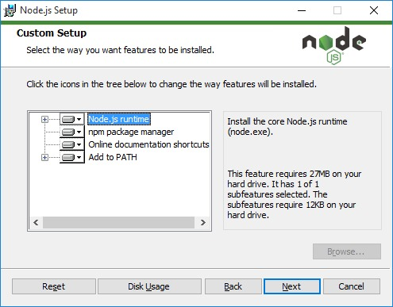
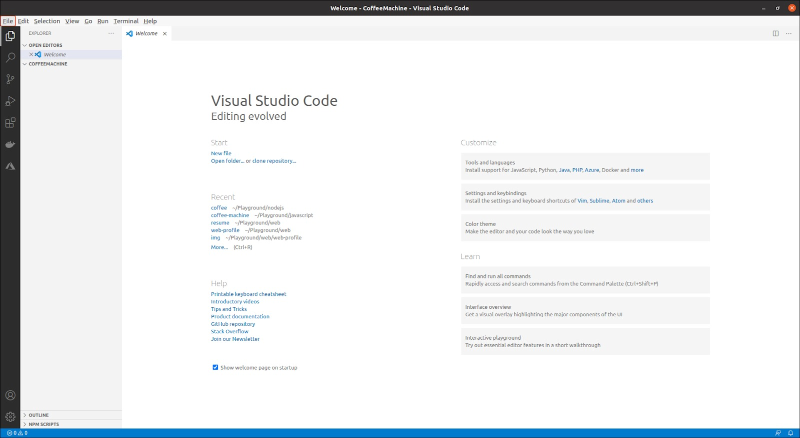
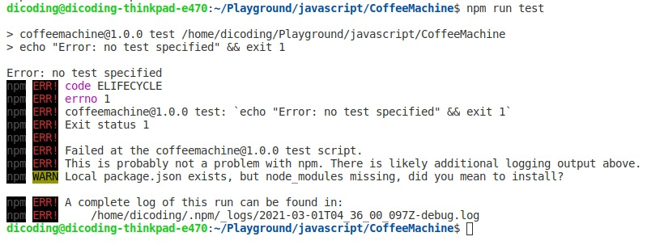
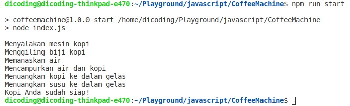

Table of Contents

1. [Mekanisme Belajar](#mekanisme-belajar)

   - [Materi Pembelajran](#materi-pembelajaran)
   - [Evaluasi Pembelajran](#evaluasi-pembelajaran)

2. [Forum Diskusi](#forum-diskusi)

   - [Ekspektasi](#ekspetasi)
   - [Sebelum Mulai Bertanya](#sebelum-mulai-bertanya)
   - [Fitur Bermanfaat](#fitur-bermanfaat)
   - [Mengenal Teman Sekelas Anda](#mengenal-teman-sekelas-anda)

3. [Glosarium](#glosarium)

   - [C](#c)
   - [D](#d)
   - [I](#i)
   - [L](#l)
   - [R](#r)
   - [S](#s)
   - [Daftar referensi](#daftar-referensi)

   


Mekanisme Belajar
=================

Selamat datang di Dicoding Academy. Sebelum memulai belajar di kelas ini, Anda
perlu tahu tahapan dan cara belajar beserta fasilitas yang tersedia agar proses
belajar lebih efektif.

### Materi Pembelajaran

-   **Materi Bacaan Elektronik**  
    Materi yang ada dalam kelas ini mayoritas berupa teks atau tulisan. Mengapa
    demikian? Karena kami menemukan bahwa dalam proses belajar di bidang
    pemrograman, bentuk materi pembelajaran yang paling efektif untuk diingat,
    dimengerti, dan yang terpenting, dipraktikkan, adalah dalam bentuk teks.

-   **Forum Diskusi**  
    Setiap kelas memiliki sebuah forum diskusi yang dapat Anda gunakan untuk
    bertanya (dan menjawab) mengenai materi kelas. Instruktur kami yang terdiri
    dari Curriculum Developer dan Academy Code Reviewer siap membantu Anda
    melalui forum diskusi ini. Tak hanya kami, Anda pun dapat berpartisipasi.
    Untuk meningkatkan retensi ilmu yang Anda punya, berbagi adalah salah satu
    kuncinya. Jadi, silakan aktif dan saling membantu di dalam forum.

    Jika Anda menemui kendala perihal situs Dicoding dan administrasi kelas,
    tanyakan kepada kami melalui tombol chat di kanan bawah layar Anda ketika
    membuka situs Dicoding. Jangan gunakan forum diskusi ya karena itu salah
    alamat.

### Evaluasi Pembelajaran

-   **Ujian (Kuis, Ujian Akhir Kelas, Knowledge Check)**  
    Terdapat berbagai jenis ujian di kelas guna mengecek pemahaman Anda pada
    materi pembelajaran. Ketersediaan ujian beserta jenis ujian yang tersedia
    pada setiap kelas dapat berbeda-beda. Setiap pertanyaan dalam ujian pasti
    mencakup materi yang telah dibahas. Sehingga jika ada pertanyaan yang tidak
    dapat Anda jawab, pastikan Anda mengulang kembali pembelajaran.

 

Forum Diskusi
=============

### Ekspektasi

Dengan banyaknya jumlah siswa Dicoding Academy, kami tidak mengharapkan siswa
untuk membaca semua diskusi atau komentar pada forum diskusi. Sebaliknya,
bacalah hal-hal yang menurut Anda menarik dan dapat membantu Anda dalam
menyelesaikan kelas. Lebih baik lagi, jika Anda dapat membantu siswa lainnya
dengan memberikan jawaban di bidang yang Anda pahami. Berbagi dalam forum
diskusi ini dapat pula membantu meningkatkan retensi ilmu Anda.

Peraturan paling penting adalah bersikap sopan dan memperlakukan semua siswa
lain dan instruktur, dengan hormat. Pelanggaran etika ini dapat berakibat pada
dikeluarkannya Anda dari kelas. 

Anda akan memiliki akses ke forum diskusi kelas selama Anda aktif terdaftar ke
kelas ini. Saat masa belajar Anda sudah habis, maka forum diskusi tidak akan
dapat diakses. Namun, jika Anda sukses menyelesaikan kelas (lulus dan sampai
mendapatkan sertifikat kompetensi dari Dicoding), maka Anda tetap dapat
mengakses forum diskusi kelas ini walau masa belajar Anda untuk kelas ini telah
habis.

### Sebelum Mulai Bertanya

1.  Sebelum membuat diskusi baru, gunakan fitur pencarian untuk cek diskusi lama
    terlebih dahulu. Problem Anda mungkin pernah dibahas dan dijawab solusinya,
    dalam forum. Dengan begitu, Anda pun tidak perlu menghabiskan waktu untuk
    bertanya dan untuk menunggu jawaban kembali. 

2.  Namun jika tidak menemukan diskusi lama dengan topik yang sama dengan
    masalah Anda, silakan membuat diskusi baru. Simak cara dan langkah berikut
    ini: <https://help.dicoding.com/academy-dicoding/aturan-membuat-pertanyaan-di-forum-diskusi-kelas/>

### Fitur Bermanfaat

-   **Mencari Posting**  
    Anda dapat mencari topik atau diskusi menggunakan tiga cara yang tersedia
    pada halaman utama forum diskusi.

    1.  Gunakan fitur “Cari Judul Diskusi” untuk mencari topik berdasarkan judul
        atau pertanyaannya.

    2.  Gunakan fitur “Pilih Berdasarkan Modul” untuk melihat diskusi
        berdasarkan modul kelasnya.

    3.  Gunakan fitur “Keyword Populer” untuk melihat diskusi berdasarkan
        Keyword yang paling sering ditanyakan.

-   **Upvote dan Downvote Komentar pada Diskusi**  
    Saat membuka sebuah diskusi, Anda akan menemukan komentar beserta jawaban
    dari siswa dan instruktur di bagian bawah. Pada setiap komentar terdapat
    tombol panah atas (˄) dan panah bawah (˅). Klik tombol panah atas (˄) jika
    Anda merasa komentar atau jawaban tersebut bijaksana, menarik, dan
    bermanfaat. Gunakan tombol panah bawah (˅) jika Anda merasa komentar atau
    jawaban tersebut tidak sopan, tidak membantu, atau bahkan tidak tepat.

    Gunakan Fitur Upvote dan Downvote ini seperti arahan di atas, sehingga
    kualitas komentar dan jawaban pada forum diskusi dapat terjaga dengan baik.

-   **Approved Answer**  
    Jika terdapat komentar/tanggapan berupa solusi terbaik dari permasalahan
    yang Anda tanyakan, maka tandai komentar tersebut sebagai jawaban terpilih.
    Caranya dengan menekan tombol “Jawaban Terpilih” di sisi kanan atas
    komentar.

    Fitur ini juga akan mempermudah siswa lainnya dengan pertanyaan yang sama
    untuk menemukan titik terang solusinya.

### Mengenal Teman Sekelas Anda

Berhubungan baik dengan teman sekelas dan instruktur merupakan bagian penting
dari kelas ini karena mereka dapat membantu jika Anda mengalami kendala dalam
pemahaman materi. 

Oleh karena itu, kami ingin Anda meluangkan waktu untuk mencairkan suasana dan
saling mengenal. Membangun interaksi dengan siswa lain akan membuat pengalaman
belajar Anda jauh lebih menyenangkan dan menarik. 

Beberapa hal yang dapat Anda tulis pada perkenalan diri:

-   Siapa Anda dan dari mana Anda berasal?

-   Apa pekerjaan atau pendidikan Anda saat ini?

-   Kenapa Anda mengambil pelatihan ini? Apakah mungkin karena Anda sedang
    mengejar perubahan dalam karir, atau lainnya?

Ayo aktif di forum diskusi kelas ini! Yuk mulai dengan memperkenalkan diri Anda
pada thread Perkenalan Diri berikut:
<https://www.dicoding.com/academies/256/discussions/88855>

 

Glosarium
=========

### C

**Compiler**

Program komputer yang menerjemahkan kode yang ditulis dalam satu bahasa
pemrograman ke bahasa lain yang dimengerti oleh mesin.

### D

**Debugging**

Proses mengidentifikasi dan menghilangkan error pada aplikasi.

### I

**Interpreter**

Program untuk menerjemahkan setiap baris kode dari bahasa pemrograman menjadi
bahasa yang dimengerti oleh mesin secara langsung. Tanpa melalui proses
kompilasi.

### L

**Library**

Sekumpulan sumber daya, biasanya berupa kode atau program, yang memiliki
fungsionalitas tertentu dan bisa digunakan pada program lain.

### R

**Runtime**

Lingkungan, platform, atau sumber daya yang menjalankan suatu kode/program.

### S

**String Concatenation**

Proses penggabungan dua String atau lebih menggunakan operator penjumlahan (+).

**String Interpolation**

Proses mengganti placeholder di dalam String dengan nilai dari variabel
tertentu.

 

Daftar Referensi
----------------

[1]  neuvoo. “Gaji di Indonesia - gaji rata-rata”
id.neuvoo.com. [https://id.neuvoo.com/gaji/?job=Front+End+Developer](https://www.dicoding.com/academies/256/tutorials/%5B1%5D%20%20neuvoo.%20%E2%80%9CGaji%20di%20Indonesia%20-%20gaji%20rata-rata%E2%80%9D%20id.neuvoo.com.%20https%3A//id.neuvoo.com/gaji/?job=Front+End+Developer%20(diakses%20pada%204%20Februari%202021)) (diakses
pada 4 Februari 2021)

[2]  neuvoo. “Gaji di Indonesia - gaji rata-rata”
id.neuvoo.com. <https://id.neuvoo.com/gaji/?job=Back+End+Developer> (diakses
pada 4 Februari 2021)

[3] D. Flanagan, "The JavaScript Standard Library," dalam JavaScript: The
Definitive Guide, 7th Edition. O'Reilly Media, Inc., 2020. Available: O'Reilly

[4] D. Flanagan, "Introduction to JavaScript," dalam JavaScript: The Definitive
Guide, 7th Edition. O'Reilly Media, Inc., 2020. Available: O'Reilly

[5] S. Amarasinghe. "Reading 17: Concurrency".
web.mit.edu. <http://web.mit.edu/6.005/www/fa14/classes/17-concurrency/> (diakses
pada 22 Maret 2021)

[6] M. Lee. "What's the difference between a tilde (\~) and a caret (\^) in a
npm package.json file?".
michaelsoolee.com. <https://michaelsoolee.com/npm-package-tilde-caret/> (diakses
pada 26 Maret 2021)

 

# Pengenalan Kelas


 

Selamat datang di kelas Belajar Dasar Pemrograman JavaScript!

Pada kelas ini kita akan belajar hal-hal fundamental yang perlu Anda ketahui
tentang bahasa pemrograman JavaScript pada lingkungan Node JS. Untuk penggunaan
JavaScript pada lingkungan browser, Anda dapat mempelajarinya pada
kelas [Belajar Dasar Pemrograman Web](https://www.dicoding.com/academies/123).

Materi yang tersaji ramah untuk pemula, sehingga tidak ada prasyarat pemrograman
yang perlu Anda kuasai untuk belajar di kelas ini.

Beberapa hal yang akan dipelajari pada kelas ini, antara lain:

-   **Introduction to JavaScript** : Mengenal apa itu JavaScript, mulai dari
    sejarah hingga alasan untuk mulai mempelajarinya.

-   **JavaScript Fundamentals** : Materi fundamental terkait JavaScript,
    seperti *statement*, *expressions*, variabel, tipe data, dan *control flow*.

-   **Data Structure** : Menjelaskan bagaimana menyimpan dan mengelola data yang
    lebih kompleks menggunakan Object, Array, Map, Set, dsb.

-   **Function** : Mempelajari bagaimana mengelompokkan kode menjadi fungsi yang
    dapat dipanggil ulang.

-   **Object-Oriented Programming** : Memahami konsep OOP pada JavaScript,
    bagaimana membuat class, properti, dan method dari class.

-   **Functional Programming** : Memahami konsep *functional
    programming* seperti perilaku fungsi, *anonymous function*,
    dan *higher-order*.

-   **Setup Environment** : Proses instalasi lingkungan pengembangan seperti
    Node JS dan IDE pada perangkat yang Anda miliki.

-   **Module** : Mempelajari bagaimana beberapa berkas JavaScript dapat saling
    berkomunikasi dan berbagi data satu sama lain.

-   **Error Handling** : Mempelajari bagaimana menangani kegagalan yang mungkin
    muncul dalam program, sehingga tidak berdampak kepada pengguna.

-   **Concurrency** : Mempelajari bagaimana menangani dan membuat
    proses *asynchronous* pada JavaScript.

-   **Node Package Manager** : Mengetahui beberapa *library* yang penting untuk
    ditambahkan ke dalam proyek aplikasi JavaScript.

-   **JavaScript Testing** : Mempelajari bagaimana melakukan pengujian otomatis
    pada kode JavaScript.

Setelah mengetahui materi apa saja yang akan akan dipelajari, mari kita mulai
melangkah ke materi pertama yaitu Pengenalan JavaScript. *Let’s go!*

 

Pengenalan JavaScript
---------------------

Sebelum mulai belajar suatu hal yang baru, penting bagi Anda untuk memahami apa
yang akan dipelajari dan apa yang bisa dilakukan dengannya. Dalam hal ini kita
akan mulai mengenal JavaScript.

Pada akhir modul ini, Anda diharapkan dapat:

-   Mengetahui apa itu JavaScript

-   Mengetahui sejarah singkat dan perkembangan JavaScript

-   Mengerti beberapa alasan untuk mulai mempelajari JavaScript

 

Apa itu JavaScript?
-------------------

JavaScript adalah bahasa pemrograman tingkat tinggi yang pada awalnya
dikembangkan untuk membuat website menjadi lebih “hidup”. Bersama dengan HTML
dan CSS, JavaScript menjadi bahasa pemrograman paling populer untuk
mengembangkan aplikasi berbasis web. Bahasa ini mampu memberikan *logic* ke
dalam website, sehingga website tersebut memiliki fungsionalitas tambahan dan
lebih interaktif.

Awalnya JavaScript dibuat supaya dapat berjalan di lingkungan browser dan
membuat website menjadi lebih interaktif. Namun, saat ini Anda sebagai developer
dapat menggunakan bahasa pemrograman JavaScript di berbagai lingkungan
pengembangan. Sehingga, tidak hanya sebatas browser/client, namun JavaScript
juga bisa berjalan di server menggunakan Node.js.

JavaScript termasuk ke dalam kategori *scripting language*. Apa maksudnya? Salah
satu ciri-ciri utama dari bahasa *scripting* adalah kode tidak perlu dikompilasi
agar bisa dijalankan. Scripting language menggunakan *interpreter* untuk
menerjemahkan kode atau perintah yang kita tulis supaya dimengerti oleh mesin.

Itulah kenapa bahasa scripting tidak membutuhkan banyak kode yang perlu ditulis
agar sebuah program bisa dijalankan. Hanya dengan satu baris kode berikut Anda
sudah bisa membuat program yang menampilkan teks “Hello, World!” ke layar.

~~~~~~~~~~~~~~~~~~~~~~~~~~~~~~~~~~~~~~~~~~~~~~~~~~~~~~~~~~~~~~~~~~~~~~~~~~~~~~~~
console.log(“Hello, World!”);
~~~~~~~~~~~~~~~~~~~~~~~~~~~~~~~~~~~~~~~~~~~~~~~~~~~~~~~~~~~~~~~~~~~~~~~~~~~~~~~~

Sederhana, bukan? Itulah salah satu ciri utama JavaScript sebagai scripting
language. Tentu tidak lengkap rasanya ketika kita sudah mengetahui apa itu
JavaScript, tetapi tidak tahu sejarah di baliknya. Sejarah singkat dari
JavaScript dapat Anda simak di materi berikutnya.

 

Sejarah JavaScript
------------------

JavaScript dibuat pada tahun 1995 oleh Brendan Eich, *programmer* dari Netscape.
Bahasa ini awalnya dinamai “Mocha” kemudian berubah menjadi “LiveScript”. Pada
saat itu bahasa Java merupakan bahasa pemrograman yang paling populer. Untuk
memanfaatkan kepopulerannya, nama LiveScript pun diubah menjadi “JavaScript”.
Jadi, meskipun namanya mirip, JavaScript tidak ada hubungannya dengan bahasa
pemrograman Java.

Setelah diadopsi di luar Netscape, JavaScript distandarisasi oleh European
Computer Manufacturers Association (ECMA). Sejak saat itu JavaScript juga
dikenal dengan ECMAScript. Meskipun begitu, masih banyak yang menyebutnya dengan
JavaScript hingga saat ini.

Terdapat beberapa versi JavaScript yang sudah distandarisasi oleh ECMAScript.
Pada tahun 2000 hingga 2010, ECMAScript 3 merupakan versi yang banyak digunakan
ketika JavaScript sedang mendominasi. Selama waktu tersebut, ECMAScript 4 sedang
dalam proses pengembangan dengan harapan akan memberikan improvisasi yang cukup
signifikan. Namun, ambisi tersebut tidak berjalan mulus sehingga pada tahun 2008
pengembangan ECMAScript dihentikan.

Walaupun begitu, ini bukan akhir dari JavaScript. Pengembangan berganti menjadi
ECMAScript 5 dengan mengurangi ambisinya dan hanya melakukan perbaikan pada hal
yang tidak jadi kontroversi. Pembaruan tersebut berhasil dan akhirnya ECMAScript
5 rilis pada tahun 2009.

Lalu, pada tahun 2015 ECMAScript 6 rilis dengan membawa perubahan yang cukup
besar termasuk ide-ide yang sudah direncanakan untuk versi 4. Sejak saat itu,
tiap tahun JavaScript melakukan update bersifat minor.

 

Kenapa JavaScript?
------------------

Jadi, kenapa kita perlu mempelajari JavaScript?

Alasan utamanya karena JavaScript merupakan bahasa yang penting untuk Anda
kuasai jika ingin menjadi *web developer*, baik
itu *front-end* maupun *back-end*.

Berikut ini adalah beberapa kelebihan dari JavaScript yang dapat Anda
pertimbangkan sebelum mulai mempelajari JavaScript:

-   **JavaScript bahasa yang versatile**  
    JavaScript bisa berjalan di lingkungan browser, server, bahkan desktop.
    Artinya, jika Anda bisa menguasai bahasa ini, maka skill Anda bisa digunakan
    di mana pun.

-   **Mudah dipelajari oleh pemula**  
    JavaScript termasuk salah satu bahasa pemrograman yang ramah bagi pemula.
    Anda tidak perlu menginstal software dan lingkungan pengembangan lain yang
    rumit untuk memulai membuat program dengan JavaScript. Cukup dengan browser
    Anda sudah bisa menulis kode JavaScript dan menjalankannya sekaligus.

    Selain itu, sebagai salah satu bahasa pemrograman paling populer, JavaScript
    memiliki komunitas yang besar pada situs
    seperti [StackOverflow](https://stackoverflow.com/questions/tagged/javascript) yang
    siap membantu Anda jika memiliki pertanyaan atau kesulitan dalam JavaScript.

-   **Potensi karir yang meyakinkan**  
    Mengikuti perkembangan teknologi dan banyaknya bisnis yang mulai merambah ke
    ranah digital, JavaScript menjadi salah satu *skill* yang paling banyak
    dicari di industri. Jika Anda mencari kata kunci “JavaScript” pada laman
    pencarian kerja seperti JobStreet, akan muncul hampir 1.500 lowongan
    pekerjaan di Indonesia yang bisa Anda lamar.

    Bukan hanya ramai peminat, pekerjaan yang berkaitan dengan JavaScript juga
    dihargai cukup tinggi. Menurut data yang diambil dari situs id.neuvoo.com
    rata-rata gaji seorang Front End Developer adalah Rp 7.500.000 per bulan
    [[1](https://id.neuvoo.com/gaji/?job=Front+End+Developer)] dan untuk Back
    End Developer adalah Rp 8.500.000 per bulan
    [[2](https://id.neuvoo.com/gaji/?job=Back+End+Developer)].

Bagaimana menurut Anda? Apakah setelah mengetahui beberapa kelebihan dari
JavaScript membuat Anda semakin semangat untuk mulai mempelajarinya? Tunggu
apalagi, yuk kita mulai belajar JavaScript!

 

Rangkuman Materi
----------------

Sebelum mempelajari sesuatu tentunya penting untuk mengetahui apa yang akan kita
pelajari serta bagaimana sejarahnya dan bagaimana perkembangannya.

Kita telah membahas beberapa hal di modul ini, antara lain:

-   JavaScript dibuat dengan tujuan awal agar website menjadi lebih interaktif.

-   JavaScript termasuk ke dalam kategori scripting language, sehingga kode
    tidak perlu dikompilasi untuk bisa dijalankan. Terdapat interpreter untuk
    menerjemahkan kode kita agar bisa dimengerti oleh mesin.

-   Terdapat dua lingkungan umum untuk menjalankan JavaScript, yaitu browser dan
    Node.js

-   JavaScript dikembangkan dengan standar ECMAScript. Update besar terakhir
    tersaji dalam versi ES6 pada tahun 2015. Sejak saat itu, tiap tahun
    JavaScript melakukan update bersifat minor.

 

### Materi Pendukung

Ulas beberapa sumber di bawah ini untuk mempelajari lebih lanjut tentang
JavaScript:

-   [JavaScript MDN Web
    Docs](https://developer.mozilla.org/en-US/docs/Web/JavaScript)

-   [An Introduction to JavaScript](https://javascript.info/intro)

-   [Introduction to Node.js](https://nodejs.dev/learn/introduction-to-nodejs)

-   [Differences between Node.js and the
    Browser](https://nodejs.dev/learn/differences-between-nodejs-and-the-browser)

 

JavaScript Fundamentals
=======================

Setelah kita mengetahui apa itu JavaScript dan sejarah singkat di baliknya, pada
modul ini Anda akan mulai menuliskan kode JavaScript pertama. Sudah tidak sabar,
bukan? Yuk, kita mulai belajar.

Pada akhir modul ini, Anda diharapkan dapat:

-   Menuliskan kode JavaScript dan menampilkannya ke konsol

-   Memahami penggunaan komentar pada kode

-   Memahami konsep variabel pada JavaScript

-   Memahami beberapa jenis tipe data pada JavaScript

-   Mengenal operator pada JavaScript dan bagaimana menggunakannya

-   Memahami konsep percabangan pada pemrograman

-   Memahami konsep perulangan pada pemrograman

 

Menulis Kode JavaScript Pertama
-------------------------------

Menulis kode dalam suatu bahasa pemrograman sederhananya adalah menuliskan
instruksi-instruksi untuk dijalankan oleh komputer. Kode di bawah ini merupakan
instruksi bagi terminal atau konsol untuk mencatat (*log*) kalimat “Hello,
World!”.

~~~~~~~~~~~~~~~~~~~~~~~~~~~~~~~~~~~~~~~~~~~~~~~~~~~~~~~~~~~~~~~~~~~~~ javascript
console.log(“Hello, World!”);
~~~~~~~~~~~~~~~~~~~~~~~~~~~~~~~~~~~~~~~~~~~~~~~~~~~~~~~~~~~~~~~~~~~~~~~~~~~~~~~~

console.log adalah kode bawaan JavaScript untuk menampilkan pesan ke konsol,
bisa berupa web konsol atau konsol dari *terminal/command prompt*.


Kode atau teks yang berada di dalam tanda kurung adalah pesan yang ingin
ditampilkan. Pada contoh kode di atas, kita menggunakan tanda kutip (“”) untuk
menandakan bahwa pesan yang ingin ditampilkan merupakan sebuah *string* atau
teks. Kita akan membahas mengenai tipe data pada beberapa modul ke depan. Saat
ini kita akan fokus untuk menampilkan teks terlebih dulu. Sekarang cobalah untuk
menampilkan nama Anda sendiri ke konsol.

~~~~~~~~~~~~~~~~~~~~~~~~~~~~~~~~~~~~~~~~~~~~~~~~~~~~~~~~~~~~~~~~~~~~~ javascript
console.log("Hello, World!");

// Tampilkan nama Anda ke layar pada kode di bawah:

output
Hello, World!
~~~~~~~~~~~~~~~~~~~~~~~~~~~~~~~~~~~~~~~~~~~~~~~~~~~~~~~~~~~~~~~~~~~~~~~~~~~~~~~~

JavaScript membagi instruksi secara umum menjadi dua jenis,
yaitu *expression* dan *statement*.

Expression adalah unit kode yang dapat dievaluasi menjadi suatu nilai. Untuk
lebih mudahnya, perhatikan contoh kode berikut:

~~~~~~~~~~~~~~~~~~~~~~~~~~~~~~~~~~~~~~~~~~~~~~~~~~~~~~~~~~~~~~~~~~~~~ javascript
5; // Baris kode ini merupakan expression karena interpreter akan membaca kode ini dan menghasilkan nilai 5.
2 + 3; // Baris kode ini juga merupakan expression. Interpreter mengevaluasi kode dan juga akan menghasilkan nilai 5.
~~~~~~~~~~~~~~~~~~~~~~~~~~~~~~~~~~~~~~~~~~~~~~~~~~~~~~~~~~~~~~~~~~~~~~~~~~~~~~~~

Sementara itu, statement adalah instruksi untuk melakukan sebuah aksi tertentu.
Aksi ini bisa termasuk membuat variabel, melakukan perulangan, pengecekan
kondisi, dll.

~~~~~~~~~~~~~~~~~~~~~~~~~~~~~~~~~~~~~~~~~~~~~~~~~~~~~~~~~~~~~~~~~~~~~ javascript
var yourName;
let yourAge;
const numberOfDays;  
// declaration statement
~~~~~~~~~~~~~~~~~~~~~~~~~~~~~~~~~~~~~~~~~~~~~~~~~~~~~~~~~~~~~~~~~~~~~~~~~~~~~~~~

Jika Anda masih bingung untuk membedakan expression dan statement, tidak perlu
khawatir. Saat ini belum banyak kode yang bisa kita jadikan contoh. Namun,
konsep ini akan banyak kita gunakan pada materi-materi yang akan datang. Yang
perlu Anda ingat adalah:

-   Expression merupakan kode yang menghasilkan nilai.

-   Statement menunjukkan aksi yang dilakukan.

 

Comments
--------

Pada materi sebelumnya kita telah membahas bahwa kode yang kita tulis merupakan
kumpulan instruksi yang harus dijalankan oleh komputer. Salah satu instruksi
yang penting adalah memberi tahu komputer untuk mengabaikan perintah yang kita
tulis. Instruksi yang ditulis dalam suatu program tetapi tidak dijalankan oleh
komputer disebut “comments”.

Sebuah komentar akan dilewatkan oleh interpreter atau *compiler*, sehingga tidak
akan memengaruhi alur program yang kita tulis. Komentar ini bisa digunakan
sebagai dokumentasi atau penjelasan dari kode yang kita tulis.

Terdapat dua metode untuk memberikan komentar. Pertama, untuk memberikan
komentar pada satu baris saja, kita bisa gunakan tanda dua garis miring (//) di
awal baris.

~~~~~~~~~~~~~~~~~~~~~~~~~~~~~~~~~~~~~~~~~~~~~~~~~~~~~~~~~~~~~~~~~~~~~ javascript
// Ini merupakan komentar satu baris, kode di bawah tidak akan dijalankan

// console.log("Halo!");
~~~~~~~~~~~~~~~~~~~~~~~~~~~~~~~~~~~~~~~~~~~~~~~~~~~~~~~~~~~~~~~~~~~~~~~~~~~~~~~~

Lalu, untuk memberikan komentar lebih dari satu baris kita bisa menggunakan
tanda /\* sebagai pembuka komentar dan tanda \*/ untuk penutup komentar. Teks
apa pun yang berada di antara tanda tersebut akan dijadikan komentar dan tidak
akan dieksekusi.

~~~~~~~~~~~~~~~~~~~~~~~~~~~~~~~~~~~~~~~~~~~~~~~~~~~~~~~~~~~~~~~~~~~~~ javascript
/* Ini merupakan komentar dengan lebih dari satu baris
Teks apapun yang berada disini akan dijadikan komentar.
Ketika menggunakan ini, jangan lupa untuk menutupnya.
*/
~~~~~~~~~~~~~~~~~~~~~~~~~~~~~~~~~~~~~~~~~~~~~~~~~~~~~~~~~~~~~~~~~~~~~~~~~~~~~~~~

 

Variable
--------

Ketika menulis sebuah program, kita memberi tahu komputer cara memproses
informasi seperti mencetak teks ke layar atau melakukan operasi perhitungan.
Untuk lebih mudah dalam penggunaan dan pemanggilan data, kita bisa memanfaatkan
variabel. Variabel umumnya digunakan untuk menyimpan informasi atau nilai yang
akan dikelola dalam sebuah program.

Pada JavaScript setidaknya ada tiga cara untuk mendeklarasikan sebuah variabel,
yaitu menggunakan keyword var, let, dan const. Pada versi ECMAScript 2015 (ES6)
dikenalkan deklarasi variabel dengan let dan const untuk menggantikan var yang
dinilai kontroversial dan rawan menimbulkan bug.

Dalam kelas ini, kita akan banyak menggunakan keyword let dan const. Jika Anda
penasaran kenapa var sudah tidak lagi disarankan, silakan simak
diskusi [berikut](https://softwareengineering.stackexchange.com/questions/274342/is-there-any-reason-to-use-the-var-keyword-in-es6).

Sekarang bagaimana caranya membuat sebuah variabel dalam JavaScript? Cukup
mudah. Ketikkan keyword let yang diikuti dengan nama variabelnya.

~~~~~~~~~~~~~~~~~~~~~~~~~~~~~~~~~~~~~~~~~~~~~~~~~~~~~~~~~~~~~~~~~~~~~ javascript
let lastName;
~~~~~~~~~~~~~~~~~~~~~~~~~~~~~~~~~~~~~~~~~~~~~~~~~~~~~~~~~~~~~~~~~~~~~~~~~~~~~~~~

Kode untuk mendeklarasikan variabel seperti di atas juga dikenal
dengan *declaration statement*.

Selanjutnya, Anda bisa mengisi nilai variabel di atas menggunakan tanda sama
dengan (=).

~~~~~~~~~~~~~~~~~~~~~~~~~~~~~~~~~~~~~~~~~~~~~~~~~~~~~~~~~~~~~~~~~~~~~ javascript
let lastName;
lastName = "Skywalker";

console.log(lastName);

/* output
Skywalker
*/
~~~~~~~~~~~~~~~~~~~~~~~~~~~~~~~~~~~~~~~~~~~~~~~~~~~~~~~~~~~~~~~~~~~~~~~~~~~~~~~~

Anda juga bisa langsung menginisialisasi nilai variabel setelah
mendeklarasikannya seperti berikut:

~~~~~~~~~~~~~~~~~~~~~~~~~~~~~~~~~~~~~~~~~~~~~~~~~~~~~~~~~~~~~~~~~~~~~ javascript
let lastName = "Skywalker";

console.log(lastName);

/* output
Skywalker
*/
~~~~~~~~~~~~~~~~~~~~~~~~~~~~~~~~~~~~~~~~~~~~~~~~~~~~~~~~~~~~~~~~~~~~~~~~~~~~~~~~

Kode untuk menginisialisasikan nilai ke dalam sebuah variabel dengan tanda sama
dengan (=) ini disebut dengan *assignment expression*.

Tunggu sebentar. Kita kembali bertemu dengan
istilah *statement* dan *expression*. Karena expression pasti menghasilkan
nilai, sehingga mereka bisa muncul di mana pun dalam program JavaScript.
Sementara itu, statement merujuk pada aksi. Sehingga, pada bagian kode tertentu
yang membutuhkan nilai tidak bisa kita isi dengan sebuah statement. Contohnya
seperti kode berikut:

~~~~~~~~~~~~~~~~~~~~~~~~~~~~~~~~~~~~~~~~~~~~~~~~~~~~~~~~~~~~~~~~~~~~~ javascript
let fullName = let lastName; // Error karena let lastName adalah sebuah statement untuk deklarasi variabel. Statement tidak bisa berada di posisi expression.

let fullName = (lastName = "Skywalker"); // (lastName = "Skywalker") merupakan expression, sehingga kode ini tidak error.

let fullName = "Luke" + "Skywalker"; // "Luke" + "Skywalker" juga merupakan expression, sehingga kode ini tidak error.
~~~~~~~~~~~~~~~~~~~~~~~~~~~~~~~~~~~~~~~~~~~~~~~~~~~~~~~~~~~~~~~~~~~~~~~~~~~~~~~~

Melalui contoh kode di atas, kita bisa bayangkan variabel sebagai sebuah kotak
atau wadah yang menyimpan nilai. Proses inisialisasi atau assignment berarti
kita memasukkan nilai ke dalam kotak tersebut.


Variabel lastName di atas akan tersimpan di dalam memori komputer.

Setiap variabel memiliki nama yang dapat kita panggil dan gunakan. Kita dapat
menamai variabel dengan nama apa pun, tetapi pastikan penamaannya masih masuk
akal dengan konteksnya supaya kode mudah di-*maintenance*.

Sebaiknya hindari penamaan variabel dengan istilah umum seperti “data”.
Gunakanlah penamaan variabel yang dapat mendeskripsikan nilai dari variabel itu
sendiri. Berikut beberapa aturan dalam penamaan variabel yang perlu Anda
ketahui:

-   Harus dimulai dengan huruf atau underscore (_).

-   Dapat terdiri dari huruf, angka, dan underscore (_) dengan berbagai
    kombinasi.

-   Tidak boleh mengandung spasi (whitespace). Jika penamaan variabel lebih dari
    dua kata, tuliskan secara camelCase. Contoh firstName, lastName, catName,

-   Tidak boleh mengandung karakter spesial (! . , / \\ + \* = dll.)

Lalu, bagaimana dengan const? Const merupakan kependekan dari *constant*.
Artinya, kita akan mendeklarasikan sebuah variabel dengan const ketika ingin
variabel bernilai konstan dan tidak bisa diubah setelah diinisialisasi nilainya.
Bayangkan variabel bernilai const sebagai sebuah kotak yang ditutup dan disegel
setelah diisi, sehingga nilainya tidak bisa diubah lagi.


Jika menginisialisasi kembali nilai variabel yang menggunakan const, kita akan
mendapati eror “TypeError: Assignment to constant variable.”

~~~~~~~~~~~~~~~~~~~~~~~~~~~~~~~~~~~~~~~~~~~~~~~~~~~~~~~~~~~~~~~~~~~~~ javascript
const z = 100;
console.log(z);
z = 200;
console.log(z)

/* TypeError: Assignment to constant variable. */
~~~~~~~~~~~~~~~~~~~~~~~~~~~~~~~~~~~~~~~~~~~~~~~~~~~~~~~~~~~~~~~~~~~~~~~~~~~~~~~~

 

Data Type
---------

Pada materi sebelumnya kita telah belajar tentang variabel untuk menyimpan
nilai. Nilai yang kita tetapkan pada variabel pasti memiliki tipe data. Tipe
data merupakan pengklasifikasian data berdasarkan jenisnya. Pada JavaScript
terdapat beberapa tipe data sebagai berikut:

### Undefined

Tipe data ini terbentuk ketika sebuah variabel tidak memiliki nilai. Artinya,
ketika kita mendeklarasikan variabel tanpa menginisialisasikan nilainya,
variabel tersebut menjadi *undefined*. Contoh:

~~~~~~~~~~~~~~~~~~~~~~~~~~~~~~~~~~~~~~~~~~~~~~~~~~~~~~~~~~~~~~~~~~~~~ javascript
let x;
console.log(typeof(x));

/* output: undefined */
~~~~~~~~~~~~~~~~~~~~~~~~~~~~~~~~~~~~~~~~~~~~~~~~~~~~~~~~~~~~~~~~~~~~~~~~~~~~~~~~

Pada contoh kode di atas, kita mendeklarasikan variabel x, tetapi kita tidak
menginisialisasikan dengan nilai apa pun. Ketika kita memastikan tipe data
dengan menggunakan fungsi typeof(), ia akan menghasilkan output undefined.

>   Fungsi typeof() digunakan untuk memastikan tipe data pada variabel dengan
>   mengembalikan tipe data tersebut dalam bentuk teks.

### Numbers

Nilai dari tipe data number adalah angka. Variabel bertipe data number
dituliskan seperti angka pada umumnya:

~~~~~~~~~~~~~~~~~~~~~~~~~~~~~~~~~~~~~~~~~~~~~~~~~~~~~~~~~~~~~~~~~~~~~ javascript
let x = 10;
~~~~~~~~~~~~~~~~~~~~~~~~~~~~~~~~~~~~~~~~~~~~~~~~~~~~~~~~~~~~~~~~~~~~~~~~~~~~~~~~

Jika angka tersebut merupakan sebuah bilangan desimal, maka kita bisa gunakan
tanda titik pada pecahan bilangannya.

~~~~~~~~~~~~~~~~~~~~~~~~~~~~~~~~~~~~~~~~~~~~~~~~~~~~~~~~~~~~~~~~~~~~~ javascript
let x = 10;
console.log(typeof(x))

/* output: number */

let y = 17.25;
console.log(typeof(y))

/* output: number */
~~~~~~~~~~~~~~~~~~~~~~~~~~~~~~~~~~~~~~~~~~~~~~~~~~~~~~~~~~~~~~~~~~~~~~~~~~~~~~~~

Pada tipe data number, kita juga dapat melakukan perhitungan aritmatika seperti
penjumlahan, pengurangan, perkalian, dsb. Berikut operator yang dapat kita
gunakan dalam perhitungan aritmatika pada tipe data number:

| Operator | Fungsi          | Contoh       |
|----------|-----------------|--------------|
| \+       | Penjumlahan     | 10 + 10 = 20 |
| \-       | Pengurangan     | 15 - 7 = 8   |
| /        | Pembagian       | 21 / 7 = 3   |
| \*       | Perkalian       | 9 \* 9 = 81  |
| %        | Sisa hasil bagi | 5 % 2 = 1    |

~~~~~~~~~~~~~~~~~~~~~~~~~~~~~~~~~~~~~~~~~~~~~~~~~~~~~~~~~~~~~~~~~~~~~ javascript
let a = 12;
let b = 9;

console.log(a + b)
console.log(a - b)
console.log(a * b)
console.log(a / b)
console.log(a % b)

/* output:
21
3
108
1.3333333333333333
3
*/
~~~~~~~~~~~~~~~~~~~~~~~~~~~~~~~~~~~~~~~~~~~~~~~~~~~~~~~~~~~~~~~~~~~~~~~~~~~~~~~~

Pada operator aritmatika juga terdapat operator *increment* (++) dan *decrement*
(--). Operator *increment* dan *decrement* digunakan untuk menambahkan atau
mengurangi nilai 1 pada nilai variabel yang ada sekarang.

Operator ini dapat dituliskan sebelum atau sesudah variabel, tetapi hal tersebut
bukan berarti sama. Berikut ketentuannya:

-   Jika dituliskan setelah variabel (x++), *expression* akan menghasilkan nilai
    variabel sebelum ditingkatkan nilainya.

-   Jika dituliskan sebelum variabel (++x), *expression* akan menghasilkan nilai
    variabel setelah ditingkatkan nilainya.

Untuk lebih jelasnya, berikut adalah contoh kode penerapan operator tersebut,
perhatikan hasil yang didapat.

~~~~~~~~~~~~~~~~~~~~~~~~~~~~~~~~~~~~~~~~~~~~~~~~~~~~~~~~~~~~~~~~~~~~~ javascript
/* Increment dan Decrement */

let postfix = 5;
console.log(postfix++);
/* output: 5 */
console.log(postfix);
/* output: 6 */

let prefix = 5;
console.log(++prefix);
/* output: 6 */
~~~~~~~~~~~~~~~~~~~~~~~~~~~~~~~~~~~~~~~~~~~~~~~~~~~~~~~~~~~~~~~~~~~~~~~~~~~~~~~~

### BigInt

Pada JavaScript, tipe data “Number” hanya mencakup nilai dari -(253 - 1) hingga
(253 - 1). Untuk kebutuhan umum, sebenarnya nilai tersebut sudah sangat cukup.
Namun, akan ada kebutuhan tertentu di mana kita membutuhkan cakupan nilai yang
lebih besar, seperti untuk kriptografi atau menentukan waktu hingga presisi
*microsecond*.

Untuk nilai di luar Number, kita bisa menggunakan tipe BigInt. Untuk membedakan
tipe BigInt dan Number, tambahkan karakter n di akhir angka. Contohnya adalah
seperti kode di bawah ini. Bandingkan dengan yang bertipe Number.

~~~~~~~~~~~~~~~~~~~~~~~~~~~~~~~~~~~~~~~~~~~~~~~~~~~~~~~~~~~~~~~~~~~~~ javascript
const bigNumber = 1234567890123456789012345678901234567890n;
const myInt = 1234567890123456789012345678901234567890;

console.log(bigNumber);
console.log(myInt);

/* output
1234567890123456789012345678901234567890n
1.2345678901234568e+39
*/
~~~~~~~~~~~~~~~~~~~~~~~~~~~~~~~~~~~~~~~~~~~~~~~~~~~~~~~~~~~~~~~~~~~~~~~~~~~~~~~~

Meskipun digunakan untuk menyimpan angka dengan nilai besar, namun BigInt tetap
bisa digunakan untuk nilai yang lebih kecil.

~~~~~~~~~~~~~~~~~~~~~~~~~~~~~~~~~~~~~~~~~~~~~~~~~~~~~~~~~~~~~~~~~~~~~ javascript
const bigIntButSmall = 7n;
~~~~~~~~~~~~~~~~~~~~~~~~~~~~~~~~~~~~~~~~~~~~~~~~~~~~~~~~~~~~~~~~~~~~~~~~~~~~~~~~

Kita juga bisa menggunakan BigInt untuk operasi aritmatika pada umumnya. Yang
membedakan adalah pada operasi pembagian, hasilnya akan dibulatkan ke bawah dan
tanpa mengandung nilai desimal. Contohnya adalah seperti ini:

~~~~~~~~~~~~~~~~~~~~~~~~~~~~~~~~~~~~~~~~~~~~~~~~~~~~~~~~~~~~~~~~~~~~~ javascript
console.log(5n + 2n);
console.log(5n - 2n);
console.log(5n * 2n);
console.log(5n / 2n);
console.log(5n % 2n);

/* output
7n
3n
10n
2n; Bukan 2.5n
1n
*/
~~~~~~~~~~~~~~~~~~~~~~~~~~~~~~~~~~~~~~~~~~~~~~~~~~~~~~~~~~~~~~~~~~~~~~~~~~~~~~~~

### Strings

Tipe data selanjutnya adalah *string* yang merupakan sebuah teks. Untuk
menetapkan nilai sebagai string pada variabel gunakan tanda petik satu (‘) atau
petik dua (“) di antara teksnya. Contohnya:

~~~~~~~~~~~~~~~~~~~~~~~~~~~~~~~~~~~~~~~~~~~~~~~~~~~~~~~~~~~~~~~~~~~~~ javascript
let greet = "Hello";
console.log(typeof(greet))

/* output: string */
~~~~~~~~~~~~~~~~~~~~~~~~~~~~~~~~~~~~~~~~~~~~~~~~~~~~~~~~~~~~~~~~~~~~~~~~~~~~~~~~

Tidak ada perbedaan antara menggunakan petik satu atau petik dua. Anda dapat
menggunakan tanda petik secara bergantian, khususnya jika Anda memiliki teks
yang mengandung tanda petik.

~~~~~~~~~~~~~~~~~~~~~~~~~~~~~~~~~~~~~~~~~~~~~~~~~~~~~~~~~~~~~~~~~~~~~ javascript
const question = '"What do you think of JavaScript?" I asked';

console.log(question)

/* output: "What do you think of JavaScript?" he asked */
~~~~~~~~~~~~~~~~~~~~~~~~~~~~~~~~~~~~~~~~~~~~~~~~~~~~~~~~~~~~~~~~~~~~~~~~~~~~~~~~

Lalu bagaimana jika teks memiliki kedua tanda petik seperti ini?

~~~~~~~~~~~~~~~~~~~~~~~~~~~~~~~~~~~~~~~~~~~~~~~~~~~~~~~~~~~~~~~~~~~~~ javascript
const answer = '"I think it's awesome!" he answered confidently';

console.log(answer);
~~~~~~~~~~~~~~~~~~~~~~~~~~~~~~~~~~~~~~~~~~~~~~~~~~~~~~~~~~~~~~~~~~~~~~~~~~~~~~~~

Tentunya kode di atas akan menghasilkan eror. Solusinya, gunakan *backslash*(\\)
untuk mengurangi ambiguitas dalam tanda petik. Mekanisme ini juga dikenal dengan
nama *escape string*. Sehingga kode di atas akan menjadi seperti berikut:

~~~~~~~~~~~~~~~~~~~~~~~~~~~~~~~~~~~~~~~~~~~~~~~~~~~~~~~~~~~~~~~~~~~~~ javascript
const answer = '"I think it\'s awesome!" he answered confidently';
~~~~~~~~~~~~~~~~~~~~~~~~~~~~~~~~~~~~~~~~~~~~~~~~~~~~~~~~~~~~~~~~~~~~~~~~~~~~~~~~

Backslash sebelum tanda petik akan memberitahukan *interpreter* bahwa itu
hanyalah tanda petik dan tidak boleh ditafsirkan sebagai pembatas string. Selain
tanda petik, backslash juga berguna untuk mengabaikan simbol lain yang
menimbulkan ambigu di dalam string, contohnya seperti backslash itu sendiri.

~~~~~~~~~~~~~~~~~~~~~~~~~~~~~~~~~~~~~~~~~~~~~~~~~~~~~~~~~~~~~~~~~~~~~ javascript
console.log("Windows path: C:\\Program Files\\MyProject");
~~~~~~~~~~~~~~~~~~~~~~~~~~~~~~~~~~~~~~~~~~~~~~~~~~~~~~~~~~~~~~~~~~~~~~~~~~~~~~~~

Pada String, kita juga dapat menggunakan operator plus (+). Operator tersebut
berfungsi untuk menggabungkan dua teks yang terpisah menjadi satu buah teks.
Contohnya seperti ini:

~~~~~~~~~~~~~~~~~~~~~~~~~~~~~~~~~~~~~~~~~~~~~~~~~~~~~~~~~~~~~~~~~~~~~ javascript
let greet = "Hello";
let moreGreet = greet + greet;
console.log(moreGreet);

/* output: HelloHello */
~~~~~~~~~~~~~~~~~~~~~~~~~~~~~~~~~~~~~~~~~~~~~~~~~~~~~~~~~~~~~~~~~~~~~~~~~~~~~~~~

Ingat, *string concatenation* seperti di atas akan menggabungkan string apa
adanya, sehingga jika Anda ingin menggabungkan dua kata atau lebih perlu
menambahkan spasi sendiri.

Selain *concatenation*, string pada JavaScript juga mendukung *string
interpolation*. Sederhananya, kita bisa memasukkan variabel ke dalam sebuah
*string template*. Contohnya adalah seperti berikut:

~~~~~~~~~~~~~~~~~~~~~~~~~~~~~~~~~~~~~~~~~~~~~~~~~~~~~~~~~~~~~~~~~~~~~ javascript
const myName = "Luke";
console.log(`Hello, my name is ${myName}.`);

/* output: Hello, my name is Luke. */
~~~~~~~~~~~~~~~~~~~~~~~~~~~~~~~~~~~~~~~~~~~~~~~~~~~~~~~~~~~~~~~~~~~~~~~~~~~~~~~~

Perhatikan bahwa untuk mendefinisikan *string template,* Anda perlu menggunakan
backticks (\`), biasanya terletak di *keyboard* di sebelah kiri tombol 1). Di
dalam string letakkan variabel yang ingin dimasukkan ke dalam *placeholder*
\${myName}.

 

### Boolean

Boolean hanya memiliki dua nilai, yaitu **true** atau **false**. Tipe data ini
menjadi kunci utama dalam penentuan logika. Kita akan banyak menggunakannya
nanti dalam materi *if/else statement*. Untuk menetapkan nilai boolean pada
variabel, gunakan keyword true atau false seperti di bawah ini.

~~~~~~~~~~~~~~~~~~~~~~~~~~~~~~~~~~~~~~~~~~~~~~~~~~~~~~~~~~~~~~~~~~~~~ javascript
let x = true;
let y = false;

console.log(typeof(x))
console.log(typeof(y))

/* output: 
boolean
boolean
*/
~~~~~~~~~~~~~~~~~~~~~~~~~~~~~~~~~~~~~~~~~~~~~~~~~~~~~~~~~~~~~~~~~~~~~~~~~~~~~~~~

Kita juga bisa menggunakan operator komparasi seperti lebih dari (\>) atau
kurang dari (\<). Contohnya:

~~~~~~~~~~~~~~~~~~~~~~~~~~~~~~~~~~~~~~~~~~~~~~~~~~~~~~~~~~~~~~~~~~~~~ javascript
const a = 10;
const b = 12;

let isGreater = a > b;
let isLess = a < b;

console.log(isGreater);
console.log(isLess);

/* output:
false
true
*/
~~~~~~~~~~~~~~~~~~~~~~~~~~~~~~~~~~~~~~~~~~~~~~~~~~~~~~~~~~~~~~~~~~~~~~~~~~~~~~~~

 

### Null

Tipe berikutnya adalah *null*. Serupa dengan undefined, namun null perlu
diinisialisasikan pada variabel. Null biasa digunakan sebagai nilai sementara
pada variabel, tapi sebenarnya nilai tersebut “tidak ada”.

Terkadang kita perlu membuat sebuah variabel, namun kita belum memerlukan nilai
apa-apa dan tidak ingin terikat oleh tipe data apa pun. Nah, daripada kita tidak
menetapkan nilai apa pun (variabel akan undefined) sebaiknya kita beri nilai
null pada variabel tersebut dan ubah nanti ketika kita membutuhkannya.

Untuk menetapkan null pada variabel, kita dapat gunakan keyword null ketika
variabel tersebut diinisialisasi.

~~~~~~~~~~~~~~~~~~~~~~~~~~~~~~~~~~~~~~~~~~~~~~~~~~~~~~~~~~~~~~~~~~~~~ javascript
let someLaterData = null;
console.log(someLaterData);

/* output:
null
*/
~~~~~~~~~~~~~~~~~~~~~~~~~~~~~~~~~~~~~~~~~~~~~~~~~~~~~~~~~~~~~~~~~~~~~~~~~~~~~~~~

 

### Symbol

Symbol adalah tipe data baru yang dikenalkan pada ES6. Tipe data Symbol
digunakan untuk menunjukkan identifier yang unik. Ketika membuat Symbol, kita
bisa memberikan deskripsi atau nama symbol seperti ini:

~~~~~~~~~~~~~~~~~~~~~~~~~~~~~~~~~~~~~~~~~~~~~~~~~~~~~~~~~~~~~~~~~~~~~ javascript
const id = Symbol("id");

console.log(id);

/* output
Symbol(id)
*/
~~~~~~~~~~~~~~~~~~~~~~~~~~~~~~~~~~~~~~~~~~~~~~~~~~~~~~~~~~~~~~~~~~~~~~~~~~~~~~~~

Symbol disebut sebagai *identifier* yang unik karena meskipun kita membuat dua
variabel symbol dengan nama atau deskripsi yang sama, kedua nilainya tetap
dianggap berbeda. Contohnya lihat kode berikut:

~~~~~~~~~~~~~~~~~~~~~~~~~~~~~~~~~~~~~~~~~~~~~~~~~~~~~~~~~~~~~~~~~~~~~ javascript
const id1 = Symbol("id");
const id2 = Symbol("id");

console.log(id1 == id2);

/* output
false
*/
~~~~~~~~~~~~~~~~~~~~~~~~~~~~~~~~~~~~~~~~~~~~~~~~~~~~~~~~~~~~~~~~~~~~~~~~~~~~~~~~

Symbol ini umumnya digunakan sebagai nama property dari Object. Object sendiri
merupakan tipe data kompleks untuk menyimpan berbagai struktur data. Kita akan
segera bertemu dan mempelajari tentang object pada modul Data Structure.

 

Operator
--------

Pada materi ini kita akan mempelajari tentang operator yang terdapat pada
JavaScript. Operator dalam bahasa pemrograman sendiri adalah simbol yang memberi
tahu interpreter untuk melakukan operasi seperti matematika, relasional, atau
logika untuk memberikan hasil tertentu.

### Assignment Operator

Dari contoh kode yang kita gunakan sebelumnya, sebenarnya kita sudah menggunakan
assignment operator. Operator ini digunakan untuk memberikan nilai pada
variabel.

Pada dasarnya operator ini adalah tanda sama dengan (=), di mana tanda ini
digunakan untuk menginisialisasi nilai pada variabel. Tempatkan variabel yang
ingin diberi nilai di sebelah kiri, sementara nilainya di sebelah kanan. Di
antara keduanya terdapat operator assignment.

~~~~~~~~~~~~~~~~~~~~~~~~~~~~~~~~~~~~~~~~~~~~~~~~~~~~~~~~~~~~~~~~~~~~~ javascript
x = y;
~~~~~~~~~~~~~~~~~~~~~~~~~~~~~~~~~~~~~~~~~~~~~~~~~~~~~~~~~~~~~~~~~~~~~~~~~~~~~~~~

*Expression* di atas berarti kita menginisialisasikan nilai y pada variabel x,
sehingga nilai x sekarang memiliki nilai yang sama dengan y.

Ada beberapa assignment operator tambahan lain dalam menginisialisasikan nilai
pada variabel. Kita bisa menyebutnya sebagai *shortcut* dalam menentukan nilai.
Contohnya:

~~~~~~~~~~~~~~~~~~~~~~~~~~~~~~~~~~~~~~~~~~~~~~~~~~~~~~~~~~~~~~~~~~~~~ javascript
let x = 10;
let y = 5

x += y;

console.log(x);

/* output
15
*/
~~~~~~~~~~~~~~~~~~~~~~~~~~~~~~~~~~~~~~~~~~~~~~~~~~~~~~~~~~~~~~~~~~~~~~~~~~~~~~~~

Pada contoh kode di atas, terdapat *expression* x += y; Apa artinya? Assignment
operator tersebut digunakan sebagai shortcut dari x = x + y. Cara ini juga dapat
digunakan pada operator aritmatika lain seperti, perkalian, pengurangan,
pembagian, dan lainnya.

~~~~~~~~~~~~~~~~~~~~~~~~~~~~~~~~~~~~~~~~~~~~~~~~~~~~~~~~~~~~~~~~~~~~~ javascript
let x = 10;
let y = 5;
 
x += y; // artinya -> x = x + y;
x -= y; // artinya -> x = x - y;
x *= y; // artinya -> x = x * y;
x /= y; // artinya -> x = x / y;
x %= y; // artinya -> x = x % y;
~~~~~~~~~~~~~~~~~~~~~~~~~~~~~~~~~~~~~~~~~~~~~~~~~~~~~~~~~~~~~~~~~~~~~~~~~~~~~~~~

 

### Comparison Operator

Sekarang kita sudah mengetahui bagaimana cara menyimpan nilai pada sebuah
variabel. Nah, selanjutnya kita akan belajar mengenai operator komparasi sebagai
logika dasar dalam membandingkan nilai pada JavaScript.

Terdapat serangkaian karakter khusus yang disebut dengan operator
pembanding/komparasi yang dapat mengevaluasi dan membandingkan dua nilai.
Berikut daftar operator dan fungsinya:

| Operator | Fungsi                                                                            |
|----------|-----------------------------------------------------------------------------------|
| ==       | Membandingkan kedua nilai apakah sama. (tidak identik).                           |
| !=       | Membandingkan kedua nilai apakah tidak sama. (tidak identik).                     |
| ===      | Membandingkan kedua nilai apakah identik.                                         |
| !==      | Membandingkan kedua nilai apakah tidak identik.                                   |
| \>       | Membandingkan dua nilai apakah nilai pertama lebih dari nilai kedua.              |
| \>=      | Membandingkan dua nilai apakah nilai pertama lebih atau sama dengan nilai kedua.  |
| \<       | Membandingkan dua nilai apakah nilai pertama kurang dari nilai kedua.             |
| \<=      | Membandingkan dua nilai apakah nilai pertama kurang atau sama dengan nilai kedua. |

Ketika kita melakukan perbandingan antara dua nilai, JavaScript akan
mengevaluasi kedua nilai tersebut dan mengembalikan boolean dengan nilai hasil
perbandingan tersebut, baik false atau true. Berikut contohnya:

~~~~~~~~~~~~~~~~~~~~~~~~~~~~~~~~~~~~~~~~~~~~~~~~~~~~~~~~~~~~~~~~~~~~~ javascript
let a = 10;
let b = 12;

console.log(a < b);
console.log(a > b);

/* output
true
false
*/
~~~~~~~~~~~~~~~~~~~~~~~~~~~~~~~~~~~~~~~~~~~~~~~~~~~~~~~~~~~~~~~~~~~~~~~~~~~~~~~~

 

#### Perbedaan antara “Sama” dan “Identik”

Dalam operator komparasi di JavaScript, hal yang menjadi sedikit “tricky” adalah
membedakan antara “sama” (==) dan “identik” (===).

Kita sudah mengetahui bahwa setiap nilai pasti memiliki tipe data baik itu
number, string atau boolean. Contohnya sebuah string “10” dan number 10
merupakan hal yang serupa, tetapi keduanya tidak benar-benar sama.

Hal inilah yang membedakan antara sama dan identik pada JavaScript. Jika kita
ingin membandingkan hanya dari kesamaan nilainya kita bisa gunakan == tapi jika
kita ingin membandingkan dengan memperhatikan tipe datanya kita gunakan ===.

Contohnya seperti berikut:

~~~~~~~~~~~~~~~~~~~~~~~~~~~~~~~~~~~~~~~~~~~~~~~~~~~~~~~~~~~~~~~~~~~~~ javascript
const aString = '10';
const aNumber = 10

console.log(aString == aNumber) // true, karena nilainya sama-sama 10
console.log(aString === aNumber) // false, karena walaupun nilainya sama, tetapi tipe datanya berbeda

/* output
true
false
*/
~~~~~~~~~~~~~~~~~~~~~~~~~~~~~~~~~~~~~~~~~~~~~~~~~~~~~~~~~~~~~~~~~~~~~~~~~~~~~~~~

 

### Logical Operator

Terdapat beberapa operator lain yang dapat kita gunakan untuk menetapkan logika
yang lebih kompleks, yakni dengan *logical operators*. Dengan logical operator,
kita dapat menggunakan kombinasi dari dua nilai boolean atau bahkan lebih dalam
menetapkan logika.

Pada JavaScript terdapat tiga buah karakter khusus yang berfungsi sebagai
logical operator. Berikut macam-macam logical operator dan fungsinya:

| Operator | Deskripsi                                                                                                         |
|----------|-------------------------------------------------------------------------------------------------------------------|
| &&       | Operator dan (and). Logika akan menghasilkan nilai true apabila semua kondisi terpenuhi (bernilai true).          |
| \|\|     | Operator atau (or). Logika akan menghasilkan nilai true apabila ada salah satu kondisi terpenuhi (bernilai true). |
| !        | Operator tidak (not). Digunakan untuk membalikkan suatu kondisi.                                                  |

Berikut contoh penerapannya pada JavaScript:

~~~~~~~~~~~~~~~~~~~~~~~~~~~~~~~~~~~~~~~~~~~~~~~~~~~~~~~~~~~~~~~~~~~~~ javascript
let a = 10;
let b = 12;

/* AND operator */
console.log(a < 15 && b > 10); // (true && true) -> true
console.log(a > 15 && b > 10); // (false && true) -> false

/* OR operator */
console.log(a < 15 || b > 10); // (true || true) -> true
console.log(a > 15 || b > 10); // (false || true) -> true

/* NOT operator */
console.log(!(a < 15)); // !(true) -> false
console.log(!(a < 15 && b > 10)); // !(true && true) -> !(true) -> false

/* output
true
false
true
true
false
false
*/
~~~~~~~~~~~~~~~~~~~~~~~~~~~~~~~~~~~~~~~~~~~~~~~~~~~~~~~~~~~~~~~~~~~~~~~~~~~~~~~~

Mungkin sebagian dari kita bertanya, sebenarnya apa kegunaan dari nilai boolean
selain hanya menampilkan nilai true dan false saja? Pada pembahasan tipe data
sudah pernah disebutkan bahwa boolean merupakan salah satu kunci dari logika
pemrograman, karena boolean dapat mengontrol bagaimana alur program kita akan
berjalan.

Lantas bagaimana cara boolean mengontrol sebuah aliran program? Pada materi
selanjutnya, kita akan membahas mengenai if/else statement yang dapat mengontrol
*flow* pada program, tentunya pada penggunaan *statement boolean* ini sangat
berguna.

If/Else Statement
-----------------

Setiap hari kita melakukan perhitungan dan perbandingan guna membuat keputusan,
apa pun itu. Contohnya, apakah perlu mencuci kendaraan ketika cuaca sedang
cerah? Apa saja transportasi *online* yang bisa dipesan ketika hujan untuk
sampai di tempat tujuan?

Ketika mengembangkan sebuah program, kita akan bertemu dengan alur bercabang
tergantung pada kondisi yang terjadi. Untuk mengakomodasi dan mengecek sebuah
kondisi dalam JavaScript, kita menggunakan kata kunci **if**.

Statement if akan menguji suatu kondisi. Jika kondisi bernilai *true*, maka blok
kode di dalamnya akan dijalankan. Sebaliknya, jika bernilai *false*, maka proses
yang ditentukan akan dilewatkan.


*Flowchart* di atas jika diterjemahkan menjadi kode, akan menjadi seperti
berikut:

~~~~~~~~~~~~~~~~~~~~~~~~~~~~~~~~~~~~~~~~~~~~~~~~~~~~~~~~~~~~~~~~~~~~~ javascript
const isRaining = true;

console.log("Persiapan sebelum berangkat kegiatan.");
if (isRaining) {
    console.log("Hari ini hujan. Bawa payung.");
}
console.log("Berangkat kegiatan.");

/* output:
Persiapan sebelum berangkat kegiatan.
Hari ini hujan. Bawa payung.
Berangkat kegiatan.
 */
~~~~~~~~~~~~~~~~~~~~~~~~~~~~~~~~~~~~~~~~~~~~~~~~~~~~~~~~~~~~~~~~~~~~~~~~~~~~~~~~

Jika Anda mengubah nilai isRaining menjadi false, maka kode di dalam blok kode
if akan dilewatkan. Sehingga program Anda tidak akan mengingatkan untuk membawa
payung.

Lalu bagaimana jika Anda ingin melakukan operasi lain ketika kondisi bernilai
false? Jawabannya adalah *statement* else. Pada contoh kode berikut kita akan
melakukan pengecekan kondisi menggunakan operator perbandingan.

~~~~~~~~~~~~~~~~~~~~~~~~~~~~~~~~~~~~~~~~~~~~~~~~~~~~~~~~~~~~~~~~~~~~~ javascript
let x = 50;

if(x > 70) {
    console.log(x);
} else {
    console.log("Nilai kurang dari 70");
}

/* output
Nilai kurang dari 70
*/
~~~~~~~~~~~~~~~~~~~~~~~~~~~~~~~~~~~~~~~~~~~~~~~~~~~~~~~~~~~~~~~~~~~~~~~~~~~~~~~~

Terdapat variabel x dengan nilai 50, kemudian kita bertanya, “Hai JavaScript!
Apakah x lebih dari 70?” Jika kondisi tersebut benar, maka kita dapat
memerintahkan JavaScript untuk menampilkan nilainya. Jika salah, kita
perintahkan JavaScript untuk menampilkan teks “Nilai kurang dari 70”.

Kita juga bisa mengecek beberapa kondisi sekaligus dengan menggabungkan else dan
if. Contohnya adalah seperti program berikut:

~~~~~~~~~~~~~~~~~~~~~~~~~~~~~~~~~~~~~~~~~~~~~~~~~~~~~~~~~~~~~~~~~~~~~ javascript
let language = "French";
let greeting = "Selamat Pagi"

if(language === "English") {
    greeting = "Good Morning!";
} else if(language === "French") {
    greeting = "Bonjour!"
} else if(language === "Japanese") {
    greeting = "Ohayou Gozaimasu!"
}

console.log(greeting);

/* output
Bonjour!
*/
~~~~~~~~~~~~~~~~~~~~~~~~~~~~~~~~~~~~~~~~~~~~~~~~~~~~~~~~~~~~~~~~~~~~~~~~~~~~~~~~

Pengecekan kondisi akan dilakukan dari statement if paling awal. Sehingga,
ketika nilai language adalah “French”, maka pengecekan untuk language ===
“Japanese” tidak akan dilakukan.

Selain if statement di atas, JavaScript juga mendukung *ternary operator* atau
*conditional expressions*. Dengan ini, kita bisa menuliskan *if-else statement*
hanya dalam satu baris.

~~~~~~~~~~~~~~~~~~~~~~~~~~~~~~~~~~~~~~~~~~~~~~~~~~~~~~~~~~~~~~~~~~~~~ javascript
// condition ? true expression : false expression

const isMember = false;
const discount = isMember ? 0.1 : 0;
console.log(`Anda mendapatkan diskon sebesar ${discount * 100}%`)

/* output
Anda mendapatkan diskon sebesar 0%
 */
~~~~~~~~~~~~~~~~~~~~~~~~~~~~~~~~~~~~~~~~~~~~~~~~~~~~~~~~~~~~~~~~~~~~~~~~~~~~~~~~

Ternary operator membutuhkan tiga *operand*. Sebelum tanda tanya (?) berisi
kondisi yang ingin kita evaluasi. Kemudian diikuti dengan *expression* apabila
nilai kondisinya benar sebelum tanda titik dua. Terakhir adalah *expression*
yang dieksekusi ketika kondisinya salah. Karena merupakan *conditional
expression*, maka operand kedua dan ketiga harus mengembalikan nilai.

### Truthy & Falsy

Di dalam if statement kita perlu memasukkan expression yang akan dievaluasi.
Umumnya, expression tersebut mengembalikan nilai boolean untuk menentukan
kondisi true atau false. Lalu bagaimana jika kita menuliskan expression yang
tidak mengembalikan nilai boolean? Jawabannya bisa.

Setiap nilai pada JavaScript pada dasarnya juga mewarisi sifat boolean. Nilai
ini dikenal dengan *truthy* atau *falsy*. Nilai truthy berarti nilai yang ketika
dievaluasi akan menghasilkan nilai true, begitu pula falsy bernilai false. Jadi
manakah yang termasuk truthy dan falsy? Selain nilai boolean false, tipe data
atau nilai yang dianggap falsy, antara lain:

-   Number 0

-   BigInt 0n

-   String kosong seperti “” atau ‘’

-   null

-   undefined

-   NaN, atau Not a Number

Selain contoh di atas maka nilainya adalah truthy dan ketika dievaluasi ke dalam
if statement akan bernilai true. Berikut ini contohnya dalam kode:

~~~~~~~~~~~~~~~~~~~~~~~~~~~~~~~~~~~~~~~~~~~~~~~~~~~~~~~~~~~~~~~~~~~~~ javascript
let name = "";

if (name) {
    console.log(`Halo, ${name}`);
} else {
    console.log("Nama masih kosong");
}

/* output:
Nama masih kosong
 */
~~~~~~~~~~~~~~~~~~~~~~~~~~~~~~~~~~~~~~~~~~~~~~~~~~~~~~~~~~~~~~~~~~~~~~~~~~~~~~~~

## Switch Case Statement

Sebelumnya kita telah mempelajari bagaimana percabangan logika menggunakan *if statement*. Selain if, JavaScript juga mendukung *switch statement* untuk melakukan pengecekan banyak kondisi dengan lebih mudah dan ringkas.

```javascript
    switch (expression) {
      case value1:
        // do something
        break;
      case value2:
        // do something
        break;
      ...
      ...
      default:
        // do something else
    }
```

Tanda kurung setelah *keyword* switch berisi variabel atau expression yang akan dievaluasi. Kemudian untuk setiap kondisi yang mungkin terjadi, kita masukkan *keyword* case diikuti dengan nilai yang valid. Jika kondisi pada case sama dengan  variabel pada switch, maka blok kode setelah titik dua (:) akan  dijalankan. Keyword break digunakan untuk keluar dari proses switch. Terdapat satu case bernama default yang memiliki fungsi yang sama dengan keyword *else* pada *control flow if-else*. Jika tidak ada nilai yang sama dengan variabel pada switch, maka blok kode ini akan dijalankan.

Berikut ini adalah contoh kode dari materi if-else yang dikonversi menjadi statement switch:

```javascript
let language = "French";
let greeting = null;

switch (language) {
    case "English":
        greeting = "Good Morning!";
        break;
    case "French":
        greeting = "Bonjour!";
        break;
    case "Japanese":
        greeting = "Ohayou Gozaimasu!";
        break;
    default:
        greeting = "Selamat Pagi!";
}

console.log(greeting);

/* output
Bonjour!
*/
```

## Loop

Ketika menulis program komputer, akan ada situasi di  mana kita perlu melakukan hal yang sama berkali-kali. Misalnya kita  ingin menampilkan semua nama pengguna yang terdaftar di aplikasi atau  sesederhana menampilkan angka 1 sampai 10. Tentunya tidak praktis jika  kita menulis kode seperti berikut:

```javascript
    console.log(1);
    console.log(2);
    console.log(3);
    console.log(4);
    console.log(5);
    console.log(6);
    console.log(7);
    console.log(8);
    console.log(9);
    console.log(10);
```

Bagaimana jika kita perlu menampilkan angka 1 sampai 100? Sudah  terbayang repotnya, bukan? Maka dari itu kita perlu mempelajari teknik  yang dapat mengatasi permasalahan tersebut, teknik ini disebut dengan *looping*. JavaScript memiliki banyak opsi untuk melakukan *looping* atau perulangan kode, antara lain:

### For loop

Dari beberapa cara melakukan proses loop pada  JavaScript, “for” merupakan salah satu cara yang banyak digunakan.  Struktur dasar dari for tampak seperti berikut:

```javascript
    for(inisialisasi variabel; test kondisi; perubahan nilai variabel) {
        // do something
    }
```

Berikut ini contoh penerapannya secara nyata:

```
for(let i = 0; i < 5; i++) {
    console.log(i);
}

/* output
0
1
2
3
4
*/
```

ebih ringkas, bukan? Mungkin kode tersebut sulit dipahami, jadi mari  kita bahas sedikit demi sedikit. Terdapat tiga bagian utama dalam  sintaks for di atas:

- Pertama, variabel i sebagai *index* iterasi. Pada variabel ini kita menginisialisasi nilai awal dari perulangan.
- Kedua, operasi perbandingan. Pada bagian ini, JavaScript akan melakukan  pengecekan kondisi apakah perulangan masih perlu dilakukan. Jika  bernilai true, maka kode di dalam blok for akan dijalankan.
- Ketiga, increment/decrement. Di sini kita melakukan penambahan atau pengurangan variabel iterasi. Jadi, pada contoh di atas variabel i akan ditambah dengan 1 di setiap akhir perulangan. Perubahan nilai ini  penting karena jika kita mengubah nilainya, proses perulangan dapat  berjalan selamanya karena kondisi akan terus terpenuhi.

JIka diartikan, maka kode di atas bisa dimaknai dengan “Jika i kurang dari 5, maka tampilkan nilai i.”


### For of loop

Cara lain dalam melakukan looping adalah menggunakan for..of. For of mulai hadir pada ECMAScript 2015 (ES6). Cara ini jauh lebih  sederhana dan modern dibanding for loop biasa. Sintaks dasar dari for of loop adalah seperti ini:

```javascript
    for(arrayItem of myArray) {
        // do something
    }
```

Yup, for of tidak membutuhkan banyak *statement* untuk melakukan *looping* pada *array*. Penjelasan tentang array akan lebih detail dibahas pada modul  berikutnya. Sebagai permulaan, kita bisa menganggap array sebagai  kumpulan nilai yang disimpan dalam satu variabel.

Dengan for..of nilai tiap array akan diinisialisasi pada variabel baru yang kita tentukan pada tiap proses *looping*-nya. Jumlah proses *looping*-nya pun akan menyesuaikan dengan ukuran dari array. Sederhananya seperti  kita melakukan perintah “Hei JavaScript! Lakukan perulangan pada  myArray, akses tiap nilainya, dan simpan pada variabel arrayItem”. Pada  proses looping kita gunakan variabel arrayItem untuk mengakses tiap  nilai dari item myArray.

Agak sulit memang menjelaskan dengan kata-kata, mari kita terjemahkan dalam kode secara langsung.

```javascript
let myArray = ["Luke", "Han", "Chewbacca", "Leia"];

for(const arrayItem of myArray) {
    console.log(arrayItem)
}

/* output
Luke
Han
Chewbacca
Leia
*/
```

Lebih mudah dan simpel bukan?


### While and do-while

Metode lain untuk melakukan looping adalah dengan statement *while*. Sama seperti for, instruksi while mengevaluasi ekspresi boolean dan menjalankan kode di dalam blok while ketika bernilai true.

Untuk menampilkan angka 1 sampai 100 dengan while kita bisa menulis kode seperti berikut:

```javascript
let i = 1;

while (i <= 100) {
    console.log(i);
    i++;
}
```

Bisa dilihat pada kode di atas bahwa looping dengan while tidak  memiliki ketergantungan dengan variabel iterasi seperti pada for loop.  Karena itu, meskipun while dapat melakukan perulangan yang sama dengan  for, while lebih cocok digunakan pada kasus di mana kita tidak tahu  pasti berapa banyak perulangan yang diperlukan.

Bentuk lain dari while adalah perulangan do-while.

```javascript
let i = 1;

do {
    console.log(i);
    i++;
} while (i <= 100);
```

Kondisi pada while akan dievaluasi sebelum blok kode di dalamnya  dijalankan, sedangkan do-while akan mengevaluasi boolean expression  setelah blok kodenya berjalan. Ini artinya kode di dalam do-while akan  dijalankan setidaknya satu kali.


### Infinite loops

Ketika menerapkan perulangan pada program, ada satu kondisi yang perlu kita hindari yaitu *infinite loop*. Infinite loop atau *endless loop* adalah kondisi di mana program kita *stucked* di dalam perulangan. Ia akan berjalan terus hingga menyebabkan *crash* pada aplikasi dan komputer kecuali ada intervensi secara eksternal, seperti mematikan aplikasi.

Kode berikut ini adalah contoh di mana kondisi infinite loop dapat terjadi:

**While**

```javascript
    let i = 1;
     
    while (i <= 5) {
        console.log(i);
    }
```

**For**

```
    for(let i = 1; i <= 5; i=1) {
        console.log(i);
    }
```

Dapatkah Anda menemukan apa yang salah dari kode di atas sehingga terjadi infinite loop?

Jawabannya adalah karena variabel i selalu bernilai 1. Alhasil, kondisi i <= 5 akan selalu bernilai true yang mengakibatkan aplikasi akan terus mencetak 1 ke konsol sehingga mengalami *crash*.

## Kuis Coding: Variabel dan Tipe Data

Untuk menguji  kemampuan praktikal Anda dalam memahami materi variabel dan tipe data di JavaScript, silakan selesaikan kuis berikut.

Sebelum Anda mengerjakan kuis, ada beberapa hal yang perlu Anda perhatikan.

- Mohon untuk membaca secara seksama perintah, kriteria, atau soal pada komentar kode yang diberi tanda **TODO.** 
- Lakukan pengujian pada kode yang Anda tulis contohnya dengan menggunakan  console.log() untuk memastikan hasil sesuai dengan yang Anda harapkan.  Gunakan tombol **Jalankan**.

Bila sudah yakin dengan pekerjaan yang Anda lakukan, silakan submit kode dengan klik tombol **Submit kode**. Jika kode yang di-*submit* benar, Anda bisa melanjutkan ke modul berikutnya. Jika tidak, Anda bisa memperbaiki kembali kode sebanyak yang Anda mau.

Batas waktu tunggu untuk mengirimkan kembali perbaikan kode adalah 1 menit.  Jadi pastikan kode yang Anda tulis sudah memenuhi perintah, kriteria,  atau soal pada kuis kali ini.

*Good luck!*

**HASIL TUGAS**

```javascript
/**
 * TODO:
 * Buatlah variabel firstName, lastName, age, isMarried dengan ketentuan:
 *  - firstName: bertipe data string, dengan nilai nama depan Anda.
 *  - lastName: bertipe data string, dengan nilai nama belakang Anda.
 *  - age: bertipe data number, dengan nilai umur Anda.
 *  - isMarried: bertipe data boolean, dengan bebas Anda tentukan.
 */

// TODO
let firstName = "Hendra Bangun";
let lastName = "Bangun Dwi R";
let age = 23 ;
let isMarried = false;
/**
 * Hiraukan kode di bawah ini
 */

module.exports = {
  firstName, lastName, age, isMarried,
};

```


## Kuis Coding: Logika Operator dan If Else

Untuk menguji  kemampuan praktikal Anda dalam memahami materi Logika Operator dan If  Else di JavaScript, silakan selesaikan kuis berikut.

Sebelum Anda mengerjakan kuis, ada beberapa hal yang perlu Anda perhatikan.

- Mohon untuk membaca secara seksama perintah, kriteria, atau soal pada komentar kode yang diberi tanda **TODO.** 
- Lakukan pengujian pada kode yang Anda tulis contohnya dengan menggunakan  console.log() untuk memastikan hasil sesuai dengan yang Anda harapkan.  Gunakan tombol **Jalankan**.

Bila sudah yakin dengan pekerjaan yang Anda lakukan, silakan submit kode dengan klik tombol **Submit kode**. Jika kode yang di-*submit* benar, Anda bisa melanjutkan ke modul berikutnya. Jika tidak, Anda bisa memperbaiki kembali kode sebanyak yang Anda mau.

Batas waktu tunggu untuk mengirimkan kembali perbaikan kode adalah 1 menit.  Jadi pastikan kode yang Anda tulis sudah memenuhi perintah, kriteria,  atau soal pada kuis kali ini.

*Good luck!*

**Hasil tugas**

```javascript
/**
 * Buatlah logika if untuk mengevaluasi nilai score dengan ketentuan:
 *  1. Jika nilai score lebih atau sama dengan 90
 *      - Isi variabel result dengan nilai: 'Selamat! Anda mendapatkan nilai A.'
 *  2. Jika nilai score ada di antara 80 hingga 89
 *      - Isi variabel result dengan nilai: 'Anda mendapatkan nilai B.'
 *  3. Jika nilai score ada di antara 70 hingga 79
 *      - Isi variabel result dengan nilai: 'Anda mendapatkan nilai C.'
 *  4. Jika nilai score ada di antara 60 hingga 69:
 *      - Isi variabel result dengan nilai: 'Anda mendapatkan nilai D.'
 *  5. Jika nilai score di bawah 60:
 *      - Isi variabel result dengan nilai: 'Anda mendapatkan nilai E.'
 *
 *
 *  Note: - Mohon untuk tidak menghapus kode yang sudah ada sebelumnya.
 *        - Anda tidak perlu membuat variabel result dan score secara manual.
 *          Gunakan variabel yang sudah disediakan.
 *
 */

function scoreChecker(score) {
  let result;

  // TODO
  // TODO
    if(score >= 90) {
        result = "Selamat! Anda mendapatkan nilai A."
    } else if(score >= 80) {
        result = "Anda mendapatkan nilai B."
    } else if(score >= 70) {
        result = "Anda mendapatkan nilai C."
    } else if(score >= 60) {
        result = "Anda mendapatkan nilai D."
    }  else if(score < 60) {
        result = "Anda mendapatkan nilai E."
    }


  // Jangan hapus kode ini
  return result;
} 
console.log(scoreChecker(20))

/**
 * Hiraukan kode di bawah ini
 */
module.exports = scoreChecker;
```

## Rangkuman Materi

Pada modul ini kita telah mempelajari  logika dan sintaksis dasar JavaScript sebelum membuat aplikasi yang  lebih kompleks ke depannya.

Beberapa hal yang telah kita bahas pada modul ini, antara lain:

- Gunakan comments untuk memberitahu interpreter supaya mengabaikan kode atau  teks yang kita tulis. Ini akan berguna untuk membuat dokumentasi atau  penjelasan atas kode yang kita tulis.
- Kita dapat menyimpan suatu nilai ke dalam variabel. ES6 mengenalkan dua cara baru untuk  mendefinisikan variabel, yaitu let dan const. Gunakan const untuk  menyimpan nilai yang tidak akan berubah setelah diinisialisasi. Gunakan  let apabila nilai di dalam variabel bisa berubah atau diinisialisasi  ulang.
- Terdapat tujuh (7) tipe data primitif yang mendefinisikan suatu nilai dalam JavaScript. Ketujuh nilai tersebut antara lain:  Undefined, Number, BigInt, String, Boolean, Null, dan Symbol.
- JavaScript memiliki beragam operator yang memberi tahu interpreter untuk melakukan operasi matematika, relasional, atau logika untuk memberikan hasil  akhir.
- Pengambilan keputusan adalah hal yang penting dalam  pemrograman. Kita bisa memanfaatkan if-else statement atau switch-case  untuk memilih satu opsi berdasarkan kondisi yang diberikan.
- Pemrograman juga membantu kita untuk melakukan pekerjaan yang berulang. Dengan kode for atau while, kita bisa melakukan perulangan terhadap suatu kode  sebanyak ratusan bahkan ribuan kali hanya dengan beberapa baris saja.


### Materi Pendukung

Berikut ini adalah beberapa materi tambahan yang bisa Anda pelajari terkait modul JavaScript Fundamentals:

- [Grammar and types](https://developer.mozilla.org/en-US/docs/Web/JavaScript/Guide/Grammar_and_Types)
- [Expressions and operators](https://developer.mozilla.org/en-US/docs/Web/JavaScript/Guide/Expressions_and_Operators)
- [Control flow and error handling](https://developer.mozilla.org/en-US/docs/Web/JavaScript/Guide/Control_flow_and_error_handling)
- [Loops and iteration](https://developer.mozilla.org/en-US/docs/Web/JavaScript/Guide/Loops_and_iteration)


### Pertanyaan

Lengkapilah kode berikut agar menjadi program yang utuh!

```javascript
    _ myJob;
    myJob = "Backend Developer";
     
    _(myJob);
```

Jawaban Anda

- [x] let, console.log
- [ ] const, console.log
- [ ] let, log
- [ ] const, log

**Anda menjawab**

let, console.log

***Jawaban Anda benar. Berikut adalah penjelasannya:\***

let digunakan untuk deklarasi variabel yang bisa diinisialisasi ulang. Untuk mencetak ke console gunakan fungsi console.log().


# Data Structure

Sebelumnya kita sempat mempelajari  tentang variabel dan tipe data yang ada di JavaScript. Tipe data yang  kita bahas sebelumnya termasuk dalam kategori tipe data primitif yang  hanya bisa menyimpan satu nilai.

Pada modul ini kita  akan membahas tentang tipe data JavaScript yang dapat menyimpan struktur data yang lebih kompleks. Beberapa jenis struktur data yang akan kita  pelajari, antara lain:

- Object
- Array
- Map
- Set

Sudah siap? Mari kita lanjut ke materi selanjutnya!

## Object

Kali ini kita akan berkenalan dengan tipe data *object*. Sebuah tipe data yang sangat berguna dalam pengembangan aplikasi dengan JavaScript. Object mampu menyimpan nilai dari beragam tipe data dan  membentuk data yang lebih kompleks.

Untuk menetapkan objek pada sebuah variabel kita gunakan tanda kurung kurawal {}.

​                

```javascript
const user = {};
```

Object berisi pasangan *key* dan *value* yang juga dikenal dengan *property*. Key berperan mirip seperti nama variabel yang menyimpan sebuah nilai.  Sementara, value berisi nilai dengan tipe data apa pun termasuk objek  lain. Key dan value di dalam object dituliskan seperti berikut:

​                

```javascript
let object = {key1: "value1", key2: "value2", key3: "value3"}
```

Key harus berupa *string* dan dituliskan sebelum titik dua (:), lalu diikuti dengan *value*-nya. Meskipun key merupakan string, kita tidak perlu menuliskan tanda petik kecuali ada karakter khusus seperti spasi.


Tanda koma di akhir properti bersifat opsional. Namun, jika tanda  koma tersebut ditulis akan lebih memudahkan ketika kita ingin memindah,  mengubah, atau menghapus properti.

Satu object dapat memiliki beberapa pasang key-value yang dipisahkan dengan tanda koma (**,**).

```javascript
const user = {firstName: "Luke", lastName: "Skywalker", age: 19, isJedi: true};
```

Dalam menuliskan objek, baris baru tidaklah penting dan tidak akan  berpengaruh apa pun. Sehingga lebih baik setiap kita menetapkan  key-value buatlah baris baru untuk memisahkan antar nilainya. Hal ini  akan memudahkan kita dalam membaca dan memahami struktur data dari  sebuah object.

```javascript
    const user = {
        firstName: "Luke",
        lastName: "Skywalker",
        age: 19,
        isJedi: true,
    };
```

Kemudian untuk mengakses nilai dari properti object, kita dapat  memanggil nama object lalu tanda titik dan diikuti nama propertinya.  Contoh:

```javascript
const user = {
    firstName: "Luke",
    lastName: "Skywalker",
    age: 19,
    isJedi: true,
};

console.log(`Halo, nama saya ${user.firstName} ${user.lastName}`);
console.log(`Umur saya ${user.age} tahun`);

/* output
Halo, nama saya Luke Skywalker
Umur saya 19 tahun
*/
```

Selain dot operator, kita juga bisa mengakses properti dari object menggunakan *bracket* atau tanda kurung siku.

```javascript
user[“home world”];
```

Untuk mengakses key yang memiliki spasi atau karakter khusus lainnya maka kita perlu menggunakan *bracket* seperti di atas.

```javascript
const user = {
    firstName: "Luke",
    lastName: "Skywalker",
    age: 19,
    isJedi: true,
    "home world": "Tattooine"
};
console.log(`Halo, nama saya ${user.firstName} ${user.lastName}`);
console.log(`Umur saya ${user.age} tahun`);
console.log(`Saya berasal dari ${user["home world"]}`);
/* output
Halo, nama saya Luke Skywalker
Umur saya 19 tahun
Saya berasal dari Tattooine
*/
```

Setelah mempelajari bagaimana membuat object dan menampilkan property di dalamnya, selanjutnya kita akan memodifikasi sebuah object. Untuk  mengubah nilai properti di dalam object kita gunakan *assignment operator* (=).

```javascript
const spaceship = {
    name: "Millenium Falcon",
    manufacturer: "Corellian Engineering Corporation",
    maxSpeed: 1200,
    color: "Light gray"
};

spaceship.color = "Glossy red";
spaceship["maxSpeed"] = 1300;
console.log(spaceship);

/* output
{
  name: 'Millenium Falcon',
  manufacturer: 'Corellian Engineering Corporation',
  maxSpeed: 1300,
  color: 'Glossy red'
}
 */
```

unggu dulu. Object spaceship dideklarasikan sebagai const, tetapi kenapa kita bisa mengubah nilainya?

Yang perlu diperhatikan adalah mengubah nilai berbeda dengan  menginisialisasi ulang nilai. Ketika membuat sebuah object, kita tidak  terikat dengan properti di dalamnya sehingga kita masih bisa  memodifikasi nilainya. Berbeda jika kita menginisialisasi ulang variabel dari object.

```javascript
    const spaceship = {
        name: "Millenium Falcon",
        manufacturer: "Corellian Engineering Corporation",
        maxSpeed: 1200,
        color: "Light gray"
    };
     
    spaceship = { name: "New Millenium Falcon" }; // Error
```

Ketika kita mengubah object menggunakan assignment operator dan  property/key-nya sudah ada, maka nilai di dalamnya akan tergantikan  dengan nilai yang baru. Sedangkan, jika property dengan nama key yang  ditentukan tidak ditemukan, maka property baru akan ditambahkan ke  object.

```javascript
const spaceship = {
    name: "Millenium Falcon",
    manufacturer: "Corellian Engineering Corporation",
    maxSpeed: 1200,
    color: "Light gray"
};

spaceship.color = "Glossy red";
spaceship["maxSpeed"] = 1300;
spaceship.class = "Light freighter";

console.log(spaceship);

/* output
{
  name: 'Millenium Falcon',
  manufacturer: 'Corellian Engineering Corporation',
  maxSpeed: 1300,
  color: 'Glossy red',
  class: 'Light freighter'
}
*/
```

Kita juga dapat menghapus property pada object menggunakan keyword delete seperti berikut:

```javascript
const spaceship = {
    name: "Millenium Falcon",
    manufacturer: "Corellian Engineering Corporation",
    maxSpeed: 1200,
    color: "Light gray"
};

spaceship.color = "Glossy red";
spaceship["maxSpeed"] = 1300;

delete spaceship.manufacturer;

console.log(spaceship);

/* output
{ name: 'Millenium Falcon', maxSpeed: 1300, color: 'Glossy red' }
 */
```

## Array

Array merupakan tipe data yang dapat mengelompokkan lebih dari satu nilai dan menempatkannya dalam satu variabel. Contoh:

```javascript
let myArray = ["Cokelat", 42.5, 22, true, "Programming"];
console.log(myArray);

/* output:
[ 'Cokelat', 42.5, 22, true, 'Programming' ]
*/
```

Perbedaan array dengan object adalah data pada array disusun secara  berurutan dan diakses menggunakan index. Untuk mengakses nilai di dalam  array, kita gunakan tanda kurung siku [] yang di dalamnya berisi angka yang merupakan posisi nilai yang ingin diakses.

```javascript
console.log(myArray[1]);
```

Jika Anda mengira bahwa konsol akan menampilkan teks ‘Cokelat’, maka  tebakan Anda kurang tepat. Dalam sebuah array, indeks dimulai dari 0,  sehingga ketika kita mengakses data pada myArray yang berada pada indeks ke-1 artinya data tersebut merupakan data pada  posisi ke-2. Jadi nilai yang akan ditampilkan pada konsol adalah 42.5.

```javascript
let myArray = ["Coklat", 42.5, 22, true, "Programming"];
console.log(myArray[1]);

/* output:
42.5
*/
```

Lalu, apa yang akan terjadi jika kita berusaha mengakses index di luar ukuran *array*-nya? Jika kita mengakses nilai array lebih dari *index*-nya, maka hasilnya akan undefined. Index terakhir array selalu jumlah nilai array - 1.

```javascript
let myArray = ["Coklat", 42.5, 22, true, "Programming"];
console.log(myArray[0]);
console.log(myArray[1]);
console.log(myArray[2]);
console.log(myArray[3]);
console.log(myArray[4]);
console.log(myArray[5]);
console.log("Panjang nilai myArray adalah " + myArray.length + ".");

/* output:
Coklat
42.5
22
true
Programming
undefined
Panjang nilai myArray adalah 5.
*/
```

Sejauh ini kita baru belajar menginisialisasi dan mengakses elemen  dari sebuah array. Pastinya Anda bertanya, “Bagaimana kita memanipulasi  data pada array tersebut?” 

Nah, untuk menambahkan data ke dalam array, kita bisa menggunakan metode push(). Fungsi push ini akan menambahkan data di akhir array.

```javascript
const myArray = ["Coklat", 42.5, 22, true, "Programming"];

myArray.push('JavaScript');
console.log(myArray);

/* output
[ 'Coklat', 42.5, 22, true, 'Programming', 'JavaScript' ]
 */
```

Sedangkan untuk mengeluarkan data atau elemen terakhir dari array, kita bisa gunakan metode pop().

```javascript
const myArray = ["Orange", 42.5, 22, true, "Programming"];

myArray.pop();
console.log(myArray);

/* output
[ Orange, 42.5, 22, true ]
*/
```

Metode lain yang bisa kita gunakan untuk memanipulasi data pada array adalah shift() dan unshift(). Metode shift() digunakan untuk mengeluarkan elemen pertama dari array, sementara unshift() digunakan untuk menambahkan elemen di awal array.

```javascript
const myArray = ["Cokelat", 42.5, 22, true, "Programming"];

myArray.shift();
myArray.unshift("Apple");

console.log(myArray);

/* output
[ 'Apple', 42.5, 22, true, 'Programming' ]
*/
```

Lalu bagaimana jika kita ingin menghapus data dari array? Sama seperti object, kita bisa menggunakan *keyword* delete.

```javascript
const myArray = ["Cokelat", 42.5, 22, true, "Programming"];

delete myArray[1];
console.log(myArray);

/* output
[ 'Apple', <1 empty item>, 22, true, 'Programming' ]
*/
```

Namun, perhatikan di sini bahwa *keyword* delete hanya menghapus data pada index yang ditentukan lalu membiarkan posisi tersebut kosong. Untuk menghapus elemen, gunakan metode splice() seperti ini:

```javascript
const myArray = ["Cokelat", 42.5, 22, true, "Programming"];

myArray.splice(2, 1);   // Menhapus dari index 2 sebanyak 1 elemen
console.log(myArray);

/* output
[ 'Cokelat', 42.5, true, 'Programming' ]
*/
```

## Spread Operator

Masih terkait dengan array, ES6 memiliki fitur menarik untuk membantu pengelolaan array menjadi lebih mudah, yaitu *spread operator*.

Sesuai namanya “spread”, fitur ini digunakan untuk menyebarkan nilai array atau lebih tepatnya *iterable object* menjadi beberapa elemen. Spread operator dituliskan dengan tiga titik (...). Mari kita lihat contoh kode berikut:

```javascript
    const favorites = ["Seafood", "Salad", "Nugget", "Soup"];
     
    console.log(favorites);
     
    /* output
    [ 'Seafood', 'Salad', 'Nugget', 'Soup' ]
    */
```

Pada kode tersebut hasil yang dicetak adalah sebuah array (ditunjukkan dengan tanda [ ]), karena memang kita mencetak nilai favorites itu sendiri. Nah, dengan  menggunakan spread operator kita dapat menyebarkan nilai-nilai dalam  array tersebut.

```javascript
const favorites = ["Seafood", "Salad", "Nugget", "Soup"];

console.log(...favorites);

/* output
Seafood Salad Nugget Soup
*/
```

Terlihat perbedaannya? Mengapa bisa demikian? Spread operator bekerja seperti meleburkan nilai array menjadi beberapa elemen sesuai panjang  nilai array-nya. Sehingga jika kita menuliskan kode seperti ini:

```javascript
console.log(...favorites);
```

Sama seperti kita menuliskan kode seperti ini:               

```javascript
console.log(favorites[0], favorites[1], favorites[2], favorites[3]);
```

Spread operator dapat digunakan untuk menggabungkan dua buah  array ke dalam array baru. Jika tidak menggunakan spread operator ini  maka hasilnya akan seperti ini:

```javascript
const favorites = ["Seafood", "Salad", "Nugget", "Soup"];
const others = ["Cake", "Pie", "Donut"];

const allFavorites = [favorites, others];

console.log(allFavorites);

/* output
[
  [ 'Seafood', 'Salad', 'Nugget', 'Soup' ],
  [ 'Cake', 'Pie', 'Donut' ]
]
*/
```

Nilai array tidak akan tergabung. Alih-alih menggabungkan nilainya,  variabel allFavorites menjadi array baru yang menampung dua array di  dalamnya. Nah, lantas bagaimana jika kita mencoba menggunakan spread  operator?

```javascript
const favorites = ["Seafood", "Salad", "Nugget", "Soup"];
const others = ["Cake", "Pie", "Donut"];

const allFavorites = [...favorites, ...others];

console.log(allFavorites);

/* output
[ 'Seafood', 'Salad', 'Nugget', 'Soup', 'Cake', 'Pie', 'Donut' ]
*/
```

## Destructuring Object & Array

Literasi object dan array  adalah dua hal yang paling banyak digunakan dalam mengelola data di  JavaScript. JSON (JavaScript Object Notation) merupakan format data  paling populer yang digunakan dalam transaksi data saat ini.

```javascript
    [
        {
            "id": 14,
            "title": "Belajar Fundamental Aplikasi Android",
            "author": "Google ATP"
        },
        {
            "id": 51,
            "title": "Belajar Membuat Aplikasi Android untuk Pemula",
            "author": "Google ATP"
        },
        {
            "id": 123,
            "title": "Belajar Dasar Pemrograman Web",
            "author": "Dicoding Indonesia"
        },
        {
            "id": 163,
            "title": "Belajar Fundamental Front-End Web Development",
            "author": "Dicoding Indonesia"
        }
    ]
```

Jika kita lihat pada struktur JSON di atas, kita dapat menyimpulkan  struktur tersebut dibangun dari array dan object. Karena kedua hal ini  banyak digunakan untuk mengelola data pada JavaScript untuk memudahkan  developer, ES6 menambahkan fitur untuk *destructuring object* dan *array*.

Apa sebenarnya destructuring object dan array itu? Destructuring dalam  JavaScript merupakan sintaksis yang dapat mengeluarkan nilai dari array  atau properties dari sebuah object ke dalam satuan yang lebih kecil.

Secara tidak sadar mungkin kita pernah melakukan destructuring. Namun, sebelum ES6 hal tersebut dilakukan dengan cara seperti ini:

**Array**

```javascript
    const foods = ['Pie', 'Cake', 'Honey']
     
    const myFood = foods[0]
    const yourFood = foods[1]
    const ourFood = foods[2]
     
    console.log(myFood, yourFood, ourFood)
     
    /* output:
    Pie Cake Honey
    */
```

**Object**

```javascript
    const profile = {
        firstName: "John",
        lastName: "Doe",
        age: 18
    }
     
    const firstName = profile.firstName
    const lastName = profile.lastName
    const age = profile.age
     
    console.log(firstName, lastName, age)
     
    /* output:
    John Doe 18
    */
```

Perhatikan kode pada destructuring object di atas, Kode tersebut akan mengekstraksi nilai yang berada di dalam object profile dan  menyimpannya pada variabel lokal yang memiliki nama sama dengan properti di dalam object profile. Mungkin mengekstraksi nilai dari object dengan langkah ini terlihat mudah, tetapi bayangkan jika object memiliki  banyak properti dan harus melakukan hal tersebut secara manual satu  persatu. Terlalu banyak kode yang dituliskan berulang, bukan?

Itulah alasan ES6 menambahkan fitur yang memudahkan kita untuk destructuring  object maupun array. Ketika kita ingin memecah struktur data menjadi  bagian-bagian yang lebih kecil, kita akan dipermudah untuk mendapatkan  data yang diinginkan.

Lantas bagaimana cara melakukan destructuring object dan array pada ES6? Mari kita simak materi berikutnya.

## Destructuring Object

Penulisan sintaksis destructuring object pada ES6 menggunakan object literal ({ }) di sisi kiri dari operator *assignment*.

```javascript
const profile = {
    firstName: "John",
    lastName: "Doe",
    age: 18
}
 
const {firstName, lastName, age} = profile;
 
console.log(firstName, lastName, age);
 
/* output:
John Doe 18
*/
```

Pada contoh di atas tanda kurung kurawal merepresentasikan object yang akan didestrukturisasi. Di dalamnya terdapat firstName, lastName, dan age yang merupakan variabel untuk menyimpan nilai properti dari object  profile. Kita juga perlu perhatikan penamaan variabelnya. Pastikan  penamaannya sama seperti properti *object*-nya. Melalui nama variabel inilah nilai-nilai properti object akan dimasukkan secara otomatis. Sehingga variabel firstName akan berisikan nilai profile.firstName, lastName akan berisikan nilai profile.lastName, begitu juga dengan variabel age akan berisikan nilai profile.age.

Dalam destructuring object, kita bisa menentukan salah satu nilai yang ingin  kita desktrukturisasikan. Sehingga kita tidak perlu membuat variabel  sebanyak properti yang dimiliki objeknya, contohnya:

```javascript
    const {lastName} = profile;
```

### Destructuring Assignment

Pada contoh sebelumnya, kita telah  melakukan destructuring object pada deklarasi variabel. Namun, pada  kasus tertentu mungkin kita perlu melakukannya pada variabel yang sudah  dideklarasikan.

```javascript
const profile = {
    firstName: "John",
    lastName: "Doe",
    age: 18
}
 
let firstName = "Dimas";
let age = 20;
 
// menginisialisasi nilai baru melalui object destruction
({firstName, age} = profile);
 
console.log(firstName);
console.log(age);
 
/* output:
John
18
*/
```

Saat melakukan destructuring assignment, kita perlu menuliskan  destructuring object di dalam tanda kurung. Jika tidak menuliskan tanda  kurung, tanda kurung kurawal akan membuat JavaScript mengira kita  membuat *block* statement, sementara *block* statement tidak bisa berada pada sisi kiri *assignment*.

```javascript
    // tidak bisa karena JavaScript mengira kita membuat block statement
    // block statement tidak bisa berada pada sisi kiri assignment
    {firstName, age} = profile;
```

Nah, inilah fungsinya tanda kurung. Ia akan memberi tahu JavaScript bahwa tanda kurawal di dalamnya bukan sebuah *block statement* melainkan sebuah *expression*, sehingga *assignment* dapat dilakukan.

```javascript
    ({firstName, age} = profile);
```

### Default Values

Ketika kita mendestruksikan objek dan  menetapkan variabel dengan nama yang bukan merupakan properti dari  objek, maka nilai dari variabel tersebut menjadi undefined. Contohnya:

```javascript
const profile = {
    firstName: "John",
    lastName: "Doe",
    age: 18
}
 
 
const {firstName, age, isMale} = profile;
 
console.log(firstName)
console.log(age)
console.log(isMale)
 
/* output:
John
18
undefined
*/
```

Alternatifnya, kita bisa secara opsional mendefinisikan nilai default  pada properti tertentu jika tidak ditemukan. Untuk melakukanya,  tambahkan tanda assignment (=) setelah nama variabel dan tentukan nilai *default*-nya seperti ini:

```javascript
const profile = {
    firstName: "John",
    lastName: "Doe",
    age: 18
}
 
 
const {firstName, age, isMale = false} = profile;
 
console.log(firstName)
console.log(age)
console.log(isMale)
 
/* output:
John
18
false
*/
```

Jika nilai properti tidak ditemukan, maka nilai *default* akan diterapkan pada variabel.

### Assigning to Different Local Variable Names

Sampai  saat ini kita tahu bahwa untuk melakukan destrukturisasi object pada  variabel lokal, kita perlu menyeragamkan penamaan variabel lokal dengan  properti *object*-nya. Namun, sebenarnya dalam proses  destrukturisasi object kita bisa menggunakan penamaan variabel lokal  yang berbeda. ES6 menyediakan sintaksis tambahan yang membuat kita dapat melakukan hal tersebut. Penulisannya mirip seperti ketika kita membuat  properti beserta nilainya pada object.

Contohnya seperti ini:

```javascript
const profile = {
    firstName: "John",
    lastName: "Doe",
    age: 18
}
 
const {firstName: localFirstName, lastName: localLastName, age: localAge} = profile;
 
console.log(localFirstName);
console.log(localLastName);
console.log(localAge);
 
 
/* output:
John
Doe
18
*/
```

## Destructuring Array

Destructuring array serupa dengan destructuring object. Object menggunakan tanda kurung kurawal { } sedangkan array menggunakan tanda kurung siku [ ]. Perbedaan lainnya adalah destructuring array bekerja berdasarkan posisi daripada penamaan propertinya. Berikut contoh dari destructuring array  pada ES6:

```javascript
const favorites = ["Seafood", "Salad", "Nugget", "Soup"];
 
const [firstFood, secondFood, thirdFood, fourthFood] = favorites;
 
console.log(firstFood);
console.log(secondFood);
console.log(thirdFood);
console.log(fourthFood);
 
/* output:
Seafood
Salad
Nugget
Soup
*/
```

Kode di atas merupakan contoh proses destructuring array. Di dalam array favorites terdapat 4 (empat) nilai string yang masing-masing nilainya  dimasukkan ke variabel lokal firstFood, secondFood, thirdFood, dan fourthFood. Nilai dari array yang dimasukkan ke variabel lokal dipilih berdasarkan posisi di mana ia dideklarasikan pada array.

```javascript
    const [firstFood, secondFood, thirdFood, fourthFood] = favorites;
```

Sebenarnya kita bebas untuk menentukan nama dari variabel lokal. Yang terpenting adalah urutan ketika deklarasi variabelnya saja.

Kita  juga bisa memilih nilai pada index tertentu untuk destrukturisasi pada  array. Contohnya, jika ingin mengambil nilai ketiga dari array, kita  tidak perlu menyiapkan variabel lokal untuk menampung nilai array  pertama, kedua, atau pun keempat. Kita bisa melakukannya dengan  membiarkan index array yang tidak kita inginkan tetap kosong (tanpa  menulis variabel lokal). Lebih lanjut, tanda koma (,) tetap diperlukan  untuk menunjukkan posisi index-nya seperti ini:

```javascript
const favorites = ["Seafood", "Salad", "Nugget", "Soup"];
 
const [, , thirdFood ] = favorites;
 
console.log(thirdFood);
 
/* output:
Nugget
*/
```

### Destructuring Assignment

Kita juga bisa melakukan  destructuring assignment pada array. Namun, tidak seperti object, kita  tidak perlu membungkusnya dengan tanda kurung. Contohnya seperti  berikut:

```javascript
const favorites = ["Seafood", "Salad", "Nugget", "Soup"];
 
let myFood = "Ice Cream";
let herFood = "Noodles";
 
[myFood, herFood] = favorites;
 
console.log(myFood);
console.log(herFood);
 
/* output:
Seafood
Salad
*/
```

Array destructuring assignment sangat berguna ketika kita hendak menukar nilai antara dua variabel. Sebelum ES6, untuk melakukan hal ini kita  menggunakan cara manual menggunakan algoritma sorting seperti ini:

```javascript
var a = 1;
var b = 2;
var temp;
 
console.log("Sebelum swap");
console.log("Nilai a: " + a);
console.log("Nilai b: " + b);
 
temp = a;
a = b;
b = temp;
 
console.log("Setelah swap");
console.log("Nilai a: " + a);
console.log("Nilai b: " + b);
 
/* output
Sebelum swap
Nilai a: 1
Nilai b: 2
Setelah swap
Nilai a: 2
Nilai b: 1
*/
```

Untuk melakukan pertukaran nilai, kita membutuhkan variabel penengah. Pada contoh kode di atas menggunakan variabel temp. Variabel penengah dibutuhkan untuk menyimpan data sementara pada  variabel yang akan ditukar. Hal ini menjadi kurang efektif karena kita  harus membuat variabel baru yang sebenarnya hanya bersifat sementara.

Dengan array destructuring assignment, kita bisa menukar nilai variabel dengan mudah tanpa membuat variabel tambahan.

```javascript
let a = 1;
let b= 2;
 
console.log("Sebelum swap");
console.log("Nilai a: " + a);
console.log("Nilai b: " + b);
 
[a, b] = [b, a]
 
console.log("Setelah swap");
console.log("Nilai a: " + a);
console.log("Nilai b: " + b);
 
/* output
Sebelum swap
Nilai a: 1
Nilai b: 2
Setelah swap
Nilai a: 2
Nilai b: 1
*/
```

### Default Values

Ketika melakukan destructuring array, tetapi  terdapat variabel yang posisinya tidak dapat terjangkau oleh array, maka variabel tersebut akan bernilai undefined. Contohnya:

```javascript
    const favorites = ["Seafood"];
    const [myFood, herFood] = favorites
     
    console.log(myFood);
    console.log(herFood);
     
    /* output:
    Seafood
    undefined
    */
```

Sama seperti object, pada destructuring array kita juga dapat memberikan nilai default pada variabel yang tidak dapat terjangkau oleh array,  sehingga nilai pada variabel tidak akan menjadi undefined.

```javascript
const favorites = ["Seafood"];
 
const [myFood, herFood = "Salad"] = favorites
 
console.log(myFood);
console.log(herFood);
 
/* output:
Seafood
Salad
*/
```

## Map

Map adalah tipe data yang menyimpan koleksi data dengan  format key-value layaknya Object. Yang membedakan adalah Map  memperbolehkan key dengan tipe data apa pun, dibandingkan Object yang  hanya mengizinkan key bertipe String atau Symbol.

Untuk mendefinisikan Map gunakan *constructor* seperti di bawah ini:

```javascript
    const myMap = new Map();
```

Apabila ingin menetapkan nilai dari Map secara langsung, gunakan array multi dimensi seperti ini:

```javascript
const myMap = new Map([
    ['1', 'a String key'],
    [1, 'a number key'],
    [true, true]
]);

console.log(myMap);

/* output
Map(3) { '1' => 'a String key', 1 => 'a number key', true => true }
*/
```

Array pertama (luar) menyimpan masing-masing elemen atau pasangan  key-value dari Map. Kemudian array di dalamnya memiliki dua elemen, di  mana elemen pertama adalah *key* dan array keduanya merupakan *value*.

Ketika sudah membuat objek Map, kita bisa mendapatkan nilainya berdasarkan key tertentu dengan metode get(). Lalu, untuk menambahkan pasangan key-value baru gunakan metode set().

```javascript
const capital = new Map([
    ["Jakarta", "Indonesia"],
    ["London", "England"],
    ["Tokyo", "Japan"]
]);

console.log(capital.size);
console.log(capital.get("London"));
capital.set("New Delhi", "India");
console.log(capital.size);
console.log(capital.get("New Delhi"));

/* output
3
England
4
India
 */
```

Note:
Meskipun kita bisa menetapkan dan mendapatkan data pada map seperti ini:

```javascript
    const wrongMap = new Map();
     
    wrongMap["My Key"] = "My Value";
    console.log(wrongMap["My Key"]);
```

Namun, kode di atas bukanlah cara yang sesuai untuk mengoperasikan Map.  Ketika kita menetapkan nilai map seperti di atas, data akan disimpan  sebagai generic object. Ini akan mengakibatkan data tidak tersimpan  dalam *Map query* dan tidak bisa menggunakan fitur dari Map seperti .has atau .delete.

```javascript
const wrongMap = new Map();
wrongMap["My Key"] = "My Value";

console.log(wrongMap.has("My Key"));
console.log(wrongMap.delete("My Key"));

/* output
false
false
 */
```

Jadi, pastikan untuk menggunakan metode .set() dan .get() untuk Map.

## Set

Struktur data yang akan kita bahas berikutnya adalah Set. Set sederhananya merupakan kumpulan nilai (*set of values*). Hal yang membedakan Set dengan struktur data yang lain adalah data pada Set tidak berurutan dan juga tidak diindeks. Selain itu, data di dalam  Set juga bersifat unik dan tidak ada duplikasi. Perhatikan contoh  deklarasi Set di bawah ini:

```javascript
const numberSet = new Set([1, 4, 6, 4, 1]);

console.log(numberSet);

/* output
Set(3) { 1, 4, 6 }
*/
```

Pada kode di atas terdapat beberapa angka yang duplikat, yaitu angka 1 dan 4. Secara otomatis Set akan membuang angka yang sama, sehingga  nilai yang tersimpan adalah {1, 4, 6}.

Untuk menambahkan data ke dalam Set kita bisa memanfaatkan fungsi add().

```javascript
const numberSet = new Set([1, 4, 6, 4, 1]);
numberSet.add(5);
numberSet.add(10);
numberSet.add(6);

console.log(numberSet);

/* output
Set(5) { 1, 4, 6, 5, 10 }
*/
```

Fungsi add() hanya menerima satu argumen. Jika Anda memasukkan array, maka array  tersebut akan dianggap sebagai satu elemen sendiri. Nilai yang duplikat  akan diabaikan.

```javascript
const numberSet = new Set([1, 4, 6, 4, 1]);
numberSet.add(5);
numberSet.add(10);
numberSet.add(6);

numberSet.delete(4);

console.log(numberSet);

/* output
Set(4) { 1, 6, 5, 10 }
*/
```

Ingat bahwa Set tidak memiliki urutan atau index, sehingga argumen yang dimasukkan ke dalam fungsi delete adalah nilai yang ingin dihapus, bukan *index*-nya.

## WeakMap and WeakSet

WeakMap merupakan varian dari Map yang mendukung *garbage collection*. Garbage collection adalah proses di mana interpreter JavaScript  mengambil kembali memori yang tidak lagi “dapat dijangkau” dan tidak  dapat digunakan oleh program[[3](https://learning.oreilly.com/library/view/javascript-the-definitive/9781491952016/ch11.html)]. Garbage collection di JavaScript dilakukan secara otomatis dan bukan menjadi urusan dari developer.

Yang dimaksud *weak* dalam WeakMap adalah referensi terhadap nilai yang disimpan. Apabila  suatu nilai yang disimpan di WeakMap sudah tidak terjangkau atau tidak  bisa lagi diakses, maka referensi ke memorinya akan dihapus.

Berikut ini adalah beberapa hal yang membedakan antara Map dan WeakMap:

- Key dari WeakMap harus berupa object atau array. Nilai primitif tidak bisa  digunakan sebagai key karena tidak mendukung garbage collection.
- WeakMap memiliki *method*get(), set(), has(), dan delete(). Namun, WeakMap tidak termasuk kategori iterable sehingga tidak memiliki method keys(), values(), atau forEach().
- WeakMap juga tidak memiliki property size. Ini karena ukuran WeakMap dapat berubah karena proses garbage collection.

Masih bingung? Mari kita lihat contoh kode dan perbedaan antara Map dan WeakMap.

```javascript
    let visitsCountMap = new Map(); // Menyimpan daftar user
     
    function countUser(user) {
        let count = visitsCountMap.get(user) || 0;
        visitsCountMap.set(user, count + 1);
    }
     
    let jonas = { name: "Jonas" };
    countUser(jonas);                // Menambahkan user "Jonas"
     
    jonas = null;                    // Data object "Jonas" dihapus
     
    console.log(visitsCountMap);
     
    /* output
    Map(1) { { name: 'Jonas' } => 1 }
    */
```

Ketika *reference* objek jonas dihapus dengan mengubahnya menjadi null, seharusnya map tidak lagi menyimpan data user (*garbage collected*). Namun, kenyataannya data jonas masih tersedia di dalam Map. Artinya,  data jonas masih tersimpan di dalam memori sampai kita benar-benar  menghapusnya.

Berbeda jika kita menggunakan WeakMap seperti inI:

```javascript
let visitsCountMap = new WeakMap();
```

Ketika nilai jonas sudah tidak bisa dijangkau, object jonas akan dihapus dari memori termasuk informasi yang disimpan di dalam WeakMap.

```javascript
let visitsCountMap = new WeakMap(); // Menyimpan daftar user

function countUser(user) {
    let count = visitsCountMap.get(user) || 0;
    visitsCountMap.set(user, count + 1);
}

let jonas = { name: "Jonas" };
countUser(jonas);                // Menambahkan user "Jonas"

jonas = null;                    // Data object "Jonas" dihapus

console.log(visitsCountMap);

/* output
WeakMap { <items unknown> }
*/
```

Seperti halnya WeakMap, WeakSet adalah versi *weak* reference dari Set. Perbedaan antara WeakSet dan Set antara lain:

- WeakSet tidak bisa menyimpan nilai primitif.
- WeakSet bukan iterable dan hanya memiliki method add(), has(), dan delete().
- WeakSet tidak memiliki properti size.


## Kuis Coding: Object

Untuk menguji kemampuan praktikal Anda dalam memahami materi object di JavaScript, silakan selesaikan kuis berikut.

Sebelum Anda mengerjakan kuis, ada beberapa hal yang perlu Anda perhatikan.

- Mohon untuk membaca secara seksama perintah, kriteria, atau soal pada komentar kode yang diberi tanda **TODO.** 
- Lakukan pengujian pada kode yang Anda tulis contohnya dengan menggunakan  console.log() untuk memastikan hasil sesuai dengan yang Anda harapkan.  Gunakan tombol **Jalankan**.

Bila sudah yakin dengan pekerjaan yang Anda lakukan, silakan submit kode dengan klik tombol **Submit kode**. Jika kode yang di-*submit* benar, Anda bisa melanjutkan ke modul berikutnya. Jika tidak, Anda bisa memperbaiki kembali kode sebanyak yang Anda mau.

Batas waktu tunggu untuk mengirimkan kembali perbaikan kode adalah 1 menit.  Jadi pastikan kode yang Anda tulis sudah memenuhi perintah, kriteria,  atau soal pada kuis kali ini.

**Hasil Tugas**

```javascript
/**
 * TODO
 * 1. Buatlah variabel dengan nama restaurant yang object dengan ketentuan berikut:
 *    - Memiliki properti bernama "name"
 *       - Bertipe data string
 *       - Bernilai apa pun, asalkan tidak string kosong atau null.
 *    - Memiliki properti bernama "city"
 *       - Bertipe data string
 *       - Bernilai apa pun, asalkan tidak string kosong atau null.
 *    - Memiliki properti "favorite drink"
 *       - Bertipe data string
 *       - Bernilai apa pun, asalkan tidak string kosong atau null.
 *    - Memiliki properti "favorite food"
 *       - Bertipe data string
 *       - Bernilai apa pun, asalkan tidak string kosong atau null.
 *    - Memiliki properti "isVegan"
 *       - Bertipe data boolean
 *       - Bernilai boolean apa pun.
 *
 * 2. Buatlah variabel bernama name.
 *    Kemudian isi dengan nilai name dari properti object restaurant
 * 3. Buatlah variabel bernama favoriteDrink.
 *    Kemudian isi dengan nilai "favorite drink" dari properti object restaurant
 */


// TODO
const restaurant = {
  name: "hendra",
  city: "Malang",
  "favorite drink": "Kopi",
  "favorite food": "Nasi Goreng",
  isVegan: false
};

const favoriteDrink = restaurant["favorite drink"];
const name = restaurant.name;
console.log(`nama saya ${name}, minuman favorit saya ${favoriteDrink}`);


/**
 * Hiraukan kode di bawah ini
 */
module.exports = { restaurant, name, favoriteDrink };
```

## Kuis Coding: Array

Untuk menguji kemampuan praktikal Anda dalam memahami materi Array di JavaScript, silakan selesaikan kuis berikut.

Sebelum Anda mengerjakan kuis, ada beberapa hal yang perlu Anda perhatikan.

- Mohon untuk membaca secara seksama perintah, kriteria, atau soal pada komentar kode yang diberi tanda **TODO.** 
- Lakukan pengujian pada kode yang Anda tulis contohnya dengan menggunakan  console.log() untuk memastikan hasil sesuai dengan yang Anda harapkan.  Gunakan tombol **Jalankan**.

Bila sudah yakin dengan pekerjaan yang Anda lakukan, silakan submit kode dengan klik tombol **Submit kode**. Jika kode yang di-*submit* benar, Anda bisa melanjutkan ke modul berikutnya. Jika tidak, Anda bisa memperbaiki kembali kode sebanyak yang Anda mau.

Batas waktu tunggu untuk mengirimkan kembali perbaikan kode adalah 1 menit.  Jadi pastikan kode yang Anda tulis sudah memenuhi perintah, kriteria,  atau soal pada kuis kali ini.

*Good luck!*

**Hasil Tugas**

```javascript
/**
 * TODO:
 * Buatlah sebuah variabel dengan nama evenNumber yang merupakan sebuah array dengan ketentuan:
 *   - Array tersebut menampung bilangan genap dari 1 hingga 100
 *
 * Catatan:
 *   - Agar lebih mudah, gunakanlah for loop dan logika if untuk mengisi bilangan genap pada array.
 */

// TODO
const evenNumber = []
for(let i = 1; i <= 100; i++){
	if((i % 2) == 0){
      evenNumber.push(i)
    }
}

console.log(evenNumber);

/**
 * Hiraukan kode di bawah ini
 */

module.exports = evenNumber;

```

## Kuis Coding: Map

Untuk menguji kemampuan praktikal Anda dalam memahami materi Map di JavaScript, silakan selesaikan kuis berikut.

Sebelum Anda mengerjakan kuis, ada beberapa hal yang perlu Anda perhatikan.

- Mohon untuk membaca secara seksama perintah, kriteria, atau soal pada komentar kode yang diberi tanda **TODO.** 
- Lakukan pengujian pada kode yang Anda tulis contohnya dengan menggunakan  console.log() untuk memastikan hasil sesuai dengan yang Anda harapkan.  Gunakan tombol **Jalankan**.

Bila sudah yakin dengan pekerjaan yang Anda lakukan, silakan submit kode dengan klik tombol **Submit kode**. Jika kode yang di-*submit* benar, Anda bisa melanjutkan ke modul berikutnya. Jika tidak, Anda bisa memperbaiki kembali kode sebanyak yang Anda mau.

Batas waktu tunggu untuk mengirimkan kembali perbaikan kode adalah 1 menit.  Jadi pastikan kode yang Anda tulis sudah memenuhi perintah, kriteria,  atau soal pada kuis kali ini.

*Good luck!*

**Hasil Tugas**

```javascript
/**
 * TODO:
 * 1. Buatlah variabel currency yang merupakan Map dengan kriteria:
 *   - key "USD", value 14000
 *   - key "JPY", value 131
 *   - key "SGD", value 11000
 *   - key "MYR", value 3500
 * 2. Buatlah variabel priceInIDR yang bernilai dari hasil perkalian:
 *     - priceInJPY dengan nilai currency JPY
 */

const priceInJPY = 5000;

// TODO
const currency = new Map([
  ["USD", 14000],
  ["JPY", 131],
  ["SGD", 11000],
  ["MYR", 3500]
]);
const priceInIDR = priceInJPY * currency.get("JPY")
console.log(priceInIDR)

/**
 * Hiraukan kode di bawah ini
 */
module.exports = { currency, priceInJPY, priceInIDR };

```

## Rangkuman Materi

Untuk menyelesaikan masalah yang lebih  kompleks secara efisien, kita membutuhkan struktur data yang lebih  canggih dibandingkan variabel primitif. JavaScript memiliki tipe data  lain yang dapat menyimpan banyak data sekaligus, contohnya seperti  Object, Arrays, Map, dan Set.

Beberapa hal yang telah kita bahas pada modul ini, antara lain:

- Object adalah tipe data kompleks untuk menyimpan banyak data dengan format key-value. Key pada object harus berupa string.
- Array digunakan untuk menyimpan banyak data. Data pada array disusun secara berurutan dan diakses menggunakan index.
- Map menyimpan banyak data dengan format key-value seperti object. Namun, key pada Map dapat bertipe apa pun.
- Set digunakan untuk menyimpan banyak data secara unik, tidak ada duplikasi, tidak berurutan, dan tidak diindeks.


### Materi Pendukung

Berikut ini adalah beberapa sumber materi tambahan yang bisa Anda pelajari:

- [Object](https://developer.mozilla.org/en-US/docs/Web/JavaScript/Reference/Global_Objects/Object)
- [Array](https://developer.mozilla.org/en-US/docs/Web/JavaScript/Reference/Global_Objects/Array)
- [Map](https://developer.mozilla.org/en-US/docs/Web/JavaScript/Reference/Global_Objects/Map)
- [Set](https://developer.mozilla.org/en-US/docs/Web/JavaScript/Reference/Global_Objects/Set)
- [WeakMap and WeakSet](https://javascript.info/weakmap-weakset)
- [Garbage collection](https://javascript.info/garbage-collection)

### Pertanyaan

Diberikan sejumlah elemen yang harus disimpan secara berurutan. Manakah struktur data yang akan Anda gunakan?

#### Jawaban Anda

- [ ] Object
- [ ] Set
- [ ] Map
- [x] Array

**Anda menjawab**

Array

***Jawaban Anda benar. Berikut adalah penjelasannya:\***

Data yang disimpan pada array diindeks dan diakses melalui index urutannya.


# Functions

Pada modul ini salah satu konsep yang tidak kalah penting pada JavaScript, yaitu Function.

Di sini kita akan mempelajari beberapa hal terkait function, seperti:

- Apa itu function?
- Tujuan dan alasan kenapa kita menggunakan function.
- Bagaimana membuat function pada JavaScript.

Mari kita mulai!

## Declaring Function

Fungsi merupakan bagian penting dalam  bahasa pemrograman. Tanpa sadar, sebenarnya kita sudah menggunakan  sebuah fungsi pada contoh kode yang ada sebelumnya. log() pada console.log() merupakan sebuah function yang berguna untuk menampilkan data pada konsol. Tapi sebenarnya apa itu *function*? Bagaimana ia bisa bekerja?

Mirip dengan fungsi pada matematika, fungsi dalam pemrograman juga digunakan  untuk menghasilkan output berdasarkan input tertentu.


Namun, fungsi juga bisa digunakan sebagai blok kode atau prosedur  yang dapat digunakan secara berulang. Dalam arti lain, kita dapat  berpikir bahwa function merupakan sebuah variabel yang berisi blok  logika. Blok logika tersebut akan dieksekusi ketika variabelnya  dipanggil.

Semua fungsi memiliki struktur yang sama. Fungsi dideklarasikan dengan *keyword* function dan nama fungsinya. Nama fungsi selalu diikuti dengan tanda kurung (*parentheses*) tanpa spasi, lalu terdapat sepasang kurung kurawal yang berisi logika dari fungsi tersebut.


Terkadang di dalam tanda kurung kita membutuhkan sebuah informasi  tambahan yang disebut dengan parameter. Parameter merupakan data yang  digunakan pada fungsi untuk diproses di dalamnya. Sebagai contoh, fungsi console.log() dapat menerima *argument* berupa string atau data lain untuk ditampilkan ke konsol.

Berikut merupakan ilustrasi dari struktur fungsi dengan parameter:


**Parameter & Argument**

Di dalam fungsi kita akan banyak bertemu istilah *parameter* & *argument*. Penggunaan istilah ini sering kali tertukar, bahkan di kalangan developer.

 Perbedaan mendasar antara keduanya antara lain:

Parameter merupakan variabel yang didefinisikan sebagai inputan dari sebuah fungsi. Contoh:

```javascript
    function multiply(a, b) {
        return a * b;
    }
```

Argument merupakan nilai atau *expression* yang dimasukkan ke dalam fungsi. Contohnya:

```javascript
    multiply(3, 4);
```

Setelah membuat fungsi kita dapat memanggilnya dengan menuliskan nama  fungsi diikuti tanda kurung dan memasukkan argumen di dalamnya (jika  ada).

```javascript
function greeting() {
    console.log("Good Morning!")
}

greeting();

/* output
Good Morning!
*/
```

Tetapi jika sebuah fungsi hanya menjalankan baris kode yang sama  dirasa kurang fungsional, bukan? Kita dapat membuat fungsi tersebut  untuk menerima dan memanfaatkan parameter untuk mengubah perilaku dari  fungsinya.

Untuk menambahkan parameter pada fungsi, tambahkan  variabel di dalam tanda kurung fungsi. Namun, variabel tersebut tidak  memerlukan keyword var, let, ataupun const. Kita juga bisa menambahkan  lebih dari satu parameter dengan memberikan tanda koma antar variabel  parameternya. Contohnya fungsi greeting akan kita tambahkan parameter name dan language seperti ini:

```javascript
    function greeting(name, language) {
        if(language === "English") {
            console.log(`Good Morning ${name}!`);
        } else if (language === "French") {
            console.log(`Bonjour ${name}!`);
        } else {
            console.log(`Selamat Pagi ${name}!`);
        }
    }
```

Sehingga dalam memanggilnya pun kita perlu mengirimkan dua buah nilainya sebagai argumen:

```javascript
function greeting(name, language) {
    if(language === "English") {
        console.log(`Good Morning ${name}!`);
    } else if (language === "French") {
        console.log(`Bonjour ${name}!`);
    } else {
        console.log(`Selamat Pagi ${name}!`);
    }
}

greeting("Harry", "French");

/* output
Bonjour Harry!
*/
```

Satu hal lagi, function dapat menghasilkan output atau mengembalikan  sebuah nilai. Dengan nilai kembalian, kita dapat membuat function yang  berfungsi untuk melakukan perhitungan matematika dan hasilnya dapat kita masukkan ke dalam sebuah variabel. Contohnya seperti ini:

```javascript
function multiply(a, b) {
    return a * b;
}

let result = multiply(10, 2)
console.log(result)

/* output
20
*/
```

Agar fungsi bisa mengembalikan nilai, gunakan *keyword* return diikuti dengan nilai yang akan dikembalikan. Nilai kembalian tidak  hanya number, bisa juga berupa string, boolean, object, array, atau tipe yang lain. Seperti inilah fungsi greeting() jika kita ubah agar mengembalikan nilai string:

```javascript
function greeting(name, language) {
    if(language === "English") {
        return `Good Morning ${name}!`
    } else if (language === "French") {
        return `Bonjour ${name}!`;
    } else {
        return `Selamat Pagi ${name}!`;
    }
}

let greetingMessage = greeting("Harry", "French");
console.log(greetingMessage);

/* output
Bonjour Harry!
*/
```

Yang perlu kita perhatikan lagi, ketika statement return tereksekusi, maka fungsi akan langsung terhenti dan mengembalikan nilai.


### Expression Function

Cara lain untuk membuat sebuah fungsi pada JavaScript adalah *expression function*. Ingat kembali bahwa *expression* adalah kode atau instruksi yang mengembalikan nilai, sehingga expression function bisa disimpan dalam sebuah variabel.

Pada expression function umumnya kita tidak perlu menuliskan nama fungsinya. Fungsi yang tidak bernama juga dikenal dengan *anonymous function*. Berikut ini merupakan contoh penulisan expression function:

```javascript
const greeting = function(name, language) {
    if(language === "English") {
        return "Good Morning " + name + "!";
    } else if (language === "French") {
        return "Bonjour " + name + "!";
    } else {
        return "Selamat Pagi " + name + "!";
    }
}

console.log(greeting('Ron', 'English'));

/* output
Good Morning Ron!
 */
```

## Arrow Function

ES6 memperkenalkan fungsi baru yang dinamakan *arrow function expression* atau lebih dikenal sebagai *arrow function*. Arrow function mirip seperti regular function secara perilaku, tetapi  berbeda dalam penulisannya. Sesuai namanya, fungsi didefinisikan  menggunakan tanda panah atau fat arrow ( => ). Tentunya penulisan arrow function ini akan lebih singkat.

Selain perbedaan sintaksis, terdapat perbedaan perilaku antara arrow function  dan regular function. Regular function dapat berupa function declaration dan function expression. Namun, arrow function hanya berupa expression  function saja. Itu sebabnya arrow function memiliki nama lengkap “arrow  function expression”.

**Regular function**

```javascript
    // function declaration
    function sayHello(greet) {
        console.log(`${greet}!`);
    }
     
    // function expression
    const sayName = function (name) {
        console.log(`Nama saya ${name}`)
    }
```

**Arrow function**

```javascript
    // function expression
    const sayHello = (greet) => {
        console.log(`${greet}!`)
    }
     
    const sayName = (name) => {
        console.log(`Nama saya ${name}`)
    }
```

Pada arrow function kita tidak perlu menuliskan *keyword function* setiap membuat fungsi. Kita tetap menuliskan parameter di dalam tanda  kurung lalu diikuti dengan tanda panah (=>) sebelum kurung kurawal.

```javascript
    const sayName = (name) => {
        console.log(`Nama saya ${name}`)
    }
```

Apabila fungsi hanya memiliki satu parameter, maka kita bisa menghapuskan tanda kurung seperti berikut:

```javascript
const sayName = name => {
    console.log(`Nama saya ${name}`)
}

sayName("Leia");

/* output
Nama saya Leia
 */
```

Namun, jika kita sama sekali tidak membutuhkan parameter, maka kita tetap menuliskan tanda kurung namun kosong seperti ini:

```javascript
const sayHello = () => {
    console.log("Selamat pagi semuanya!")
};

sayHello();

/* output
Selamat pagi semuanya!
 */
```

Satu hal yang menarik, ketika *body* dari function hanya terdiri  dari satu baris, kita bisa menghapus tanda kurung kurawal. Tentunya ini  akan menghemat baris kode yang kita tulis.

```javascript
const sayName = name => console.log(`Nama saya ${name}`);
sayName("Leia");

const sayHello = () => console.log("Selamat pagi semuanya!");
sayHello();

/* output
Nama saya Leia
Selamat pagi semuanya!
 */
```

Ketika sebuah fungsi perlu mengembalikan nilai, kita tidak perlu lagi menuliskan return (hanya bekerja untuk fungsi satu baris).

```javascript
const multiply = (a, b) => a * b;
console.log(multiply(3, 4));

/* output
12
 */
```

## Variable Scope

Sejauh ini kita sudah mengenal *function*. Setelah kita memisahkan kode ke dalam blok atau fungsi terpisah, ada satu hal penting yang perlu kita tahu, yaitu *variable scoping*. Ada banyak keadaan di mana kita membutuhkan variabel untuk diakses di  seluruh script yang kita buat. Tetapi ada juga keadaan di mana kita  ingin variabel tersebut hanya dapat diakses pada cakupan fungsi dan  fungsi turunannya saja.

Variabel yang dapat diakses dari seluruh *script* disebut dengan “globally scoped”, sementara variabel yang hanya diakses hanya pada fungsi tertentu disebut dengan “locally scoped”.

Variabel JavaScript menggunakan fungsi untuk mengelola cakupannya. Jika variabel didefinisikan di luar fungsi, maka variabel tersebut bersifat global.  Jika variabel didefinisikan di dalam fungsi, maka variabel bersifat  lokal dan cakupannya hanya pada fungsi tersebut beserta turunannya.

Berikut ini merupakan contoh *scoping* dalam kode:

```javascript
    // global variable, dapat diakses pada parent() dan child()
    const a = 'a'; 
     
    function parent() {
        // local variable, dapat diakses pada parent() dan child(), tetapi tidak dapat diakses di luar dari fungsi tersebut.
        const b = 'b'; 
        
        function child() {
            // local variable, dapat diakses hanya pada fungsi child().
            const c = 'c';
        }
    }
```

Kita harus berhati-hati dalam mendefinisikan variabel di dalam fungsi.  Pasalnya, kita bisa mendapatkan hasil yang tidak diperkirakan, contohnya seperti berikut:

```javascript
function multiply(num) {
    total = num * num;
    return total;
}

let total = 9;
let number  = multiply(20);

console.log(total)

/* output
400
*/
```

Mungkin kita berharap nilai total akan tetap 9, mengingat variabel total pada fungsi multiply seharusnya tidak akan berpengaruh untuk kode di  luar dari fungsi tersebut. Hal ini bisa terjadi karena pada fungsi multiply() kita tidak menetapkan variabel total sebagai cakupan lokal. Kita tidak menggunakan *keyword* const atau let ketika mendeklarasikan variabel total pada fungsi multiply() sehingga variabel total menjadi global.

> Perlu kita perhatikan, jika kita lupa menuliskan keyword let, const, atau var pada script ketika membuat sebuah variabel, maka variabel tersebut akan menjadi global.

Sebisa mungkin kita harus  menghindari pembuatan variabel global, karena variabel global dapat  diakses pada seluruh script yang kita tuliskan. Semakin banyak variabel  global yang kita tuliskan, semakin tinggi kemungkinan tabrakan (*collision*) terjadi.

## Closure

Setelah mempelajari tentang scope pada materi selanjutnya, kali ini kita akan membahas seputar *closure*. Sebelumnya kita telah tahu bahwa fungsi dapat didefinisikan dalam  lingkup global atau di dalam fungsi lain. Suatu fungsi yang dapat  mengakses variabel di dalam *lexical scope*-nya disebut dengan closure. *Lexical scope* berarti pada sebuah fungsi bersarang, fungsi yang berada di dalam memiliki akses ke variabel di lingkup induknya.

```javascript
function init() {
    var name = 'Obi Wan';   // Variabel lokal di dalam scope fungsi init
    
    function greet() {      // Inner function, merupakan contoh closure
        console.log(`Halo, ${name}`);   // Memanggil variabel yang dideklarasikan di parent function
    }

    greet();
}

init();

/* output
Halo, Obi Wan
 */
```

Fungsi init() memiliki variabel lokal name dan fungsi greet(). Fungsi greet() adalah *inner function* yang didefinisikan di dalam init() dan hanya bisa diakses dari dalam  fungsi init(). Perhatikan bahwa fungsi greet() tidak memiliki variabel  lokal. Namun, karena *inner function* memiliki akses ke variabel di *parent function*-nya, sehingga greet() dapat mengakses variabel name. Itulah yang dimaksud dengan *lexical scope*.

Sekarang perhatikan contoh kode berikut:

```javascript
function init() {
    var name = 'Obi Wan';

    function greet() {
        console.log(`Halo, ${name}`);
    }

    return greet;
}

let myFunction = init();
myFunction();

/* output
Halo, Obi Wan
 */
```

Kode di atas akan menghasilkan output yang sama. Perbedaannya adalah fungsi greet() dikembalikan (*return*) dari *outer function*-nya sebelum dieksekusi. Karena variabel name berada dalam scope init(), maka umumnya variabel tersebut akan hilang atau dihapus ketika fungsinya selesai dijalankan. Namun, pada kasus di atas fungsi greet() yang diakses melalui fungsi MyFunction() masih memiliki referensi atau akses ke variabel name. Variabel pada mekanisme di atas telah tertutup (*close covered*), yang berarti variabel tersebut berada di dalam *closure*.

Memang di awal cukup sulit untuk memahami closure. Jadi, mari kita lihat  langsung untuk apa closure ini digunakan pada suatu program yang nyata.

JavaScript tidak memiliki cara untuk mendeklarasikan suatu fungsi atau variabel menjadi *private* seperti bahasa Java. Sehingga sebuah fungsi atau variabel bisa diakses dari mana pun. Kenapa kita membutuhkan *private method*? Salah satunya adalah untuk membatasi akses ke fungsi atau variabel. Perhatikan contoh berikut:

```javascript
let counter = 0;

let add = () => {
    return ++counter;
}

console.log(add());
console.log(add());
counter = 23;
console.log(add());

/* output
1
2
24
 */
```

Nilai counter akan bertambah ketika kita memanggil fungsi add(). Namun, kita juga bisa mengubah nilai counter secara langsung dengan *assignment operator*. Pada contoh program yang lebih kompleks, sebaiknya hal ini dihindari  karena perubahan langsung pada nilai counter bisa saja memunculkan *bug*.

Closure memungkinkan kita membuat fungsi dan variabel seolah menjadi *private*. Seperti inilah contoh program counter yang dibuat dengan closure:

```javascript
let add = () => {
    let counter = 0;
    return () => {
        return ++counter;
    };
}

let addCounter = add();

console.log(addCounter());
console.log(addCounter());
console.log(addCounter());

/* output
1
2
3
 */
```

## Kuis Coding: Function

Untuk menguji kemampuan praktikal Anda dalam memahami materi Function di JavaScript, silakan selesaikan kuis berikut.

Sebelum Anda mengerjakan kuis, ada beberapa hal yang perlu Anda perhatikan.

- Mohon untuk membaca secara seksama perintah, kriteria, atau soal pada komentar kode yang diberi tanda **TODO.** 
- Lakukan pengujian pada kode yang Anda tulis contohnya dengan menggunakan  console.log() untuk memastikan hasil sesuai dengan yang Anda harapkan.  Gunakan tombol **Jalankan**.

Bila sudah yakin dengan pekerjaan yang Anda lakukan, silakan submit kode dengan klik tombol **Submit kode**. Jika kode yang di-*submit* benar, Anda bisa melanjutkan ke modul berikutnya. Jika tidak, Anda bisa memperbaiki kembali kode sebanyak yang Anda mau.

Batas waktu tunggu untuk mengirimkan kembali perbaikan kode adalah 1 menit.  Jadi pastikan kode yang Anda tulis sudah memenuhi perintah, kriteria,  atau soal pada kuis kali ini.

```javascript
/**
 * TODO:
 * 1. Buatlah fungsi bernama minimal dengan ketentuan berikut:
 *    - Menerima dua buah argumen number, a dan b.
 *    - Mengembalikan nilai terkecil antara a atau b.
 *    - Bila nilai keduanya sama, maka kembalikan dengan nilai a
 *
 *    contoh:
 *    minimal(1, 4) // 1
 *    minimal(3, 2) // 2
 *    minimal(3, 3) // 3
 *
 * 2. Buatlah fungsi bernama power dengan ketentuan berikut:
 *    - Menerima dua buah argumen number, a dan b.
 *    - Mengembalikan nilai dari hasil perkalian a * a sebanyak b (fungsi kuadrat).
 *
 *    contoh:
 *    power(7, 3) // 343
 *    power(3, 3) // 27
 *    power(4, 0.5) // 2
 */


// TODO
function minimal(a, b){
  return Math.min(a, b);
}
console.log(minimal(1, 4));
console.log(minimal(3, 2));
console.log(minimal(3, 3));

function power(a, b){
  let c = a ** b
  return c;
}
console.log(power(7, 3));
console.log(power(3, 3));
console.log(power(4, 0.5));


/**
 * Hiraukan kode di bawah ini
 */

module.exports = { minimal, power };

```

## Rangkuman Materi

Untuk membuat kode yang bersih dan mudah dipahami, salah satu cara yang bisa kita lakukan adalah dengan menggunakan function.

Beberapa hal yang telah kita bahas pada modul ini, antara lain:

- Function/fungsi adalah blok atau kumpulan kode yang memungkinkan untuk dipanggil berkali-kali.
- Penamaan fungsi harus mendeskripsikan fungsi dengan jelas. Penamaan yang bagus  akan langsung memberi kita pemahaman tentang apa yang dilakukan atau  dikembalikan.
- Function dapat menerima masukan nilai melalui parameter.
- Fungsi dapat mengembalikan nilai. Jika tidak, maka hasilnya adalah undefined.
- Karena fungsi berupa nilai, fungsi dapat ditetapkan atau dideklarasikan di  setiap tempat kode, termasuk variabel atau parameter dari fungsi lain.


### Materi Pendukung:

Berikut ini adalah beberapa sumber materi tambahan yang bisa Anda pelajari:

- [Function](https://developer.mozilla.org/en-US/docs/Web/JavaScript/Reference/Global_Objects/Function)
- [Function expression](https://developer.mozilla.org/en-US/docs/Web/JavaScript/Reference/Operators/function)
- [Arrow function expressions](https://developer.mozilla.org/en-US/docs/Web/JavaScript/Reference/Functions/Arrow_functions)
- [Closures](https://developer.mozilla.org/en-US/docs/Web/JavaScript/Closures)

### Pertanyaan

Berapa banyak parameter yang bisa dimiliki oleh suatu function?

#### Jawaban Anda

- [ ] Bisa satu atau dua                
- [ ] Hanya satu                
- [ ] Minimal tiga
- [x] Sesuai kebutuhan

**Anda menjawab**

Sesuai kebutuhan

***Jawaban Anda benar. Berikut adalah penjelasannya:\***

Kita bisa menentukan jumlah parameter sesuai kebutuhan fungsi yang kita buat.


# Object-Oriented Programming (OOP)

Object Oriented  Programming atau OOP adalah salah satu paradigma pemrograman yang sangat umum digunakan oleh developer di dunia. Paradigma OOP berdasarkan pada  konsep objek yang memiliki atribut serta dapat melakukan operasi atau  prosedur tertentu.

Meskipun JavaScript bukan bahasa pemrograman  yang berbasis class seperti Java --Java sepenuhnya mengusung paradigma  OOP--, tetapi JavaScript tetap bisa menerapkan dan memanfaatkan fitur  OOP.

Pada modul ini kita akan membahas beberapa hal terkait OOP, seperti:

- Apa itu class?
- Empat pilar OOP.
- Penggunaan property & method.
- Object Composition.
- Contoh object/class bawaan dari JavaScript.

Mari kita lanjut ke materi selanjutnya!

## Introduction to OOP

Object Oriented Programming (OOP) adalah  salah satu paradigma dalam dunia pemrograman komputer. Ia adalah  pendekatan berbasiskan objek, di mana suatu objek terdiri dari kumpulan  atribut dan method di dalamnya. Di dalam JavaScript, atribut adalah  variable, yang digunakan untuk menyimpan nilai. Sementara method adalah  fungsi, yang digunakan untuk menjalankan suatu proses.

Untuk lebih mudah memahami apa itu OOP, kita bisa menggunakan pemodelan hal-hal  dunia nyata ke dalam program yang kita buat. Ambil contoh Kucing, ia  berperan sebagai objek.

Kita ibaratkan ada seekor yang kucing  memiliki karakteristik bulunya berwarna kuning, tinggi badan 23 cm, dan  juga berat badan 4kg. Kucing tersebut juga memiliki kemampuan khusus  yaitu mampu berlari, melompat, dan juga tidur. 

Nah, dalam konteks OOP, karakteristik kucing (warna bulu, tinggi badan, dan berat badan)  merupakan atribut dari suatu objek kucing, ia adalah nilai-nilai yang  dimiliki oleh seekor kucing. Sedangkan kemampuan (berlari, melompat,  tidur) adalah method dari seekor kucing, ia adalah suatu aktivitas yang  bisa dilakukan oleh seekor kucing.

JavaScript memiliki kapabilitas untuk membuat program dengan menerapkan paradigma OOP. Meskipun ada  beberapa perbedaan dan perdebatan mengenai OOP di JavaScript dengan yang ada di bahasa pemrograman lain.

Sebelumnya kita sudah mengenal  dan mempelajari object. Di mana object dapat merepresentasikan sebuah  layer data. Jika string dianalogikan sebagai kata (kumpulan karakter),  number sebagai angka, dan boolean sebagai pernyataan benar atau salah;  object dianalogikan sebagai sebuah benda yang lebih kompleks. OOP-pun  sama, namun lebih kompleks lagi karena di dalam paradigma OOP terdapat 4 pilar utama, yaitu *encapsulation*, *abstraction*, *inheritance*, dan *polymorphism*.

Sebagai contoh, kita memiliki sebuah data object bernama mail seperti contoh di bawah ini.

```javascript
    const mail = {
        from: "pengirim@dicoding.com",
      sendMessage: function(msg, to) {
        console.log(`you send: ${msg} to ${to} from ${this.from}`);
      } 
    };
     
    console.log(mail.from);
    mail.sendMessage('apakabar', 'penerima@dicoding.com');
     
    /**
    output:
    you send: apakabar to penerima@dicoding.com from pengirim@dicoding.com
    **/
```

Object di atas memiliki atribut dengan tipe data string (from) dan sebuah fungsi atau method untuk mengirim pesan (sendMessage). Selain itu kita juga dapat mengubah isi dari salah satu atribut dari objek tersebut. Contohnya:

```javascript
    mail.from = "pengirim2@dicoding.com";
```

Atau, menambahkan sebuah fungsi baru bernama saveContact.

```javascript
    mail.saveContact = function(addr) {
      console.log('email saved:', addr);
    }
```

Contoh di atas adalah penulisan dengan gaya format **object literal**, yaitu penulisan object dengan langsung menuliskan *key* dan *value*-nya dalam Object yang dibuat. Hal-hal tersebut belum sepenuhnya merangkum konsep object dalam OOP.

Misalkan akan ada pertanyaan:

1. Bagaimana jika saya ingin membuat objek baru bernama mail2 dengan atribut yang  sama namun value yang berbeda dengan mail? Apakah harus mendefinisikan  attribute dan function/method yang sama secara berulang?
2. Bagaimana jika saya ingin membuat mail2 tanpa attribute saveContact?
3. Bagaimana jika saya ingin menambahkan fungsi tambahan pada mail2?

Dari sedikit pertanyaan di atas, maka fungsi paradigma OOP dapat menjadi  solusi dikarenakan memiliki 4 pilar yang sudah disebutkan sebelumnya, di mana sederhananya kita akan membuat *base template* dari sebuah  object, kemudian dari base tersebut kita dapat meng-instansiasi dalam  bermacam bentuk objek. Di bawah ini adalah gambaran di mana Mail adalah  base template dan sms, email, mailgroup adalah instansiasi dari Mail.


Contoh lainnya, misalkan base template dari sebuah object adalah Animal dan dapat merepresentasikan berbagai bentuk misalkan aves, mamalia, pisces, dll. Untuk membuat base template tersebut maka kita akan mempelajari Class terlebih dahulu.

## Class

*Class* adalah hal yang sangat penting dalam  pemrograman berorientasi objek. Hal itu karena class menyediakan  informasi tentang suatu object. Jadi dapat dikatakan object adalah *instance* dari sebuah class. Class sendiri dalam paradigma OOP secara teknis merupakan sebuah *blueprint* dalam mendefinisikan karakteristik dari sebuah objek. Sebagai contoh, misalkan terdapat blueprint untuk mendefinisikan objek Mail. Yang mana sms dan postman adalah object dari class Mail.

| Nama Class       | Mail                          |
| ---------------- | ----------------------------- |
| Karakteristik    | pengirim, penerima, isi pesan |
| Kapabilitas/aksi | kirim pesan, terima pesan     |

Penulisan kelas di JavaScript sendiri bisa menggunakan sintaks class ataupun fungsi.

```javascript
    // Cara 1
    class YourClassName{}
    class YourAnotherClassName{
        constructor(property1, property2) {}
    }
     
     
    // Cara 2
    function YourClassName() {}
    function YourAnotherClassName(property1, property2) {}
     
     
    // pemanggilannya
    const nameOfObject = YourClassName();
    const nameOfObject2 = new YourAnotherClassName('value of property', 123);
```

Sebagai contoh, kita akan membuat *blueprint* untuk Mail, yang mana memiliki *attribute* from dan *method* sendMessage.

```javascript
    function Mail() {
        this.from = 'pengirim@dicoding.com';
        this.sendMessage = function(msg, to) {
            console.log('you send:', msg, 'to', to, 'from', this.from);
        };
    };
     
    const mail1 = new Mail();
    mail1.sendMessage('hallo', 'penerima@dicoding.com');
     
    /**
    output:
    you send: hallo to penerima@dicoding.com from pengirim@dicoding.com
    **/
```

Kedua cara di atas adalah contoh penulisan dan instansiasi object dari sebuah Class. 

## Property & Method

### Property

Property adalah  atribut dari sebuah objek, property sendiri dapat berupa tipe data  primitive--seperti yang sebelumnya dibahas-- bahkan bisa juga berbentuk  object dan fungsi. Misalkan isi pesan, list penerima, data pengirim,  perintah kirim, dll. Sebagai contoh:

```javascript
    // cara 1
    class Mail{
      from = 'pengirim@dicoding.com';
        contacts = [];
        sendMessage = function(msg, to) {
            console.log('you send:', msg, 'to', to, 'from', this.from);
        this.contacts.push(to); // menyimpan kontak baru
        };
    }
     
     
    // cara 2
    function Mail() {
        this.from = 'pengirim@dicoding.com';
        this.contacts = [];
        this.sendMessage = function(msg, to) {
            console.log('you send:', msg, 'to', to, 'from', this.from);
        this.contacts.push(to); // menyimpan kontak baru
        };
    };
```

Contoh class di atas memiliki 3 (tiga) property dan method. Yang perlu diingat adalah, this merupakan representasi bahwasanya *field* yang ditunjuk adalah field global dan dapat diakses dari method ataupun property di dalam kelas tersebut dengan menambahkan this di depannya.  Sebagai gambaran, kita akan coba ubah kode di atas menjadi seperti  berikut ini:

```javascript
class Mail{
  from = 'pengirim@dicoding.com';
	contacts = [];
	sendMessage = function(msg, to, from) {
		console.log('you send:', msg, 'to', to, 'from', from); // from di sini merujuk ke `from` parameter, bukan ke `from` dari global value yaitu pengirim@dicoding.com
    this.contacts.push(to);
	};
}

const mail1 = new Mail();
mail1.sendMessage('hallo', 'penerima@dicoding.com', 'aku@gmail.com');

/**
you send: hallo to penerima@dicoding.com from aku@gmail.com
**/
```

Contoh di atas menunjukan bahwa ketika kita ingin menginisialisasi  ataupun mengakses sebuah attribute global dari sebuah kelas, maka harus  menggunakan this.attributeName.

Dalam OOP sendiri, properti dibagi menjadi 2:

- *Internal interface* : method dan property yang dapat diakses oleh method lain namun tidak bisa diambil/dijalankan di luar kelas tersebut.
- *External interface* : method dan property yang dapat diakses di luar kelas itu sendiri.

Sedangkan di dalam JavaScript sendiri terdapat 2 jenis akses identifier untuk sebuah field:

- *Public* : dapat diakses dari mana pun.
- *Private* : hanya dapat diakses dari dalam kelas itu sendiri.

Secara *default*, semua atribut yang didefinisikan adalah public. Sehingga semua  attribute tersebut dapat diakses oleh objek yang telah meng-instansiasi  kelas tersebut. Sebagai contoh:

```javascript
    const mail1 = new Mail();
    mail1.from; // 'pengirim@dicoding.com'
    mail1.contacts; // ['penerima@dicoding.com']
    mail1.sendMessage('hallo', 'penerima@dicoding.com'); // method mengirim pesan
```

Dari contoh tersebut, bagaimana jika kita ingin mengubah attribute contacts yang tidak dapat diakses langsung oleh objek yang telah meng-instansiasi. Kita perlu mengubah sedikit pada kode class Mail yang kita miliki:

```javascript
    /** 
    cara 1, menggunakan var (hanya dapat digunakan pada penulisan kelas menggunakan statement `function`)
    **/
    var contacts = [];
    // contoh
    function Mail(){
      this.from = 'pengirim@dicoding.com';
        var contacts = [];
        sendMessage = function(msg, to) {
            console.log('you send:', msg, 'to', to, 'from', this.from);
                          contacts.push(to);
        };
    }
     
     
    /**
    cara 2, cara ini dapat digunakan pada penulisan kelas menggunakan statement `function` dan `class`
    **/
    _contacts = []
    // contoh
    class Mail{
      from = 'pengirim@dicoding.com';
        _contacts = [];
        sendMessage = function(msg, to) {
            console.log('you send:', msg, 'to', to, 'from', this.from);
        this._contacts.push(to);
        };
    }
     
     
    /** 
    cara 3, menambahkan prefix # , cara ini dapat digunakan pada penulisan kelas menggunakan statement `class` saja 
      **/
    #contacts = [];
    // contoh
    class Mail{
      from = 'pengirim@dicoding.com';
        #contacts = [];
        sendMessage = function(msg, to) {
            console.log('you send:', msg, 'to', to, 'from', this.from);
        this.#contacts.push(to);
        };
    }
```

Dari contoh di atas, ketika kita ingin mengakses attribute contacts secara langsung melalui objek yang menginisiasi maka return-nya adalah undefined. Ketiga cara tersebut juga dapat digunakan pada sebuah method atau function.

```javascript
    const mail = new Mail();
     
    mail.contacts; // undefined
```

Catatan:
Ketahuilah bahwa cara ke-2 bukanlah cara murni yang  diusung JavaScript dalam menetapkan atribut private. Namun, cara  tersebut merupakan standarisasi penulisan yang biasanya digunakan oleh  pengembang software (dengan JS) untuk membedakan variable-variable yang  merupakan private variable.

Sedangkan untuk cara 3, belum  sepenuhnya didukung oleh JavaScript engine versi lama. ini merupakan  proposal pengembangan JavaScript terkait dengan identifier pada js (https://github.com/tc39/proposal-private-methods).


### Class Method

Class Method adalah function atau method yang ada di dalam sebuah object. Untuk menggunakannya, sebuah class harus di-*instantiate* terlebih dahulu menjadi object baru bisa dijalankan. Contoh class mail di atas, kita akan menggunakan method sendMessage maka kita harus meng-*instantiate* Mail terlebih dahulu.

```javascript
    const mail1 = new Mail();
    mail1.sendMessage('hallo', 'penerima@dicoding.com');
    /**
    output-nya berhasil:
    you send: hallo to penerima@dicoding.com from pengirim@dicoding.com
    **/
```

Kita tidak dapat langsung mengakses sendMessage tanpa melakukan instansiasi terlebih dahulu, misalkan:

```javascript
    Mail.sendMessage('hallo', 'penerima@dicoding.com');
    /**
    output-nya error:
    TypeError: Mail.sendMessage is not a function
    **/
```

### Static Method

Static method adalah function atau method yang sama seperti class method, akan tetapi untuk mengaksesnya tidak perlu meng-*instantiate* class, kita cukup menuliskan nama kelas dan nama *method*-nya secara langsung (NamaClass.namaMehod()).

Sebagai contoh, kita menambahkan sebuah method untuk memeriksa apakah sebuah input adalah nomor handphone:

```javascript
    class Mail{
      static isValidPhone(phone) {
        return typeof phone === 'number';
      }
    }
```

Dari contoh di atas, kita dapat memanggil fungsi tersebut tanpa membuat instance kelas Mail terlebih dahulu.

```javascript
    Mail.isValidPhone(089000000000) //true
```

### Constructor

Ketika kita membuat sebuah objek, adakalanya karakteristik dari *blueprint* yang kita buat harus sudah didefinisikan bersamaan dengan sebuah objek  saat pertama kali diinisiasi. Constructor adalah sebuah method/function  yang dijalankan pertama kali ketika object dibuat. Dari contoh kelas  yang kita buat sebelumnya, kita akan membuat from sebagai sebuah value  yang harus ditulis ketika sebuah objek di inisiasi. Maka dalam  JavaScript ada dua cara, yaitu:

```javascript
    // cara 1, jika kita menggunakan statement class
    class YourClassName{
      constructor(params1, params2, ....) {
        // do something here
      };
    }
     
     
    // cara 2, jika kita menggunakan statemen function
    function Mail(params1, params2, ....) {
        this.yourPropertyName = params1;
      // do something here
    }
```

Contoh penerapannya sebagai berikut:

```javascript
    // cara 1
    class Mail{
      constructor(author) {
        this.from = 'pengirim@dicoding.com';
        
        console.log('is instantiated', author);
      };
    }
     
    // cara 2
    function Mail(author) {
        this.from = author;
      
      console.log('is instantiated', author);
    }
```

Dari contoh constructor di atas, maka cara pemanggilannya menjadi seperti di bawah ini:

```javascript
    const mail1 = new Mail("emailku@dicoding.com");
```

Karena JavaScript bukan bahasa dengan dukungan *static type* maka sebenarnya kita dapat melakukan instansiasi dengan parameter sesuka kita:

```javascript
    const mail1 = new Mail(085000111222); // misalkan untuk SMS
    const mail2 = new Mail("emailku@dicoding.com"); // misalkan untuk Email
```

## 4 Pilar OOP

Seperti yang sempat kita singgung pada awal modul OOP, terdapat empat pilar dalam OOP, yaitu encapsulation, abstraction,  inheritance, dan polymorphism.

### Encapsulation

Enkapsulasi adalah kondisi di mana attribute  atau method di dalam class dibungkus dan bersifat privat. Artinya objek  lain tidak bisa mengakses atau mengubah nilai dari property secara  langsung. Pada contoh kasus Mail kita tidak bisa langsung mengubah daftar contact, namun kita bisa  menambahkannya melalui fungsi saat kirim pesan atau mengambil data  tersebut melalui method showAllContacts.


```javascript
    class Mail{
        _contacts = [];
        constructor(author) {
            this.from = author;
        }
        sendMessage = function(msg, to) {
            console.log('you send:', msg, 'to', to, 'from', this.from);
            this._contacts.push(to);
        }
        showAllContacts() {
            return this._contacts;
        }
    }
```

### Abstraction

Abstraksi dapat dikatakan merupakan penerapan  alami dari enkapsulasi. Abstraksi berarti sebuah objek hanya menunjukkan operasinya secara high-level. Misalnya kita cukup tahu bagaimana  bagaimana pesan dikirim atau diterima, namun kita tidak perlu tahu  seperti apa proses enkripsi dan deskripsi isi pesan, atau bagaimana  sebuah daftar  contact dapat bertambah.

### Inheritance

Beberapa objek bisa memiliki beberapa  karakteristik atau perilaku yang sama, tetapi mereka bukanlah objek yang sama. Di sinilah inheritance atau pewarisan berperan. SMS dan jenis  pesan lainnya memiliki karakteristik umum yang dimiliki juga oleh jenis  pesan lainnya, seperti memiliki konten pesan, alamat/nomor pengirim,  alamat/nomor penerima, dsb. Maka dari itu Email sebagai objek turunan  (subclass) mewarisi semua sifat dan perilaku dari objek induknya  (superclass) Mail. Begitu juga dengan objek Whatsapp juga mewarisi sifat dan perilaku yang sama, namun whatsapp bisa membuat grup, mengirim  broadcast message sedangkan Email tidak (*misalkan).



Dari contoh di atas, misalkan kita ingin membuat 2 (dua) child class  yaitu WhatsApp dan Email. Maka dalam JavaScript cara menuliskan  pewarisan terdapat 2 cara, yaitu sebagai berikut:

```javascript
    // cara 1: menggunakan keyword `extends` jika menggunakan statement `class`
    class ChildClassName extends ParentClassName{}
     
     
    // cara 2: menggunakan `prototype` jika menggunakan statement `function` / `class`
    ChildClassName.prototype = new ParentClassName()
```

Misalkan kita akan membuat sebuah child class bernama WhatsApp yang  mewarisi kelas Mail. Maka contoh kodenya adalah sebagai berikut:

```javascript
class Mail{
  _contacts = [];
         constructor(author) {
                     this.from = author;
           };
	sendMessage = function(msg, to) {
		console.log('you send:', msg, 'to', to, 'from', this.from);
                     this._contacts.push(to);
	};
	showAllContacts() {
    return this._contacts;
  }
}

class WhatsApp extends Mail{
           username = 'dicoding';
	isBussinessAccount = true;
	
	myProfile = function() {
                   return `my name ${this.username}, is ${this.isBussinessAccount? 'Business': 'Personal'}`;
            };
}

const wa1 = new WhatsApp(080111000222);
console.log(wa1.myProfile());
// my name dicoding, is Business
```

Kita juga dapat mengakses attribute maupun method dari parent class yang Accessible. Misalkan:

```javascript
    wa1.sendMessage('halo', 089000999888);
```

### Polymorphism

Polymorphism dalam bahasa Yunani berarti “banyak bentuk.” Sederhananya objek dapat memiliki bentuk atau implementasi  yang berbeda-beda pada satu metode yang sama. Semua jenis Mail dapat  mengirim pesan, namun whatsapp, email, sms tentunya memiliki cara yang  berbeda dalam mengirim pesan, misalkan: whatsapp dapat mengirim pesan  suara sedangkan yang lainnya tidak, email dapat menyaring konten spam  saat mengirim pesan sedangkan yang lain tidak. Perbedaan bentuk atau  cara mengirim pesan tersebut merupakan contoh dari polymorphism.

## Overriding Method

Overriding adalah teknik untuk kita  melakukan perombakan (baik total ataupun tidak) pada sebuah method  ataupun constructor yang dimiliki oleh parent class sehingga dapat  disesuaikan dengan behavior di child class.

### Overriding Constructor

Sebelumnya kita telah mempelajari  tentang constructor dan juga pewarisan. Pada contoh kasus di inheritance atau pewarisan, kita menemukan kasus seperti di bawah ini.

```javascript
    class WhatsApp extends Mail{
      username = 'dicoding';
        isBussinessAccount = true;
        ....
    }
     
    //pemanggilan
    const wa1 = new WhatsApp(080111000222);
```

Sekarang bagaimana jika kita menambahkan **username** dan **isBussinessAccount** ke dalam constructor? Jika kita membuat constructor baru kodenya akan seperti ini:

```javascript
    class WhatsApp extends Mail{
        constructor(username, isBussinessAccount, phone) {
            this.from=phone;
        this.username = username;
        this.isBussinessAccount = true;
        }
    }
     
    const wa1 = new WhatsApp('dicoding', true, 089989090898);
    /** 
    Error:
    Must call super constructor in derived class before accessing 'this' or returning from derived constructor
    **/
```

Akan terjadi error tersebut dikarenakan constructor pada kelas parent  gagal dieksekusi, meskipun kita telah menggunakan operator this.nameOfProperty. Solusinya kita menggunakan operator super() untuk mengeksekusi *method parent*-nya. Sehingga constructor pada kelas WhatsApp menjadi seperti ini.

```javascript
    constructor(username, isBussinessAccount, phone) {
      super(phone);
      this.username = username;
      this.isBussinessAccount = true;
    }
```

### Overriding Method

Hampir sama dengan *overriding constructor*, namun yang di-*override* di sini adalah *method-method* yang ada pada parent class. Pada dasarnya semua method yang ada pada kelas parent dapat diakses langsung di *child* kelasnya (*as is*).

```javascript
    super.methodName();
```

Kadang kita tidak menggunakan sebuah method seutuhnya sama seperti  parent kelasnya. namun dapat menambahkan perintah tertentu ataupun  menguranginya. Berikut merupakan contoh override pada method sendMessage

```javascript
    class WhatsApp extends Mail{
      constructor(username, isBussinessAccount, phone) {
        super(phone);
        this.username = username;
        this.isBussinessAccount = true;
      }
        
      // Overriding method => Melakukan Override Total
      sendMessage = function(msg, to) {
        console.log('Send by WA');
      }
    }
```

Dari contoh tersebut, ketika kita memanggil method sendMessage hanya akan mengeksekusi kode yang ada pada child class.

```javascript
    const wa1 = new WhatsApp('di', true, 089000999888);
    wa1.sendMessage('halo', 089000999888);
     
    /**
    Output:
    Send by WA
    **/
```

Untuk tetap melakukan eksekusi kode pada parent class maka perlu menggunakan operator `super.methodName()`.

```javascript
    sendMessage = function(msg, to) {
        super.sendMessage(msg, to);
        console.log('Send by WA');
    }
```

Catatan:
`super(...)` digunakan untuk memanggil constructor parent, dan hanya dapat digunakan di constructor.

`super.methodName(...)` digunakan untuk memanggil parent method.

## Object Composition

Setelah konsep dari OOP kita pelajari,  pasti sudah ada gambaran terkait dengan bagaimana membuat sebuah Parent  Class kemudian membuat berbagai Child Class yang mana mewarisi  sifat-sifat dari Parent nya, serta dapat menambahkan, mengubah, bahkan  merombak setiap method yang ada.

Perlu diketahui bahwasanya sebuah paradigma OOP akan menghasilkan hirarki, di mana semakin besar software yang kita buat maka akan semakin besar dan rumit juga hirarkinya.


Coba bayangkan saja jika kita ingin membuat Child Class bernama **PersonalEnterpriseWhatsApp** di mana *blueprint* kelas tersebut kita ingin menggunakan method dan attribute yang ada di **PersonalWhatsApp** dan **BussinessWhatsApp**.  Dapat dibayangkan kita akan merombak kembali kelas-kelas parent-nya  hanya untuk membuat sebuah kelas baru. Nah, pendekatan object  composition di sini berperan.

Object composition adalah prinsip  komposisi dari sebuah alur bisnis tanpa perlu melakukan pewarisan dari  parent-nya. Prinsip ini didasarkan di mana kita telah mendefinisikan  kumpulan-kumpulan perilaku (method/function) sehingga ketika kita ingin  membuat alur bisnis lain dengan beberapa perilaku (method) yang sama,  kita dapat menggunakan yang sudah ada tanpa melakukan  inheritance/pewarisan.

Pada dasarnya konsep yang harus dilakukan adalah:

1. Memisahkan fungsi-fungsi umum yang biasa digunakan.

   1. ```javascript
          const yourGenericAction = params => ({
            actionA: () => { /** do action A **/},
            actionB: () => { /** do action B **/},  
          });
      ```

      

2. Membuat Class seperti biasa.

   1. ```javascript
      const YourClassName = (paramA, paramB) => {}
      ```

3. Kita dapat menyimpan attribute yang kita punya ke dalam sebuah object,  biasanya seorang engineer menggunakan konstanta dengan nama self atau  state untuk menampung attribute.

   1. ```javascript
          const YourClassName = (paramA, paramB) => {
            const self = {
              paramsA,
              paramsB
            };
          }
      ```

      

4. Menambahkan perilaku (method/function) yang hanya ada pada kelas tersebut.

   1. ```javascript
          const YourClassName = (paramA, paramB) => {
            const self = {
              paramsA,
              paramsB
            };
            
            const yourSpecificActions = self => ({
              specificActinA: { /** do action A **/},
            });
          }
      ```

      

5. Membuat kumpulan attribute, generic method, dan spesific method menjadi satu objek.

   1. ```javascript
          const YourClassName = (paramA, paramB) => {
            const self = {
              paramsA,
              paramsB
            };
            
            const yourSpecificActions = self => ({
              specificActinA: { /** do action A **/},
            });
            
            return Object.assign(self, yourGenericAction(self), yourSpecificActions(self))
          }
      ```

Sebagai contoh, dari hirarki Mail yang sudah kita buat sebelumnya. kita  akan merombak dan membuatnya dengan pendekatan Object composition.

```javascript
// [1] list of abstractions
const canSendMessage = self => ({
    sendMessage: () => console.log('send message:', self.message)
  });

const checkIsValidPhone = self => ({
    isValid: () => console.log('valid phone', self.from)
  });

// [2] crate object composition
const personalEnterprise = (from, message, store) => {
  // [3] attributes
  const self = {
    from,
    message,
    store
  };
  // [4] method
  const personalEnterpriseBehaviors = self => ({
    createCatalog: () => console.log('Catalog has created: ', self.store)
  });
  
  // [5] create object composition
  return Object.assign(self, personalEnterpriseBehaviors(self), canSendMessage(self), checkIsValidPhone(self));
};

const pe1 = personalEnterprise('pengirim@gmail.com', 'hei produk baru nih', 'Dicoding Store');
pe1.createCatalog(); //Catalog has created:  Dicoding Store
pe1.sendMessage(); //send message: hei produk baru nih
```

Penjabaran kode di atas:

1. Kita membuat sebuah  abstraksi untuk method-method yang umum digunakan (di sini misalkan  method mengirim pesan, dan validasi nomor hp).
2. Kita  membuat sebuah kelas baru dengan nama personalEnterprise, di mana  seperti biasa kita dapat menggunakan parameter yang akan digunakan.
3. Pada  object composition ini, penggunaan parameter biasa digunakan untuk  mendaftarkan attribute-attribute dari kelas tersebut. Pada contoh di  atas, kita mengumpulkan attribute tersebut pada konstanta bernama self  atau state.
4. Method, kita dapat juga menambahkan  method/fungsi yang spesifik hanya ada pada kelas tersebut  (kapabilitasnya hanya pada kelas tersebut / tidak umum).
5. Proses pembuatan object dengan perintah Object.assign(attribute, method1, method2, methodN).

Dari contoh kode di atas maka kita dapat membuat sebuah object dengan nama personalEnterprise tanpa harus melakukan pewarisan.

## Built-in Class

Dalam JavaScript sendiri terdapat built-in  Object bawaan, misalkan Date, Object, Array, Math, dan String yang dapat digunakan untuk memanipulasi data-data terkait dengan array, perintah  matematik, manipulasi karakter, dan manipulasi objek.

Date  merupakan core object bawaan dari bahasa pemrograman JavaScript yang  digunakan untuk utilitas terkait tanggal dan waktu. Ini sangat membantu  kita ketika dalam program yang kita buat terdapat penggunaaan dan  manipulasi tanggal dan waktu.

Untuk menggunakannya kita dapat me-instansiasi Date object tersebut dengan 4 cara:

```javascript
    // #1 tanpa parameter, yang berarti `myDate` akan berisi tanggal dan waktu saat ini
    const myDate = new Date(); 
     
    // #2 parameter tanggal dalam bentuk string, misal  "January 01, 2021" 
    const myDate = new Date(dateString); 
     
    // #3 parameter dalam bentuk number, misal 87400000
    const myDate = new Date(miliseconds); 
     
    // #4 parameter tanggal dalam bentuk number (7 parameter), [hour,minute,second,millisecond] bersifat opsional
    const myDate = new Date(year,month,date,hour,minute,second,millisecond); 
```

Dalam object Date terdapat beberapa method yang dapat kita gunakan. Berikut adalah daftar method yang umum digunakan.

| Methods           | Penjelasan                                                   | Contoh penggunaan        |
| ----------------- | ------------------------------------------------------------ | ------------------------ |
| getMonth()        | Nilai kembaliannya adalah bulan dalam bentuk angka (0 sampai 11), 0 berarti Januari. | myDate.getMonth()        |
| getFullYear()     | Nilai kembaliannya adalah tahun, misalkan 2021.              | myDate.getFullYear()     |
| getDate()         | Nilai kembaliannya adalah tanggal dari 1 sampai 31.          | myDate.getDate()         |
| getHours()        | Nilai kembaliannya adalah jam dari 0 sampai 23               | myDate.getHours()        |
| getMinutes()      | Nilai kembaliannya adalah menit dari 0 sampai 59 Nilai kembaliannya | myDate.getMinutes()      |
| getSeconds()      | Nilai kembaliannya adalah detik dari 0 sampai 59             | myDate.getSeconds()      |
| getMilliseconds() | Nilai kembaliannya adalah mili-detik dari 0 to 999           | myDate.getMilliseconds() |
| getTime()         | Nilai kembaliannya adalah waktu dalam bentuk epoch mili-detik (dimulai dari 1 January, 1970 yang berarti 0) | myDate.getTime()         |
| getDay()          | Nilai kembaliannya adalah hari dalam seminggu dari 0 sampai 6. 0 berarti minggu | myDate.getDay()          |

Selain itu, juga terdapat static method yang dapat digunakan tanpa perlu melakukan instansiasi, yaitu:

| Method                | Penjelasan                                                   | Contoh Penggunaan        |
| --------------------- | ------------------------------------------------------------ | ------------------------ |
| parse(datestring)     | digunakan untuk merubah tanggal dalam format string, menjadi epoch miliseconds | Date.parse("2021-01-01") |
| UTC(year, [..params]) | digunakan untuk merubah tanggal dalam format string, menjadi epoch miliseconds | Date.UTC(2021, 01, 01)   |

### Date String Format

ketika kita menggunakan tanggal dan waktu, kita perlu memahami format yang dipakai oleh standar dunia. Ini berguna dan memudahkan kita untuk melakukan konversi dan manipulasi sebuah  tanggal. Format date string sendiri, secara umum terdiri dari:

| Format | Penjelasan                                   |
| ------ | -------------------------------------------- |
| YYYY   | 4 digit tahun, misalkan : 2021               |
| MM     | 2 digit bulan, misalkan : 01 berarti Januari |
| DD     | 2 digit tanggal 0 sampai 31                  |
| HH     | 2 digit jam 0 sampai 23                      |
| mm     | 2 digit menit 0 sampai 59                    |
| ss     | 2 detik detik 0 sampai 49                    |
| sss    | 3 digit milidetik 0 sampai 999               |
| -      | Pemisah untuk tanggal                        |
| :      | Pemisah untuk waktu                          |
| Z      | Berarti tanggal akan diatur sebagai UTC      |

Dari tabel format di atas, ketika misalnya kita akan melakukan  parsing baik dari string ke milliseconds ataupun sebaliknya, kita dapat  memanfaat format di atas.

Untuk Date Object javascript sendiri, nilai epoch dimulai dari 0 untuk tanggal 1 January, 1970, 00:00:00 UTC

### Contoh Penggunaan Date

Berikut ini adalah kode misalkan kita ingin menghitung berapa umur kita dengan memanfaatkan object date.

```javascript
// parameter birthday dapat berupa miliseconds ataupun date string
const myAge = birthday => {
  const birtday = new Date(birthday);
  const today = Date.now(); // today menghasilkan nilai miliseconds saat ini
  
  const diff_ms = today - birtday.getTime(); // menghitung selisih nilai miliseconds hari ini dan tanggal lahir
  const diffDate = new Date(diff_ms);
  
  return diffDate.getFullYear() - 1970; // 1970 adalah representasi 0 dari miliseconds
};

myAge('2000-01-22'); // 21 tahun
```

Selain Date, kita juga dapat menggunakan built-in class javascript yang lainnya.

```javascript
    const listOfContent = [1,2,”President”, {}];
    console.log(Array.isArray(listOfContent)); 
    // result is true
     
    const splitText = "12:20:00".split(':');
    // result is [ '12', '20', '00' ]
```

## Rangkuman Materi

Kita telah berada di akhir dari modul Object Oriented Programming. Mari kita uraikan materi yang sudah Anda pelajari.

- OOP merupakan paradigma yang berdasarkan pada konsep objek yang memiliki  atribut serta dapat melakukan operasi atau prosedur tertentu.
- Terdapat 4 (empat) pilar dalam object oriented programming, antara lain:  encapsulation, abstraction, inheritance, dan polymorphism.
- Class merupakan blueprint untuk mendefinisikan karakteristik dari sebuah objek.
- Object composition memungkinkan penyusunan kumpulan perilaku/method untuk menghindari pewarisan dan hirarki yang kompleks.

### Materi Pendukung

Berikut ini beberapa materi tambahan yang bisa Anda pelajari untuk mendalami seputar Object-Oriented Programming (OOP):

- [Object-oriented JavaScript for beginners](https://developer.mozilla.org/en-US/docs/Learn/JavaScript/Objects/Object-oriented_JS)
- [A Guide to Object-Oriented Programming in JavaScript](https://betterprogramming.pub/object-oriented-programming-in-javascript-b3bda28d3e81)

### Pertanyaan

Di antara pilihan berikut manakah yang tepat untuk menjadi method dari class Vehicle?

#### Jawaban Anda

- [ ] numberOfTyres & brake
- [x] turnLeft & turnRight
- [ ] color & numberOfTyres 
- [ ] accelerate & numberOfSeats

**Anda menjawab**

turnLeft & turnRight

***Jawaban Anda benar. Berikut adalah penjelasannya:***

Method atau fungsi menunjukkan suatu aksi dari object, sehingga penamaannya disarankan menggunakan kata kerja.

------

**Anda dapat lanjut ke modul berikutnya.**

# Functional Programming

Seperti yang sudah disampaikan di awal, JavaScript adalah bahasa yang mendukung *multiparadigm*. Artinya, selain merupakan bahasa pemrograman berorientasi objek,  penulisan syntax JavaScript juga menggunakan gaya functional  programming.

Sebelumnya kita telah mempelajari tentang paradigma  OOP, kali ini kita akan melanjutkan dengan pendekatan paradigma yang  lain, yakni Functional Programming.

Kita juga telah membahas  mengenai Object Composition. Di mana konsep ini cukup membantu ketika  membuat sebuah kelas tanpa harus melakukan proses pewarisan. Ia akan  memecah-mecah fungsi yang umum digunakan agar dapat digunakan kembali  (reusable) tanpa proses pewarisan.

Nah, Functional Programming adalah pendekatan yang lebih dalam dari konsep tersebut.

Di modul kali ini, kita akan belajar banyak mengenai paradigma functional  programming. Hingga di akhir modul ini Anda diharapkan dapat:

- Mengetahui Paradigma Functional Programming.
- Mengetahui konsep Pure Function, Immutability, dan Higher-Order Function.
- Menggunakan Reusable Function yang ada pada JavaScript.

## Pengenalan Functional Programming

Paradigma Functional  Programming adalah paradigma pemrograman di mana proses komputasi  didasarkan pada fungsi matematika murni. Functional Programming  (selanjutnya akan kita singkat menjadi FP) ditulis dengan gaya  deklaratif yang berfokus pada “what to solve” dibanding “how to solve”  yang dianut oleh gaya imperatif.

Sebagai gambaran buat Anda yang belum tahu apa itu deklaratif dan imperatif lebih jauh, silakan simak contoh kode berikut.

```javascript
const names = ['Harry', 'Ron', 'Jeff', 'Thomas'];

const newNamesWithExcMark = [];

for(let i = 0; i < names.length; i++) {
  newNamesWithExcMark.push(`${names[i]}!`);
}

console.log(newNamesWithExcMark);

/* output:
   [ 'Harry!', 'Ron!', 'Jeff!', 'Thomas!' ]
*/
```

Contoh kode di atas merupakan salah satu gaya penulisan kode imperatif. Di mana proses pengisian nilai array baru (**newNames**) berdasarkan array lama (**names**) dilakukan secara manual. Inilah maksud dari “how to solve”, di mana  kita perlu memikirkan bagaimana cara melakukan perulangannya (for);  kapan perulangannya harus berhenti (i < names.length); bagaimana cara memasukkan nilai baru ke dalam array (newNamesWithExcMark.push). *Huft*, sangat melelahkan!

Lantas bagaimana dengan gaya deklaratif? Mari kita lihat kode dengan fungsi yang sama namun dengan gaya deklaratif.

```javascript
const names = ['Harry', 'Ron', 'Jeff', 'Thomas'];

const newNamesWithExcMark = names.map((name) => `${name}!`);

console.log(newNamesWithExcMark);

/* output:
 * [ 'Harry!', 'Ron!', 'Jeff!', 'Thomas!' ]
 */
```

Kesan apa yang pertama Anda rasakan ketika melihat kode di atas? Coba bandingkan dengan kode sebelumnya, tentu ini jauh lebih mudah dibaca  dan ringkas. Yap! Inilah yang disebut dengan gaya deklaratif. Kita tidak perlu pusing untuk memikirkan cara manual untuk mencapai sebuah tujuan. Tidak ada proses looping manual; Tidak perlu tahu kapan harus berhenti  dari looping; Kita cukup fokus pada “what to solve” alias apa yang ingin kita selesaikan atau capai.

JavaScript sendiri merupakan bahasa pemrograman yang mendukung paradigma FP. Banyak *Higher-Order Function* (kita akan bahas detail tentang ini nanti) yang bisa kita manfaatkan  sebagai utilitas, salah satunya fungsi array map() di atas.

Namun  FP bukan hanya sekedar menggunakan High-Order Function bawaan saja.  Untuk memahami paradigma FP secara mendalam, kita perlu tahu dulu  konsep-konsep apa saja yang ada di dalamnya.

## Konsep-Konsep Functional Programming

Setelah Anda memiliki  sedikit gambaran tentang bagaimana paradigma FP dapat membuat kode yang  Anda tuliskan lebih mudah dibaca dan ringkas, kini saatnya Anda ketahui, apa saja konsep-konsep dasar yang ada di dalam paradigma FP.

Di sini kita akan membahas 3 konsep besar yang ada di FP. Yakni Pure Function, Immutability, dan High-Order Function.

### Pure Function

Salah satu konsep besar dari paradigma FP  adalah Pure Function. Apa artinya? Pure Function merupakan konsep dari  pembuatan fungsi yang mengharuskan fungsi untuk **tidak bergantung terhadap nilai yang berada di luar fungsi atau parameternya**. Sehingga mau seperti apa keadaanya, fungsi yang dibuat selalu  menghasilkan sesuatu yang sama, terkecuali bila fungsi tersebut  diberikan nilai parameter yang berbeda.

Untuk lebih jelasnya, simak kode berikut:

```javascript
let PI = 3.14;

const hitungLuasLingkaran = (jariJari) => {
  return PI * (jariJari * jariJari); 
}

console.log(hitungLuasLingkaran(4)); // 50.24

PI = 5; // tidak sengaja nilai PI berubah

console.log(hitungLuasLingkaran(4)); // 80
```

Menurut Anda, apakah fungsi hitungLuasLingkaran merupakan *pure function* atau *impure function* (lawan dari pure function)? Jika Anda menjawab impure function, Anda tepat sekali!

Fungsi tersebut tidak bisa dikatakan pure function karena ia membutuhkan nilai yang berada di luar dari fungsinya, yakni nilai PI. Bila nilai PI  berubah, maka penggunaan fungsi menghasilkan nilai yang berbeda walaupun diberikan nilai parameter yang sama.

Lantas, bagaimana cara membuat fungsi tersebut menjadi pure? Mudah!

```javascript
const hitungLuasLingkaran = (jariJari) => {
  return 3.14 * (jariJari * jariJari); 
}

console.log(hitungLuasLingkaran(4)); // 50.24
console.log(hitungLuasLingkaran(4)); // 50.24
console.log(hitungLuasLingkaran(8)); // 200.96
console.log(hitungLuasLingkaran(8)); // 200.96
```

Dengan memindahkan nilai PI secara konstan di dalam fungsi, maka  dapat dipastikan nilai tersebut tidak akan berubah atau tak sengaja  diubah. Dengan begitu fungsi selalu menghasilkan nilai yang sama bila  nilai parameter yang diberikan sama.

Selain dilarang untuk bergantung terhadap nilai luar, pure function juga **dilarang keras untuk mengubah nilai yang berada di luar baik secara sengaja atau tidak sengaja**. Pure function tidak boleh menimbulkan efek samping (*no side effect*) ketika digunakan.

Untuk lebih jelasnya, coba lihat contoh kode berikut

```javascript
const createPersonWithAge = (age, person) => {
  person.age = age;
  return person;
};

const person = {
  name: 'Bobo'
};

const newPerson = createPersonWithAge(18, person);

console.log({
  person,
  newPerson
});

/**
 * Output:
 *  {
      person: { name: 'Bobo', age: 18 },
      newPerson: { name: 'Bobo', age: 18 }
    }
*/
```

Fungsi createPersonWithAge bertujuan untuk membuat objek person baru dengan tambahan properti age dari objek person yang ada. Namun alih-alih hanya membuat objek baru, ia juga malah  mengubah nilai dari objek lama. Nah, hal inilah yang menyebabkan fungsi createPersonWithAge bukanlah pure function.

Lalu bagaimana cara membuat fungsi tersebut menjadi pure? Mudah, kita  manfaatkan destructuring object daripada mengubah objek tersebut secara  langsung.

```javascript
const createPersonWithAge = (age, person) => {
  return { ...person, age };
};

const person = {
  name: 'Bobo'
};

const newPerson = createPersonWithAge(18, person);

console.log({
  person,
  newPerson
});

/**
 * Output:
 *  { 
 *    person: { name: 'Bobo' },
 *    newPerson: { name: 'Bobo', age: 18 } 
 *  }
*/


```

Lihat! Lagi-lagi lebih mudah dan singkat bukan?

Agar lebih  mudah dalam mengetahui apakah fungsi yang Anda buat sudah pure atau  belum, pastikan 3 konsep ini ada pada fungsi yang Anda buat.

- Mengembalikan nilai yang sama bila inputannya (nilai parameter) sama.
- Hanya bergantung pada argumen yang diberikan.
- Tidak menimbulkan efek samping.

Bila 3 konsep di atas terpenuhi, maka bisa dipastikan Anda membuat sebuah *pure function*.


### Immutability

Konsep yang kedua adalah immutability. Immutable berarti sebuah objek tidak  boleh diubah setelah objek tersebut dibuat. Kontras dengan mutable yang  artinya objek boleh diubah setelah objek tersebut dibuat.

Konsep  immutability sangat kental pada paradigma FP. Anda bisa lihat sebelumnya pada contoh penggunaan array map. Ketika menggunakan array.map(), alih-alih ia mengubah nilai dari array itu sendiri, malah ia membuat atau menghasilkan array baru.

```javascript
const names = ['Harry', 'Ron', 'Jeff', 'Thomas'];

const newNamesWithExcMark = names.map((name) => `${name}!`);

console.log({
    names,
    newNamesWithExcMark,
});

/**
 * {
     names: [ 'Harry', 'Ron', 'Jeff', 'Thomas' ],
     newNamesWithExcMark: [ 'Harry!', 'Ron!', 'Jeff!', 'Thomas!' ]
   }
 */


```

Lantas, bagaimana bila kita benar-benar perlu mengubah nilai dari sebuah objek? Contohnya seperti ini:

```javascript
const user = {
    firstname: 'Harry',
    lastName: 'Protter', // ups, typo!
}

const renameLastNameUser = (newLastName, user) => {
    user.lastName = newLastName;
}

renameLastNameUser('Potter', user);

console.log(user);

/**
 * output:
 * { firstname: 'Harry', lastName: 'Potter' }
 * 
 */
```

Yap! Tujuan Anda memang tercapai namun itu bukanlah konsep dari  paradigma FP. Bila Anda ingin menerapkan FP sepenuhnya, hindari cara  seperti di atas. Lantas bagaimana solusinya? Sama seperti fungsi array  map(), alih-alih mengubah nilai objek secara langsung, terapkan  perubahan tersebut pada nilai return dalam objek baru.

```javascript
const user = {
    firstname: 'Harry',
    lastName: 'Protter', // ups, typo!
}

const createUserWithNewLastName = (newLastName, user) => {
    return { ...user, lastName: newLastName }
}

const newUser = createUserWithNewLastName('Potter', user);

console.log(newUser);

/**
 * output:
 * { firstname: 'Harry', lastName: 'Potter' }
 * 
 */
```

Hasilnya sama kan? Selain itu, Anda juga bisa menyesuaikan nama fungsinya dari renameLastNameUser menjadi createUserWithNewLastName. Hal itu perlu untuk mengindikasikan bahwa fungsi mengembalikan atau menghasilkan objek user baru.

### Higher-Order Function

JavaScript memiliki kemampuan [First Class Functions](https://developer.mozilla.org/en-US/docs/Glossary/First-class_Function), karena itu fungsi pada JavaScript dapat diperlakukan layaknya sebuah  data. Kita bisa menyimpan function dalam variabel, memberikan function  sebagai parameter pada fungsi lainnya, hingga mengembalikan function di  dalam function.

```javascript
const hello = () => {
  console.log('Hello!')
};

const say = (someFunction) => {
  someFunction();
}

const sayHello = () => {
    return () => {
        console.log('Hello!');
    }
}

hello();
say(hello);
sayHello()();

/**
 * Hello!
 * Hello!
 * Hello!
 */
```

Karena dengan kemampuan *First Class Functions*-nya itu, kita dapat membuat Higher-Order Function secara mudah. Tunggu, tunggu. Apa itu Higher-Order Function?

Higher-Order Function menjadi bagian konsep pada paradigma FP. Higher-Order Function merupakan fungsi yang dapat menerima fungsi lainnya pada argumen;  mengembalikan sebuah fungsi; atau bahkan keduanya.

Teknik Higher-Order Function biasanya digunakan untuk:

- Mengabstraksi atau mengisolasi sebuah aksi, event, atau menangani alur asynchronous menggunakan callback, promise, dan lainnya.
- Membuat utilities yang dapat digunakan diberbagai tipe data.
- Membuat teknik [currying](https://en.wikipedia.org/wiki/Currying) atau function composition.

Array map() merupakan salah satu contoh Higher-Order Function yang ada di JavaScript. Karena dalam penggunaanya, **ia menerima satu buah argumen yang merupakan sebuah function**.

Dengan mengetahui adanya Higher-Order Function, Anda bisa membuat fungsi map() versi Anda sendiri!

```javascript
const names = ['Harry', 'Ron', 'Jeff', 'Thomas'];

const arrayMap = (array, fn) => {
    const newArray = [];
    
    for(let i = 0; i < array.length; i++) {
        newArray.push(fn(array[i]));
    }
    
    return newArray;
}

const newNames = arrayMap(names, (name) => `${name}!` );

console.log({
    names,
    newNames,
});

/**
 * output:
 * {
 *   names: [ 'Harry', 'Ron', 'Jeff', 'Thomas' ],
 *   newNames: [ 'Harry!', 'Ron!', 'Jeff!', 'Thomas!' ]
 * }
 */
```

## Reusable Function

Dengan menerapkan konsep-konsep yang ada di dalam paradigma FP, fungsi yang Anda buat akan bersifat *reusable*. Karena fungsi yang Anda buat merupakan pure function sehingga tidak  akan dipengaruhi ataupun mempengaruhi keadaan di/dari luar. Hal ini  tentu membuat fungsi dapat digunakan berkali-kali tanpa khawatir  mendapatkan hasil di luar dari yang Anda ekspektasikan.

Pada  materi kali ini kita tidak akan fokus bagaimana membuat banyak reusable  function di JavaScript. Kami percaya, dengan memahami konsep functional  programming secara matang, Anda dapat membuatnya sendiri sesuai  kebutuhan Anda.

Alih-alih membuatnya sendiri, kita akan coba  membahas dan menggunakan beberapa reusable function yang sudah ada di  JavaScript. Khususnya beberapa Higher-Order Function yang dimiliki  array, seperti map, filter, dan forEach.

### Array Map

Fungsi array.map() merupakan fungsi bawaan dari  array yang sangat berguna dan banyak sekali digunakan. Fungsi ini dapat  dipanggil dari sebuah data bertipe array dan menerima satu buah callback function.

```javascript
['Harry', 'Ron', 'Jeff', 'Thomas'].map(() => { });
```

Callback function tersebut akan dipanggil sebanyak jumlah panjang array  dan akan memiliki akses pada index array sesuai dengan iterasinya.

```javascript
['Harry', 'Ron', 'Jeff', 'Thomas'].map((name) => { });
```

Seperti yang Anda ketahui di awal, fungsi map akan mengembalikan array  baru. Nilai tiap item pada array yang dikembalikan, dihasilkan dari  kembalian callback function-nya. Karena callback function dapat  mengakses item array, biasanya Developer menggunakannya untuk  menghasilkan nilai baru.

```javascript
const newArray = ['Harry', 'Ron', 'Jeff', 'Thomas'].map((name) => { return `${name}!`});

console.log(newArray);

/**
 * [ 'Harry!', 'Ron!', 'Jeff!', 'Thomas!' ]
 * 
 */
```

### Array Filter

Sama seperti array.map(), fungsi array.filter()  merupakan fungsi bawaan dari data yang bertipe array di JavaScript.  Sesuai namanya, fungsi ini sangat berguna untuk melakukan proses  penyaringan (filtering) terhadap nilai array yang ada. Bila Anda  memiliki kasus di mana Anda ingin menghilangkan beberapa item di array  berdasarkan spesifikasi tertentu, fungsi ini sangatlah cocok Anda  gunakan.

Cara kerja fungsi ini mirip seperti array.map(). Namun,  callback function dari fungsi ini harus mengembalikan boolean. Di mana  nilai boolean ini digunakan untuk menentukan apakah item array lolos  saring atau tidak.

Sama seperti fungsi map(), fungsi filter() juga akan mengembalikan array yang telah disaring dalam bentuk array baru.

Contoh penggunaan ketika Anda ingin menghilangkan seluruh nilai falsy pada array:

```javascript
const truthyArray = [1, '', 'Hallo', 0, null, 'Harry', 14].filter((item) => Boolean(item));

console.log(truthyArray);

/**
 * output:
 * [ 1, 'Hallo', 'Harry', 14 ]
 * 
 */
```

Contoh lain, penggunaan filter untuk menyaring array dari objek siswa  yang layak mendapatkan beasiswa berdasarkan nilai skor yang didapat.

```javascript
const students = [
  {
    name: 'Harry',
    score: 60,
  },
  {
    name: 'James',
    score: 88,
  },
  {
    name: 'Ron',
    score: 90,
  },
  {
    name: 'Bethy',
    score: 75,
  }
];

const eligibleForScholarshipStudents = students.filter((student) => student.score > 85);

console.log(eligibleForScholarshipStudents);

/**
 * output:
 * [ { name: 'James', score: 88 }, { name: 'Ron', score: 90 } ]
 * 
 */
 
```

### Array forEach

Array forEach merupakan fungsi bawaan dari  array yang berfungsi untuk memanggil fungsi callback pada setiap iterasi index array. Berbeda dari fungsi array lain yang sudah kita bahas,  fungsi ini tidak mengembalikan nilai apa pun. Jadi fungsi ini secara  harfiah hanya berfungsi untuk memanggil fungsi callback-nya saja, tak  lebih dari itu.

Melalui fungsi ini, Anda dapat mengubah sintaks perulangan berdasarkan jumlah array secara imperatif menjadi deklaratif.

**Cara imperatif**

```javascript
    const names = ['Harry', 'Ron', 'Jeff', 'Thomas'];
     
    for(let i = 0; i < names.length; i++) {
      console.log(`Hello, ${names[i]}!`);
    }
     
    /**
     * output:
     * Hello, Harry!
     * Hello, Ron!
     * Hello, Jeff!
     * Hello, Thomas!
     * 
     */
```

**Cara deklaratif**

```javascript
    const names = ['Harry', 'Ron', 'Jeff', 'Thomas'];
     
    names.forEach((name) => {
      console.log(`Hello, ${name}`);
    });
     
    /**
     * output:
     * Hello, Harry!
     * Hello, Ron!
     * Hello, Jeff!
     * Hello, Thomas!
     * 
     */
```

Namun, ketahuilah bahwa ketika menggunakan forEach, kita tidak bisa  menggunakan operator break atau continue pada proses perulangan (Anda  bisa melakukannya pada perulangan for). Hal ini juga berlaku ketika pada fungsi map dan filter.

```javascript
    const names = ['Harry', 'Ron', 'Jeff', 'Thomas'];
     
    for(let i = 0; i < names.length; i++) {
      if(names[i] === 'Jeff') continue; // Bisa!
      
      console.log(`Hello, ${names[i]}!`);
    }
     
    names.forEach((name) => {
      if(names[i] === 'Jeff') continue; // Tidak Bisa!
      console.log(`Hello, ${name}`);
    });
```

## Kuis Coding: Functional Programming

Untuk menguji  kemampuan praktikal Anda dalam memahami materi Functional Programming di JavaScript, silakan selesaikan kuis berikut.

Sebelum Anda mengerjakan kuis, ada beberapa hal yang perlu Anda perhatikan.

- Mohon untuk membaca secara seksama perintah, kriteria, atau soal pada komentar kode yang diberi tanda **TODO.** 
- Lakukan pengujian pada kode yang Anda tulis contohnya dengan menggunakan  console.log() untuk memastikan hasil sesuai dengan yang Anda harapkan.  Gunakan tombol **Jalankan**.

Bila sudah yakin dengan pekerjaan yang Anda lakukan, silakan submit kode dengan klik tombol **Submit kode**. Jika kode yang di-*submit* benar, Anda bisa melanjutkan ke modul berikutnya. Jika tidak, Anda bisa memperbaiki kembali kode sebanyak yang Anda mau.

Batas waktu tunggu untuk mengirimkan kembali perbaikan kode adalah 1 menit.  Jadi pastikan kode yang Anda tulis sudah memenuhi perintah, kriteria,  atau soal pada kuis kali ini.

*Good luck!*

**HASIL TUGAS**

```javascript
/**
 * TODO:
 * Buatlah variabel greatAuthors yang merupakan array
 * berdasarkan hasil filter() dan map() dari books:
 *   - Gunakan fungsi filter untuk mengembalikan nilai item books
 *     yang hanya memiliki nilai sales lebih dari 1000000.
 *   - Gunakan fungsi map pada books yang sudah ter-filter,
 *     untuk mengembalikan nilai string dengan format:
 *     - `${author} adalah penulis buku ${title} yang sangat hebat!`
 *
 * Catatan: Jangan ubah nilai atau struktur dari books
 */

const books = [
  { title: 'The Da Vinci Code', author: 'Dan Brown', sales: 5094805 },
  { title: 'The Ghost', author: 'Robert Harris', sales: 807311 },
  { title: 'White Teeth', author: 'Zadie Smith', sales: 815586 },
  { title: 'Fifty Shades of Grey', author: 'E. L. James', sales: 3758936 },
  { title: 'Jamie\'s Italy', author: 'Jamie Oliver', sales: 906968 },
  { title: 'I Can Make You Thin', author: 'Paul McKenna', sales: 905086 },
  { title: 'Harry Potter and the Deathly Hallows', author: 'J.K Rowling', sales: 4475152 },
];

// TODO
let greatAuthors=books.filter((books) => books.sales>1000000).map((item)=>{
  let author = item.author;
  let title = item.title;
  return `${author} adalah penulis buku ${title} yang sangat hebat!`
})

/**
 * Hiraukan kode di bawah ini
 */

module.exports = { books, greatAuthors };

```

## Rangkuman Materi

Anda berada di akhir dari modul Functional  Programming. Mari kita uraikan materi yang sudah Anda pelajari untuk  mempertajam pemahaman.

- Anda sudah mengenal paradigma Functional Programming.
- Anda sudah mengenal konsep Pure Function, Immutability, dan Higher-Order Function pada paradigma Functional Programming.
- Anda sudah mencoba beberapa reusable function yang ada di JavaScript seperti array map, array filter, dan array forEach.

Dengan ringkasan tersebut, diharapkan Anda dapat memahami semua materi yang  telah disampaikan. Jika belum, Anda bisa ulas kembali materi yang  diberikan pada modul ini. Untuk Anda yang sudah merasa mantap, yuk  lanjut ke modul berikutnya!

### Pertanyaan

Berikut ini yang bukan merupakan karakteristik dari functional programming, adalah...

#### Jawaban Anda

- [ ] Pure Funtion
- [ ] Immutability
- [x] Polymorphsim
- [ ] Higher-order

**Anda menjawab**

Polymorphism

***Jawaban Anda benar. Berikut adalah penjelasannya:***

Polymorphism merupakan karakteristik dari OOP dan bukan karakterisitik FP.

# Setup Environment

Sejauh ini kita telah mempelajari beberapa hal mendasar dalam JavaScript sekaligus menjalankan contoh-contoh kodenya pada *platform* Dicoding. Selanjutnya bagaimana jika Anda ingin mengembangkan aplikasi lebih lanjut di luar platform Dicoding?

Ada beberapa *tools* yang perlu Anda siapkan untuk memulai mengembangkan aplikasi dengan komputer atau laptop Anda sendiri.

## Text Editor

Dalam mengembangkan aplikasi, kita akan banyak menuliskan kode. Maka dari itu, *tools* yang wajib kita miliki adalah sebuah text editor. Beberapa sistem  operasi sebenarnya sudah menyediakan text editor bawaan. Contohnya  Windows memiliki Notepad, Linux memiliki Text Editors, dan Mac OS  memiliki TextEdit. Ketiga aplikasi tersebut bisa kita gunakan untuk  belajar membuat aplikasi dengan JavaScript, meskipun masih banyak  alternatif text editor lainnya selama masih dapat menyimpan sebuah plain text dengan format **.js**.

Perlu diperhatikan bahwa kode yang kita tulis merupakan sebuah plain text. Pastikan Anda  menggunakan text editor yang tepat. Jangan pernah gunakan Microsoft Word untuk menuliskan sebuah kode. Ini penting karena aplikasi tersebut  menampilkan teks yang telah diformat atau biasa disebut dengan *rich text*.

Selain text editor bawaan dari sistem operasi, ada beberapa teks editor lain  yang memang dirancang khusus untuk menulis kode pemrograman. Teks editor ini umumnya dilengkapi dengan banyak fitur berguna yang mendukung kita  dalam mengembangkan aplikasi.

Tutorial dan contoh di kelas ini  selanjutnya akan menggunakan teks editor Visual Studio Code. Visual  Studio Code merupakan text editor yang dikembangkan oleh Microsoft.  Dalam Visual Studio Code terdapat fitur debugging, Git control, syntax  highlighting, code completion, snippets, dan code refactoring. Visual  Studio Code tersedia untuk sistem operasi Windows, Mac, maupun Linux.  Selain itu, text editor ini bisa kita gunakan secara gratis. Untuk  mengunduhnya, silakan kunjungi website berikut: https://code.visualstudio.com/.


## Terminal

Pada materi selanjutnya kita akan sering menuliskan *command line* untuk menjalankan program menggunakan Node.js. Tentunya command line dituliskan dalam sebuah terminal.

Sebenarnya Anda tidak perlu menyiapkan atau mengunduh aplikasi apa pun untuk ini,  karena sistem operasi baik Windows, MacOS, dan Linux sudah menyediakan  Terminal usungannya masing-masing. Untuk menuliskan command line pada  Linux dan MacOS, gunakan aplikasi yang bernama “Terminal.” Pada Windows  kita bisa menuliskannya melalui “CMD” atau “PowerShell”.

## JavaScript Runtime

Sesuai yang telah dijelaskan pada  modul-modul awal, JavaScript mulanya hanya digunakan pada lingkungan web browser. Saat ini pun browser masih merupakan lingkungan eksekusi yang  paling umum untuk kode JavaScript [[4](https://learning.oreilly.com/library/view/javascript-the-definitive/9781491952016/ch01.html#idm46198582059640)]. Lingkungan web browser memungkinkan kode JavaScript untuk menerima  inputan dari mouse dan keyboard pengguna. Selain itu, JavaScript juga  dapat menampilkan output kepada pengguna melalui HTML dan CSS.

Salah satu cara termudah untuk menjalankan kode JavaScript di lingkungan  browser adalah menggunakan browser itu sendiri. Kita dapat menggunakan  developer tools yang disediakan oleh browser. Developer tools bisa kita  akses melalui shortcut **ctrl + shift + i** atau **klik kanan** -> **Inspect Element**. Setelah itu pilih tab **console**. Developer tools ini dilengkapi dengan interpreter yang akan menjalankan kode yang kita tulis.


Selain browser, terdapat runtime lain yang bisa menjalankan  JavaScript, yaitu Node.js. Node.js memungkinkan JavaScript dapat  berjalan di berbagai platform, tidak hanya browser. Itulah kenapa  JavaScript yang awalnya terkenal sebagai bahasa untuk front-end web,  kini mulai merambah juga ke ranah back-end dari website.

Node  memberikan akses JavaScript ke seluruh sistem operasi, memungkinkan  program JavaScript dapat membaca dan menulis file; mengirim dan menerima data melalui jaringan; serta membuat dan melayani permintaan HTTP.

Selanjutnya kita akan fokus untuk pengembangan program JavaScript pada lingkungan  Node. Tentunya kita perlu menginstal Node.js terlebih dulu. Penasaran  bagaimana caranya? Kita akan bahas pada materi selanjutnya.

## Node.js

Node.js adalah runtime environment untuk JavaScript  yang bersifat open-source dan cross-platform. Dengan Node.js kita dapat  menjalankan kode JavaScript di mana pun, tidak hanya terbatas pada  lingkungan browser.

Node.js menjalankan V8 JavaScript engine (yang juga merupakan inti dari Google Chrome) di luar browser. Ini  memungkinkan Node.js memiliki performa yang tinggi.

Node.js juga  menyediakan banyak library/module JavaScript yang membantu  menyederhanakan pengembangan aplikasi web. Berikut ini adalah beberapa  fitur penting dari Node.js yang menjadikannya pilihan utama dalam  pengembangan aplikasi:

- **Asynchronous & Event-driven**
  Semua API dari Node.js bersifat asynchronous, artinya tidak memblokir proses  lain sembari menunggu satu proses selesai. Server Node.js akan  melanjutkan ke ke pemanggilan API berikutnya lalu memanfaatkan mekanisme event notification untuk mendapatkan respon dari panggilan API  sebelumnya.

  

- **Very Fast**
  Eksekusi kode dengan Node.js sangat cepat karena berjalan pada V8 JavaScript Engine dari Google Chrome.

  

- **Single Threaded but Highly Scalable**
  Node.js menggunakan model single thread dengan event looping. Mekanisme ini  membantu server untuk merespon secara asynchronous dan menjadikan server lebih scalable dibandingkan server tradisional yang menggunakan banyak  thread untuk menangani permintaan.

Node.js dirancang untuk  aplikasi dengan proses I/O yang intensif seperti network server atau  backend API. Pemrograman dengan multithreading relatif lebih berat dan  sulit untuk dilakukan. Jika kita ingin membuat web server yang bisa  menangani ratusan request bersamaan, menggunakan ratusan thread akan  membutuhkan memori yang besar. Oleh karena itu, karakteristik Node yang  asynchronous dan single thread dirancang untuk memungkinkan implementasi server yang dapat menangani banyak request pada waktu yang sama.

Bagaimana jika langsung mencoba Node.js pada perangkat kita? Kita akan mulai  dengan langkah instalasi Node.js pada materi berikutnya.

## Instalasi Node

Untuk bisa menjalankan Node pada perangkat  lokal, kita perlu menginstal Node.js. Node.js memiliki dua versi rilis,  yaitu LTS dan current. LTS merupakan kepanjangan dari Long Term Support. Artinya, versi tersebut mendapat dukungan dalam jangka waktu yang lama, sehingga lebih disarankan menggunakan versi ini. Sementara, versi  current berisi fitur-fitur baru yang dirilis untuk Node.js.

### Windows

Jika Anda menggunakan sistem operasi Windows, kunjungi situs https://nodejs.org/ lalu unduh Node.js versi LTS.


Setelah berhasil mengunduh, buka berkas yang baru saja diunduh dan ikuti instruksi yang diberikan.


Jika Anda ingin mengubah lokasi instalasi, Anda bisa menentukan lokasi yang Anda inginkan.


Pada bagian selanjutnya, kita juga dapat melihat komponen apa saja yang akan diterapkan (*bundling*) dalam pemasangan node.js ini.



Lalu ikuti instruksi selanjutnya dan tunggu proses instalasi hingga  selesai. Jika instalasi selesai dan berhasil, maka pesan seperti ini  akan tampil.


### Mac

Jika Anda menggunakan MacOS, kunjungi situs https://nodejs.org/ kemudian unduh Node.js versi LTS.


Setelah berhasil mengunduh, silakan buka berkas tersebut dan ikuti instruksi yang diberikan.


Jika ingin mengubah lokasi instalasi, Anda bisa menentukan lokasi yang diinginkan.


Tuliskan username dan password administrasi pada Mac Anda jika diperlukan.


Lalu tunggu proses instalasi selesai. Jika instalasi berhasil, maka akan menampilkan pesan seperti ini:


### Linux

Jika Anda menggunakan Linux (Ubuntu), Anda dapat  menginstal Node.js melalui terminal. Pastikan Anda terkoneksi dengan  internet. Silakan buka terminal dan tuliskan perintah berikut:

​                

```bash
curl -fsSL https://deb.nodesource.com/setup_lts.x | sudo -E bash -
```

> **NOTE**: Jika Anda menggunakan linux versi lain, silakan lihat instruksi pemasangan Node.js pada tautan berikut: https://github.com/nodesource/distributions/blob/master/README.md.

Jika terjadi eror, kemungkinan Anda belum memasang curl pada komputer Anda.  Silakan instal curl terlebih dulu dengan perintah berikut:

​                

```bash
sudo apt-get install curl
```

Selanjutnya pasang Node.js dengan perintah berikut:

​                

```bash
sudo apt-get install -y nodejs
```

Ikuti instruksi yang ada dan tunggu hingga proses selesai.

Untuk memastikan Node.js telah terpasang, jalankan dua perintah berikut pada terminal/command prompt:

​                

```bash
node -v
npm -v
```


Jika konsol menampilkan nomor versi, artinya Node.js dan NPM telah berhasil terinstal pada komputer Anda.

## Membuat Project JavaScript

Setelah berhasil menginstal text editor dan juga Node.js di komputer, artinya peralatan “perang” kita sudah siap.

Sebenarnya kita bisa membuat berkas atau project JavaScript secara manual dengan  membuat folder dan meletakkan berkas berekstensi .js di dalamnya. Namun, untuk memudahkan pengembangan ke depannya, kita akan membuat proyek  menggunakan Node Package Manager (NPM). NPM digunakan untuk mengelola  package tambahan untuk mempermudah kita mengembangkan aplikasi. Akan ada modul tersendiri yang membahas lebih rinci terkait NPM. Untuk saat ini, kita baru akan menggunakan NPM untuk membuat proyek Node.js.

Pada direktori komputer Anda, buatlah folder baru sebagai folder utama dari  proyek yang akan kita buat. Di sini kita beri nama folder tersebut  dengan “CoffeeMachine”. Kemudian buka folder tersebut menggunakan Visual Studio Code. Anda dapat melakukannya dengan memilih menu **File** → **Open Folder …** → Lalu pilih folder project Anda.



Lalu buka terminal/command prompt pada project tersebut dengan memilih menu **Terminal** → **New Terminal**. Ketika terminal muncul jalankan perintah:       

```bash
npm init
```

Selanjutnya Anda akan diberikan beberapa pertanyaan untuk  mengisi nilai package name, version, description, dsb. Semua itu  merupakan informasi dasar tentang aplikasi yang kita buat.


Nilai yang berada di dalam tanda kurung merupakan nilai default. Jika nilai default tersebut sudah cocok dengan yang diharapkan, kita dapat  menggunakan nilainya dengan langsung menekan tombol enter.

Setelah mengisi seluruh pertanyaan yang diberikan, kita akan diminta untuk  melihat dan memverifikasi informasi yang akan disimpan.


Jika nilai yang ditampilkan sudah sesuai, tekan tombol **enter**. Nilai tersebut akan tersimpan dalam berkas **package.json**. Jika, berkas package.json dibuka, hasilnya terlihat seperti gambar di bawah ini.


Berkas tersebut digunakan untuk menyimpan informasi aplikasi yang kita  buat. Untuk membuat berkas package.json, sebenarnya kita dapat  membuatnya sendiri layaknya membuat berkas baru pada umumnya. Namun,  cara tersebut bukan pendekatan yang baik. Dalam membuat berkas  package.json, sebaiknya gunakan perintah **npm init** pada Terminal di dalam project yang kita buat.

## Menjalankan Project Node

Pada modul sebelumnya kita telah  tahu bagaimana membuat proyek Node.js. Sekarang kita akan mulai  menuliskan kode dan menjalankannya melalui terminal.

Pertama, buatlah berkas baru di dalam folder proyek Anda. Caranya, **klik kanan** pada daftar file yang ada di Visual Studio Code lalu pilih **New File**. Beri nama berkas sesuai yang Anda masukkan pada package.json (*default*-nya adalah **index.js**).


Pada berkas inilah kita bisa mulai menuliskan kode JavaScript.  Sebagai permulaan, cetak sejumlah proses pembuatan kopi dari mesin kopi  kita. Tambahkan kode berikut ke dalam file index.js:             

```javascript
console.log("Menyalakan mesin kopi");
console.log("Menggiling biji kopi");
console.log("Memanaskan air");
console.log("Mencampurkan air dan kopi");
console.log("Menuangkan kopi ke dalam gelas");
console.log("Menuangkan susu ke dalam gelas");
console.log("Kopi Anda sudah siap!");
```

Untuk menjalankan file JavaScript di atas juga cukup mudah, cukup jalankan perintah berikut pada terminal:

​                

```bash
node index.js
```

Node.js akan mengeksekusi setiap baris kode yang kita tulis lalu menampilkannya ke konsol terminal.


### Run Scripts

Pada berkas package.json terdapat beberapa object yang penting untuk kita perhatikan, salah satunya adalah object  scripts. Secara default object tersebut akan terbentuk ketika  package.json dibuat menggunakan perintah init. Nilai default dari  scripts adalah seperti ini:

```json
"scripts": {
  "test": "echo \"Error: no test specified\" && exit 1"
},
```

Object scripts merupakan objek yang mengandung kumpulan script di  dalamnya. Script tersebut dapat dijalankan kapan saja pada proyek kita.  Untuk menjalankan script, gunakan perintah **npm run <script-name>** yang dapat Anda tulis seperti di bawah ini:

```bash
 run test
```

Dengan menjalankan script test, artinya kita mengeksekusi kode yang berada di dalam nilai test, yaitu:

​                

```bash
"echo \"Error: no test specified\" && exit 1"
```

Sehingga, pada terminal akan menghasilkan output seperti berikut:



Pada object scripts biasanya kita menetapkan script yang sering  digunakan secara berkala, seperti menjalankan aplikasi (selama proses  development), compiling source code ke tahap produksi, atau melakukan  testing.

Untuk menetapkan nilai baru pada object scripts, kita  tuliskan nama script sebagai properti. Kemudian tuliskan perintah yang  akan dieksekusi sebagai nilai dari properti tersebut. Mari kita buat  script baru untuk menjalankan kode dari berkas **index.js**.

Pada object scripts, tuliskan nilai baru dengan properti bernama **start**, kemudian tambahkan perintah untuk mengeksekusi berkas sebagai nilainya:

```json
"scripts": {
  "test": "echo \"Error: no test specified\" && exit 1",
  "start": "node index.js"
},
```

Kini kita bisa menjalankan program dengan perintah npm run start seperti di bawah ini



## Rangkuman Materi

Pada modul ini Anda telah  menyiapkan tools yang dibutuhkan untuk mengembangkan aplikasi  JavaScript. Dengan ini Anda dapat mulai membuat dan menjalankan aplikasi pada perangkat Anda sendiri tanpa tanpa tergantung platform seperti  Dicoding atau lainnya.

Pada modul ini juga Anda telah mempelajari beberapa hal, seperti:

- Perbedaan runtime browser dan node
- Instalasi text editor
- Instalasi Node
- Membuat dan menjalankan project Node.js

### Pertanyaan

Bagaimanakah karakteristik API pada Node.js?

- [ ] Synchronous
- [ ] Semua benar 
- [x] Asynchronous
- [ ] Semua salah

**Anda menjawab**

Asynchronous

***Jawaban Anda benar. Berikut adalah penjelasannya:***

Secara default API dari Node.js bersifat asynchronous dan tidak memblokir proses lain.

# Module

Ketika aplikasi sudah semakin berkembang, tentu kita  bisa menuliskan seluruh kode hanya dalam satu berkas. Bayangkan Anda  harus mencari baris kode yang menimbulkan bug dari ribuan bahkan jutaan  baris kode. Sudah terbayang repotnya bukan? Untuk itulah penting untuk  membagi project menjadi beberapa berkas berdasarkan tugas dan fungsinya.

Ketika kita membagi kode JavaScript menjadi beberapa berkas, di situlah kita  perlu membuat sebuah modul JavaScript. Apa tujuannya? Tak lain adalah  untuk menghubungkan berkas JavaScript yang terpisah agar dapat saling  digunakan.

Pada materi ini kita akan belajar bagaimana cara implementasi module pada Node.js dan ES6.

## Export & Import

Modul bekerja dengan cara exporting dan  importing nilai. Baik itu nilai variabel, fungsi, array, object, atau  class agar bisa digunakan pada berkas JavaScript lain. Satu berkas  JavaScript terdiri dari satu module yang dapat kita export menjadi lebih dari satu nilai.

Dalam environment Node.js, gunakan perintah module.exports untuk melakukan proses export module. Setiap berkas JavaScript yang  berjalan pada Node, memiliki objek module lokal yang memiliki properti  exports. Properti tersebut digunakan untuk mendefinisikan nilai apa yang akan diekspor dari berkas tersebut.

Buatlah berkas baru bernama **state.js** pada project Anda. Kode di bawah ini merupakan contoh bagaimana melakukan export nilai menggunakan module.exports.

```javascript
const coffeeStock = {
  arabica: 100,
  robusta: 150,
  liberica: 200
}
 
module.exports = coffeeStock;
```

Kode module.exports = coffeeStock membuat object coffeeStock ditetapkan sebagai nilai dari module.exports. Nilai properti exports ini nantinya bisa di-import dan digunakan pada berkas JavaScript lain.

Jika Anda mencoba melihat nilai module yang ada pada berkas **state.js** dengan menambahkan kode console.log(module) di akhir berkas, maka kita akan melihat object coffeeStock menjadi nilai dari properti exports.

```javascript
Module {
  id: '.',
  path: '/home/dicoding/Playground/javascript/CoffeeMachine',
  exports: { arabica: 100, robusta: 150, liberica: 200 },
  parent: null,
  filename: '/home/dicoding/Playground/javascript/CoffeeMachine/state.js',
  loaded: false,
  children: [],
  paths: [
    '/home/dicoding/Playground/javascript/CoffeeMachine/node_modules',
    '/home/dicoding/Playground/javascript/node_modules',
    '/home/dicoding/Playground/node_modules',
    '/home/dicoding/node_modules',
    '/home/node_modules',
    '/node_modules'
  ]
}
```

Lalu bagaimana caranya untuk melakukan import atau menggunakan object yang sudah di-*export*? Caranya adalah menggunakan method require().

**index.js**

```javascript
const coffeeStock = require('./state');
     
console.log(coffeeStock);
     
/* output
{ arabica: 100, robusta: 150, liberica: 200 }
*/
```

**state.js**

```javascript
 const coffeeStock = {
     arabica: 100,
     robusta: 150,
     liberica: 200
 };
  
 module.exports = coffeeStock;
```

Dalam inisialisasi variabel coffeeStock (nama variabel bebas kita tentukan), kita gunakan method require() dengan memberikan parameter lokasi berkas **state.js**. Dengan begitu variabel coffeeStock akan memiliki nilai module.exports yang sama pada berkas **state.js**. Setelah mendapatkan nilainya, kita bebas menggunakannya seperti variabel lokal pada umumnya.

```javascript
const coffeeStock = require('./state');
 
const makeCoffee = (type, miligrams) => {
    if (coffeeStock[type] >= miligrams) {
        console.log("Kopi berhasil dibuat!");
    } else {
        console.log("Biji kopi habis!");
    }
}
 
makeCoffee("robusta", 80);
 
/* output
Kopi berhasil dibuat!
*/
```

> **Tips**: Jika kita menggunakan lokasi yang relatif (dapat  berubah/dipindahkan), pastikan awali dengan menuliskan ./. Contohnya,  berkas index.js dan state.js berada pada folder yang sama, maka kita  cukup menuliskannya dengan ./state.js.

## Multiple export value in Node.js

Pada materi sebelumnya kita  telah mengetahui cara export nilai dari suatu berkas JavaScript. Lantas  bagaimana jika kita perlu meng-*export* beberapa nilai sekaligus?

Mari kita contohkan dengan menambahkan variabel isCoffeeMachineReady pada berkas state.js seperti berikut:

```javascript
const coffeeStock = {
    arabica: 100,
    robusta: 150,
    liberica: 200
};
 
const isCoffeeMachineReady = true;
```

Kita tidak bisa melakukan export dari kedua nilai di atas dengan cara seperti di bawah ini:

```javascript
module.exports = coffeeStock;
module.exports = isCoffeeMachineReady;
```

Baris kode kedua berarti kita menginisialisasikan ulang nilai properti module.exports sehingga nilai yang di-*export* hanya variabel isCoffeeMakerReady.

Solusinya adalah kita tetap mengekspor satu nilai, tetapi kita akan memanfaatkan **object literals** ({ }).

```javascript
module.exports = {coffeeStock, isCoffeeMachineReady}; 
```

Jika kita lihat nilai module pada console, nilai dari  properti exports merupakan sebuah objek yang menampung nilai dari objek  coffeeStock dan variabel isCoffeeMachineReady.

```javascript
Module {
  id: '.',
  path: '/home/dicoding/Playground/javascript/CoffeeMachine',
  exports: {
    coffeeStock: { arabica: 100, robusta: 150, liberica: 200 },
    isCoffeeMachineReady: true
  },
  parent: null,
  filename: '/home/dicoding/Playground/javascript/CoffeeMachine/state.js',
  loaded: false,
  children: [],
  paths: [
    '/home/dicoding/Playground/javascript/CoffeeMachine/node_modules',
    '/home/dicoding/Playground/javascript/node_modules',
    '/home/dicoding/Playground/node_modules',
    '/home/dicoding/node_modules',
    '/home/node_modules',
    '/node_modules'
  ]
}
```

Lalu bagaimana cara import kedua nilai tersebut? Masih ingat dengan materi *destructuring object*? Pada berkas index.js kita gunakan teknik destructuring object untuk mendapatkan nilai yang di-*import* seperti ini:

```javascript
const {coffeeStock, isCoffeeMachineReady} = require('./state');
 
console.log(coffeeStock);
console.log(isCoffeeMachineReady);
 
/* output
{ arabica: 100, robusta: 150, liberica: 200 }
true
*/
```

Namun ingat, ketika menggunakan destructuring object pastikan penamaan  variabel lokal sesuai dengan properti objeknya. Jika tidak, maka  variabel tersebut akan menghasilkan *undefined*.

## ES6 Module

Untuk melakukan export dan import module  JavaScript, ada dua cara yang bisa kita gunakan. Sebelumnya kita telah  mempelajari salah satu cara yaitu format CommonJS yang berjalan di  lingkungan Node.js. Sejak ES6, JavaScript memiliki sistem modular secara native. Karena itu, sistem ini dapat dijalankan baik pada environment  Node.js maupun browser.

Pada Node.js sebelumnya tidak ada  perbedaan antara export satu atau beberapa nilai. Semua nilai yang akan  diekspor dijadikan nilai dari properti module.exports. Pada ES6 module,  jika kita hanya mengekspor satu nilai pada sebuah berkas JavaScript baik itu primitive value, function, array, object, atau class, kita gunakan  keyword export default. Contohnya seperti ini:

```javascript
const coffeeStock = {
    arabica: 100,
    robusta: 150,
    liberica: 200
};
 
export default coffeeStock;
```

Lalu untuk mengimpor nilainya kita dapat menggunakan keyword import … from seperti berikut ini:

```javascript
import coffeeStock from "./state.js";
```

Berbeda dengan gaya Node.js, kita gunakan keyword import  ketika mendeklarasikan variabel yang di-import. Kita juga menggunakan  keyword from untuk menentukan lokasi berkas JavaScript-nya.

Ketika menggunakan export default, kita dapat menggunakan penamaan apa saja  saat mendeklarasikan variabel untuk menyimpan nilai yang diimpor.

```javascript
import stock from "./state.js";
```

Hal tersebut aman untuk dilakukan karena dengan menggunakan  export default dapat dipastikan hanya satu nilai yang diekspor pada satu berkas JavaScript.

Setelah kita berhasil mendapatkan nilai yang diekspor,kita dapat menggunakan nilainya layaknya variabel lokal.

**index.js**

```javascript
import coffeeStock from './state.js';
 
const displayStock = stock => {
    for (const type in stock) {
        console.log(type);
    }
}
 
displayStock(coffeeStock);
```

Sekarang jalankan kode di atas pada project Anda. Apakah muncul eror seperti berikut?


Jika iya, itu disebabkan karena berkas JavaScript yang kita buat tidak  dianggap sebagai module. Saat ini, fitur ES6 module tidak secara default diaktifkan. Pesan eror di atas menyebutkan dua cara bagaimana  mengaktifkan ES6 module. Dua cara tersebut adalah menambahkan properti  pada **package.json** atau dengan mengubah ekstensi **.js** menjadi **.mjs**. Mari kita gunakan cara pertama yang lebih sederhana.

```json
{
  "name": "coffeemachine",
  "version": "1.0.0",
  "description": "",
  "main": "index.js",
  "type": "module",
  "scripts": {
    "test": "echo \"Error: no test specified\" && exit 1",
    "start": "node index.js"
  },
  "author": "",
  "license": "ISC"
}
```

Tambahkan properti **type** dengan nilai **module** pada berkas **package.json**. Lalu jalankan kembali program Anda. Seharusnya Node.js sudah berjalan dengan baik dan menampilkan output seperti berikut:

```javascript
arabica
robusta
liberica
```

Jika sebelumnya kita hanya melakukan ekspor satu nilai pada berkas  JavaScript menggunakan default export, selanjutnya kita akan membahas  bagaimana mengekspor banyak nilai dalam satu berkas JavaScript  menggunakan ES6.

*Named export* digunakan untuk mengekspor  banyak nilai dalam berkas JavaScript. Cara kerjanya mirip seperti pada  Node.js. Nilai yang akan diekspor dituliskan di dalam object literals,  seperti ini:

```javascript
const coffeeStock = {
    arabica: 100,
    robusta: 150,
    liberica: 200
};
 
const isCoffeeMachineReady = true;
 
export {coffeeStock, isCoffeeMachineReady};
```

Lalu untuk mendapatkan nilai yang diekspor melalui named export, kita gunakan destructuring object.

```javascript
import { coffeeStock, isCoffeeMachineReady } from './state.js';
 
console.log(coffeeStock);
console.log(isCoffeeMachineReady);
 
/* output
{ arabica: 100, robusta: 150, liberica: 200 }
true
*/
```

Karena named import menggunakan teknik destructuring object untuk  mendapatkan nilai, maka pastikan penamaan variabel sesuai dengan nama  variabel yang diekspor. Jika nama tidak sesuai, akan terjadi seperti  berikut:

```javascript
import { stock, isCoffeeMachineReady } from './state.js';
 
/* output
SyntaxError: The requested module './state.js' does not provide an export named 'stock'
*/
```

Namun, jika kita tetap ingin mengubah penamaan variabel dari named import, kita bisa melakukannya dengan menambahkan keyword as setelah penamaan variabelnya.

```javascript
import { coffeeStock as stock, isCoffeeMachineReady } from './state.js';
 
console.log(stock);
console.log(isCoffeeMachineReady);
 
/* output
{ arabica: 100, robusta: 150, liberica: 200 }
true
*/
```

## Kuis Coding: Module

Untuk menguji kemampuan praktikal Anda dalam memahami materi Module di JavaScript, silakan selesaikan kuis berikut.

Sebelum Anda mengerjakan kuis, ada beberapa hal yang perlu Anda perhatikan.

- Mohon untuk membaca secara seksama perintah, kriteria, atau soal pada komentar kode yang diberi tanda **TODO.** 
- Lakukan pengujian pada kode yang Anda tulis contohnya dengan menggunakan  console.log() untuk memastikan hasil sesuai dengan yang Anda harapkan.  Gunakan tombol **Jalankan**.
- Anda tidak bisa menggunakan ES6 module pada kuis ini, jadi gunakan sistem module CommonJS atau bawaan dari Node.js.

Bila sudah yakin dengan pekerjaan yang Anda lakukan, silakan submit kode dengan klik tombol **Submit kode**. Jika kode yang di-*submit* benar, Anda bisa melanjutkan ke modul berikutnya. Jika tidak, Anda bisa memperbaiki kembali kode sebanyak yang Anda mau.

Batas waktu tunggu untuk mengirimkan kembali perbaikan kode adalah 1 menit.  Jadi pastikan kode yang Anda tulis sudah memenuhi perintah, kriteria,  atau soal pada kuis kali ini.

*Good luck!*

**HASIL TUGAS**

**main.js**

```javascript
/**
 * TODO 1 (Tiger.js):
 * Ekspor nilai dari class Tiger
 *
 * TODO 2 (Wolf.js)
 * Ekspor nilai dari class Wolf
 *
 * TODO 3 (main.js)
 * Impor class Tiger dan Wolf
 *
 * TODO 4 (main.js)
 * Ekspor fungsi fight, myTiger, myWolf, dan result
 *
 */


// TODO 3
const Tiger  = require('./Tiger.js');
const Wolf  = require('./Wolf.js');

const fight = (tiger, wolf) => {
  if (tiger.strength > wolf.strength) {
    return tiger.growl();
  }
  if (wolf.strength > tiger.strength) {
    return wolf.howl();
  }
  return 'Harimau dan serigala sama-sama kuat!';
};

const myTiger = new Tiger();
const myWolf = new Wolf();

const result = fight(myTiger, myWolf);


// TODO 4
module.exports = {fight, myTiger, myWolf, result}

```

**Tiger.js**

```javascript
class Tiger {
  constructor() {
    this.strength = Math.floor(Math.random() * 100);
  }

  growl() {
    return 'grrrrrrr';
  }
}

// TODO: 1
module.exports = Tiger;
```

**Wolf.js**.

```javascript
class Wolf {
  constructor() {
    this.strength = Math.floor(Math.random() * 100);
  }

  howl() {
    return 'Auuuuuuuuu';
  }
}

// TODO 2
module.exports = Wolf;
```

## Rangkuman Materi

Pada modul ini kita telah  mempelajari bagaimana membuat beberapa berkas JavaScript bisa saling  berkomunikasi menggunakan module. Beberapa poin yang telah kita  pelajari, antara lain:

- Bagaimana meng-*export* dan meng-*import* nilai antar berkas JavaScript.
- Mempelajari dua jenis format module yang bisa digunakan pada JavaScript.

### Pertanyaan

Cara yang tepat untuk meng-export beberapa nilai sekaligus dalam module adalah ...

#### Jawaban Anda

- [ ]  Tidak bisa. Module hanya bisa meng-export satu nilai.                                    
- [ ]  Menginisialisasikan setiap nilai yang ingin di-export pada properti module.exports.                                    
- [ ]  Membuat fungsi pada file module lalu dipanggil dari file yang akan menggunakannya.                                    
- [x]  Menyimpan setiap nilai pada object literals.                                    

**Anda menjawab**

Menyimpan setiap nilai pada object literals.

***Jawaban Anda benar. Berikut adalah penjelasannya:***

Kita bisa meng-export beberapa nilai menggunakan object literals.

# Error Handling

Ketika mengembangkan sebuah aplikasi, sebagus apa pun kita membuatnya, akan selalu ada kemungkinan terjadi *error* atau *crash*. Entah terjadi karena kesalahan kita dalam menyusun logika kode, kesalahan input dari user, atau banyak alasan lainnya.

Ketika aplikasi mengalami eror, aplikasi akan berhenti dan program setelahnya tidak akan dieksekusi.

Sebagai developer, tentunya menjadi tugas kita untuk memastikan aplikasi tetap  berjalan bagaimana pun kondisinya. Termasuk mengatasi ketika terjadi  eror. Lantas bagaimana?

Pada modul ini, kita akan mempelajari beberapa hal, seperti:

- Bagaimana menangani error yang mungkin muncul pada aplikasi supaya tidak crash.
- Membuat custom error untuk menandai error yang tidak tersedia pada JavaScript.

Sudah siap? Mari kita lanjut ke materi selanjutnya!

## Try and Catch

Untuk menangani eror pada JavaScript, gunakan *try* dan *catch*. Penulisan kode try-catch untuk menangani eror adalah seperti ini:

```javascript
try {
    // kode
} catch (error) {
    // error handling
}
```

Taruh kode yang berpeluang menimbulkan eror di dalam blok try. Apabila terjadi eror di dalam blok kode try, maka ia akan ditangkap dan ditangani oleh blok kode catch. Sementara, jika tidak terjadi eror pada kode, maka blok catch akan diabaikan.

```javascript
try {
    console.log("Awal blok try");
    console.log("Akhir blok try");
} catch (error) {
    console.log("Tidak terjadi eror, maka kode ini diabaikan");
}
 
/* output
Awal blok try
Akhir blok try
*/
```

Kode di dalam blok try di atas tidak akan menghasilkan eror, sehingga  kode di dalam blok catch akan diabaikan dan tidak dijalankan. Berikut  ini adalah contoh kode yang menghasilkan eror:

```javascript
try {
    console.log("Awal blok try");   // (1)
    errorCode;                      // (2)
    console.log("Akhir blok try");  // (3)
} catch (error) {
    console.log("Terjadi error!");  // (4)
}
 
/* output
Awal blok try
Terjadi error!
*/
```

Baris kode (2) akan menghasilkan eror. Eksekusi kode di dalam blok  try akan dihentikan, sehingga baris kode (3) tidak akan tereksekusi.  Kemudian kode akan dilanjutkan ke baris (4) atau blok catch.

Selamat! Anda telah berhasil menangani eror dan menghindarkan aplikasi dari *crash* (Cobalah untuk menghapus sintaks try-catch dan melihat bagaimana  aplikasi akan crash). Namun, bagaimana kita bisa tahu apa yang  menyebabkan suatu program mengalami eror? Jika ada informasi yang jelas  tentunya akan sangat membantu kita atau pengguna nantinya bukan?

Sekarang perhatikan blok catch. Di sana catch memiliki satu parameter bernama error (nama variabel bisa diubah). Variabel error tersebut merupakan sebuah  object yang menyimpan detail informasi dari error yang terjadi.

Object error memiliki beberapa properti utama di dalamnya, yaitu:

- **name** : Nama error yang terjadi.
- **message** : Pesan tentang detail error.
- **stack** : Informasi urutan kejadian yang menyebabkan error. Umumnya digunakan  untuk debugging karena terdapat informasi baris mana yang menyebabkan  error.

Sekarang mari kita coba untuk mengubah kode dan menampilkan properti error di atas.

```javascript
try {
    console.log("Awal blok try");   // (1)
    errorCode;                      // (2)
    console.log("Akhir blok try");  // (3)
} catch (error) {
    console.log(error.name);
    console.log(error.message);
    console.log(error.stack);
}
 
/* output
Awal blok try
ReferenceError
errorCode is not defined
ReferenceError: errorCode is not defined
    at file:///home/dicoding/Playground/javascript/CoffeeMachine/error.js:3:5
    at ModuleJob.run (internal/modules/esm/module_job.js:152:23)
    at async Loader.import (internal/modules/esm/loader.js:166:24)
    at async Object.loadESM (internal/process/esm_loader.js:68:5)
*/
```

Dari informasi di atas, kita bisa tahu bahwa error yang muncul adalah ReferenceError karena errorCode dianggap sebagai sebuah variabel atau nilai yang tidak terdefinisi.

### try-catch-finally

Selain try dan catch, ada satu blok lagi yang ada dalam mekanisme error handling pada JavaScript, yaitu finally. Blok finally akan tetap dijalankan tanpa peduli apa pun hasil yang terjadi pada blok try-catch.

```javascript
try {
    console.log("Awal blok try");
    console.log("Akhir blok try");
} catch (error) {
    console.log("Baris ini diabaikan");
} finally {
    console.log("Akan tetap dieksekusi");
}
 
/* output
Awal blok try
Akhir blok try
Akan tetap dieksekusi
*/
```

## Throwing Errors

Sekarang kita lihat implementasi try-catch pada kasus yang lebih umum. Perhatikan kode berikut:

```javascript
let json = '{ "name": "Yoda", "age": 20 }';
 
try {
    let user = JSON.parse(json);
 
    console.log(user.name);
    console.log(user.age);
} catch (error) {
    console.log(error.name);
    console.log(error.message);
}
```

Pada kode di atas, fungsi JSON.parse akan melakukan *parsing* atau konversi dari variabel json (String) menjadi sebuah object.  Skenario seperti di atas akan banyak kita temui ketika melakukan request ke API.

Jalankan kode di atas pada *text editor* Anda. Seharusnya aplikasi berjalan lancar tanpa menimbulkan eror.

Lalu, bagaimana jika json string tidak sesuai dengan format object JavaScript?

```javascript
let json = '{ bad json }';
 
try {
    let user = JSON.parse(json);
 
    console.log(user.name);
    console.log(user.age);
} catch (error) {
    console.log(error.name);
    console.log(error.message);
}
 
 
/* output
SyntaxError
Unexpected token b in JSON at position 2
*/
```

Apabila json tidak sesuai format, maka JSON.parse akan menimbulkan eror. Eror tersebut akan ditangkap oleh blok catch dan kode di dalamnya yang akan dieksekusi.

Lalu, bagaimana jika json yang didapat adalah seperti ini?

```javascript
let json = '{ "age": 20 }';
 
try {
    let user = JSON.parse(json);
 
    console.log(user.name); // undefined
    console.log(user.age);  // 20
} catch (error) {
    console.log(error.name);
    console.log(error.message);
}
```

Secara sintaksis, kode di atas tidak menimbulkan eror, sehingga blok  catch akan diabaikan. Namun, tidak adanya properti name pada json  sebenarnya sama saja dengan eror karena akan berdampak pada jalannya  program kita.

Untuk mengatasinya, kita bisa menggunakan throw. Operator ini akan “melemparkan” eror pada program, sehingga eksekusi  kode akan masuk pada blok catch. Berikut ini adalah contoh  mengimplementasikan throw untuk menimbulkan eror kita sendiri:

```javascript
let json = '{ "age": 20 }';
 
try {
    let user = JSON.parse(json);
 
    if (!user.name) {
        throw new SyntaxError("'name' is required.");
    }
 
    console.log(user.name); // undefined
    console.log(user.age);  // 20
} catch (error) {
    console.log(`JSON Error: ${error.message}`);
}
 
/* output
JSON Error: 'name' is required.
*/
```

Ketika properti user.name tidak memiliki nilai, maka program akan menghasilkan SyntaxError. Di dalamnya kita bisa menentukan pesan yang dapat membantu menjelaskan apa eror yang terjadi.

Sekarang kita telah mengetahui ada banyak kemungkinan eror yang bisa muncul  dalam sebuah program. Tentunya akan sangat membantu jika kita bisa  memberikan pesan yang sesuai kepada pengguna atau kepada diri kita  sendiri untuk menemukan kesalahan dengan lebih mudah.

Sekarang  anggaplah json sudah sesuai, tetapi ternyata ada eror lain yang terjadi, misalnya karena variabel yang belum terdefinisi.

```javascript
let json = '{ "name": "Yoda", "age": 20 }';
 
try {
    let user = JSON.parse(json);
 
    if (!user.name) {
        throw new SyntaxError("'name' is required.");
    }
 
    errorCode;
 
    console.log(user.name); // Yoda
    console.log(user.age);  // 20
} catch (error) {
    console.log(`JSON Error: ${error.message}`);
}
 
/* output
JSON Error: errorCode is not defined
*/
```

Eror berhasil ditangani, tetapi konsol tetap menampilkan pesan “JSON  Error”, lantas bagaimana kita bisa menampilkan pesan eror sesuai eror  yang muncul?

Jawabannya adalah dengan *if statement*.

```javascript
try {
    // ...
} catch (error) {
    if (error instanceof SyntaxError) {
        console.log(`JSON Error: ${error.message}`);
    } else if (error instanceof ReferenceError) {
        console.log(error.message);
    } else {
        console.log(error.stack);
    }
}
```

Dengan operator instanceOf, kita bisa mendapatkan tipe dari eror yang terjadi. Dari sana kita bisa membuat percabangan bagaimana cara menangani erornya.

## Custom Error (Extending an Error)

Setelah  menangani eror, pada materi ini kita akan mempelajari bagaimana membuat  eror sendiri. Ketika mengembangkan suatu aplikasi, akan ada banyak  sekali kemungkinan munculnya eror. Seringkali, kita membutuhkan kelas  eror sendiri untuk menunjukkan kesalahan yang spesifik dan tidak  tersedia dalam kelas Error bawaan dari JavaScript.

Mari lihat lagi kode kita sebelumnya.

```javascript
let json = '{ "age": 31 }';
 
try {
    let user = JSON.parse(json);
 
    if (!user.name) {
        throw new SyntaxError("'name' is required.");
    }
 
    console.log(user.name);
    console.log(user.age);
} catch (error) {
    if (error instanceof SyntaxError) {
        console.log(`JSON Error: ${error.message}`);
    } else if (error instanceof ReferenceError) {
        console.log(error.message);
    } else {
        console.log(error.stack);
    }
}
```

Awalnya, JSON.parse akan mengonversi data String menjadi object. Apabila format String tidak sesuai, maka fungsi tersebut akan melemparkan SyntaxError. Meskipun format atau sintaksis dari json string sudah sesuai, tetap ada kemungkinan data di dalamnya tidak lengkap. Saat ini kita masih  menggunakan SyntaxError untuk menandai eror akibat data yang tidak  lengkap, padahal secara sintaksis tidak ada masalah dari variabel json.  Tentunya akan lebih baik jika kita punya Error yang lebih spesifik,  bukan?

Untuk itu kita bisa membuat kelas Error kita sendiri dengan nama dan pesan yang lebih sesuai. Kelas ini merupakan turunan dari  kelas Error yang sudah ada. Sebagai contoh, untuk mengecek validasi data dari json, kita bisa membuat kelas Error seperti ini:

```javascript
class ValidationError extends Error {
    constructor(message) {
        super(message);
        this.name = "ValidationError";
    }
}
```

Kelas ValidationError memiliki *parameter constructor* berupa message yang berisi pesan detail terkait erornya. Mari kita lihat penerapannya pada kode sebelumnya.

```javascript
class ValidationError extends Error {
    constructor(message) {
        super(message);
        this.name = "ValidationError";
    }
}
 
let json = '{ "age": 30 }';
 
try {
    let user = JSON.parse(json);
 
    if (!user.name) {
        throw new ValidationError("'name' is required.");
    }
    if (!user.age) {
        throw new ValidationError("'age' is required.");
    }
 
    console.log(user.name);
    console.log(user.age);
} catch (error) {
    if (error instanceof SyntaxError) {
        console.log(`JSON Syntax Error: ${error.message}`);
    } else if (error instanceof ValidationError) {
        console.log(`Invalid data: ${error.message}`);
    } else if (error instanceof ReferenceError) {
        console.log(error.message);
    } else {
        console.log(error.stack);
    }
}
 
/* output
Invalid data: 'name' is required.
*/
```

Sekarang kode untuk menangani error menjadi lebih baik bukan? Penggunaan instanceOf akan memberikan hasil eror yang lebih detail dan sesuai dengan eror yang terjadi.

## Kuis Coding: Error Handling

Untuk menguji kemampuan praktikal Anda dalam memahami materi Error Handling di JavaScript, silakan selesaikan kuis berikut.

Sebelum Anda mengerjakan kuis, ada beberapa hal yang perlu Anda perhatikan.

- Mohon untuk membaca secara seksama perintah, kriteria, atau soal pada komentar kode yang diberi tanda **TODO.** 
- Lakukan pengujian pada kode yang Anda tulis contohnya dengan menggunakan  console.log() untuk memastikan hasil sesuai dengan yang Anda harapkan.  Gunakan tombol **Jalankan**.

Bila sudah yakin dengan pekerjaan yang Anda lakukan, silakan submit kode dengan klik tombol **Submit kode**. Jika kode yang di-*submit* benar, Anda bisa melanjutkan ke modul berikutnya. Jika tidak, Anda bisa memperbaiki kembali kode sebanyak yang Anda mau.

Batas waktu tunggu untuk mengirimkan kembali perbaikan kode adalah 1 menit.  Jadi pastikan kode yang Anda tulis sudah memenuhi perintah, kriteria,  atau soal pada kuis kali ini.

*Good luck!*

**Hasil tugas**

```javascript
/**
 * Saat ini, Anda sudah memiliki fungsi detectTriangle yang berguna untuk
 * mendeteksi jenis segitiga berdasarkan nilai argumen.
 * Contoh:
 *  - 1, 1, 1 -> Segitiga sama sisi
 *  - 4, 4, 2 -> Segitiga sama kaki
 *  - 3, 4, 6 -> Segitiga sembarang
 *
 * Namun fungsi detectTriangle belum berjalan dengan baik karena
 * bila ada argumen fungsi yang bukan number, alih-alih error, ia akan mengembalikan "Segitiga sembarang".
 * Contoh:
 *  - 1, false, 1 -> Segitiga sembarang
 *  - 'a', 3, 5 -> Segitiga sembarang
 *  - 12, 2, null -> Segitiga sembarang
 * Kondisi yang diharapkan:
 *  - 1, false, 1 -> Argumen kedua harus number
 *  - 'a', 3, 5 -> Argumen pertama harus number
 *  - 12, 2, null -> Argumen ketiga harus number
 *
 *  Tugas Anda adalah memperbaiki fungsi detectTriangle agar berjalan dengan kondisi yang diharapkan.
 *  Pastikan Anda menggunakan teknik Throwing dan Handling Error yah.
 *
 * TODO 1:
 * - Buatlah class ValidationError yang merupakan custom error dengan spesifikasi berikut:
 *   - Turunan dari class Error
 *   - Memiliki constructor(message)
 *   - this.name harus bernilai "ValidationError"
 *
 * TODO 2:
 * - Buatlah fungsi validateNumberInput yang memvalidasi 3 buah input (argumen) dengan spesifikasi berikut:
 *   - Menerima 3 argumen
 *   - Bila argumen pertama bukan number:
 *     - throw ValidationError dengan pesan 'Argumen pertama harus number'
 *   - Bila argumen kedua bukan number:
 *     - throw ValidationError dengan pesan 'Argumen kedua harus number'
 *   - Bila argumen ketiga bukan number:
 *     - throw ValidationError dengan pesan 'Argumen ketiga harus number'
 *
 * TODO 3:
 * - Panggil fungsi validateInputNumber di dalam fungsi detectTriangle untuk memvalidasi nilai argumen a, b, dan c.
 *   - pastikan Anda memanggil validaateInputNumber menggunakan try .. catch.
 *   - bila block catch terpanggil, kembalikan fungsi detectTriangle dengan pesan error yang dibawa fungsi validateInputNumber.
 */
// bantuan cek angka
/*
function isN(n) { // buat check if n is number
  return !isNaN(parseFloat(n)) && !isNaN(n - 0); // inversnya: isNaN(parseFloat(n)) || isNaN(n - 0)
}
*/
 
 
// TODO 1
class ValidationError extends Error {
    constructor(message) {
        super(message);
        this.name = "ValidationError";
    }
}
 
 
// TODO 2
function validateNumberInput(a, b, c) {
  if ( isNaN(parseFloat(a)) || isNaN(a - 0) ) {
    throw new ValidationError('Argumen pertama harus number');
  }
  else if ( isNaN(parseFloat(b)) || isNaN(b - 0)  ) {
    throw new ValidationError('Argumen kedua harus number');
  }
  else if ( isNaN(parseFloat(c)) || isNaN(c - 0)  ) {
    throw new ValidationError('Argumen ketiga harus number');
  }
}
 
 
 
 
/*
function validateNumberInput(a, b, c) {
  if ( !isN(a)) {
    throw new ValidationError('Argumen pertama harus number');
  }
  else if ( !isN(b) ) {
    throw new ValidationError('Argumen kedua harus number');
  }
  else if ( !isN(c) ) {
    throw new ValidationError('Argumen ketiga harus number');
  }
}
*/
 
 
const detectTriangle = (a, b, c) => {
  // TODO 3
 try { // validate
  validateNumberInput(a, b, c);
   
  if (a === b && b === c) {
    return 'Segitiga sama sisi';
  }
 
 
  if (a === b || a === c || b === c) {
    return 'Segitiga sama kaki';
  }
 
 
  return 'Segitiga sembarang';
 }
 catch (e) {
  if (e instanceof ValidationError) {
    return e.message;
  }
 }
}
  
 
 
//console.log(detectTriangle(1, 2, 3) );
console.log(detectTriangle(1, 2, false) );
//console.log(detectTriangle(4, false, 7) );
 
 
            
/**
 * Hiraukan kode di bawah ini
 */
module.exports = { ValidationError, validateNumberInput, detectTriangle };
```

## Rangkuman Materi

Kita telah berada di akhir modul  Error Handling. Pada modul ini kita mempelajari bagaimana menangani  kemungkinan eror pada program agar tidak mengalami crash.

Beberapa poin yang sudah kita bahas di antaranya:

- Penggunaan sintaksis try-catch untuk menangani eror.
- Melemparkan eror sendiri yang tidak terdeteksi oleh JavaScript.
- Membuat kelas sendiri untuk menandai eror yang tidak tersedia di JavaScript.

### Pertanyaan

Perhatikan kode berikut:

```
class MyCustomError extends Error {
    constructor(message) {
        super(message);
        this.name = "MyError";
    }
}
 
try {
    throw new MyCustomError("This is an error");
} catch (e) {
    console.log(e.message);
}
```

Output ketika kode di atas dijalankan adalah...

Output ketika kode di atas dijalankan adalah...

#### Jawaban Anda

- [ ] MyError                                    
- [ ] Aplikasi tidak bisa dijalankan                                    
- [ ] MyCustomError                                    
- [x] This is an error                                    

**Anda menjawab**

This is an error

***Jawaban Anda benar. Berikut adalah penjelasannya:\***

Output yang dicetak adalah message dari kelas MyCustomError.

# Concurrency

Dalam pemrograman, salah satu topik yang menantang adalah tentang *concurrency*. Concurrency sendiri berarti beberapa komputasi yang terjadi pada saat yang bersamaan[[4](http://web.mit.edu/6.005/www/fa14/classes/17-concurrency/)]. Sejauh ini kita telah menuliskan kode secara *synchronous*. Lebih lanjut, pada modul ini kita akan mempelajari beberapa materi seperti:

- Bagaimana menjalankan program secara asynchronous
- Bagaimana menangani kode asynchronous

Sebelum membahas asynchronous lebih dalam, kita akan bahas dahulu apa perbedaan synchronous dan asynchronous. *Let’s go!*

## Synchronous vs Asynchronous

Dalam *synchronous program*, kode dijalankan secara berurutan dari atas ke bawah. Artinya jika kita  menuliskan dua baris kode, maka baris kode kedua tidak bisa dieksekusi  sebelum kode baris pertama selesai. Kita bisa bayangkan ini dalam  kehidupan nyata ketika mengantri membeli kopi di sebuah kedai kopi. Kita tidak akan dilayani sebelum semua antrian di depan kita selesai  dilayani, begitu pula orang di belakang kita pun harus menunggu  gilirannya.

Dalam *asynchronous program*, jika kita  menuliskan dua baris kode, kita dapat membuat baris kode kedua  dieksekusi tanpa harus menunggu kode pada baris pertama selesai  dieksekusi. Dalam dunia nyata kita bisa membayangkan dengan memesan  kopi, tetapi pemesanannya melalui pelayan. Sembari menunggu pesannya  datang, kita dapat melakukan aktivitas lain seperti membuka laptop,  menulis, hingga kopi itu datang dengan sendirinya.

Urutan di mana  seseorang mendapatkan minumannya terlebih dahulu memiliki korelasi  dengan kapan ia memesan makanannya. Namun bukan hanya itu, faktor ini  juga dipengaruhi dengan minuman apa yang ia pesan. Contohnya jika kita  memesan kopi espresso sedangkan teman kita hanya memesan air mineral.  Walaupun kita memesannya terlebih dahulu, tiada jaminan kita akan  mendapatkannya duluan. Membuat espresso tentu akan membutuhkan waktu  lebih lama dibandingkan dengan menuangkan air mineral pada gelas, kan?

Dalam program yang dijalankan secara asynchronous pun demikian. *Task* yang kecil akan lebih dahulu selesai dibandingkan dengan *task* yang besar, meskipun *task* yang besar lebih dahulu dijalankan.


Program asynchronous memungkinkan suatu operasi bisa berjalan sembari  menunggu operasi lainnya selesai. Umumnya kita memanfaatkan asynchronous pada operasi yang besar dan membutuhkan waktu lama, seperti mengambil  data dari internet atau API, menyimpan data ke database, dan membaca  data dari sebuah berkas.

## setTimeout

Fungsi setTimeout() merupakan cara yang paling mudah untuk membuat kode kita dijalankan secara *asynchronous*. Fungsi ini menerima dua buah parameter. Parameter pertama adalah fungsi yang akan dijalankan secara asynchronous. Kedua adalah nilai number  dalam milisecond sebagai nilai tunggu sebelum fungsi dijalankan. Contoh  penggunaannya adalah seperti i

```javascript
console.log("Selamat datang!");
setTimeout(() => {
  console.log("Terima kasih sudah mampir, silakan datang kembali!");
}, 3000);
console.log("Ada yang bisa dibantu?");
```

Jika hanya mengenal program secara *synchronous*, maka kita dapat membayangkan hasilnya memiliki urutan sebagai berikut:

- Mencetak -> Selamat datang!
- Menunggu selama tiga detik.
- Mencetak -> Terima kasih sudah mampir, silakan datang kembali!
- Mencetak -> Ada yang bisa dibantu?

Namun, nyatanya setTimeout() tidak akan menghentikan JavaScript untuk melakukan eksekusi kode pada  baris berikutnya. Sehingga urutannya menjadi seperti berikut:

- Mencetak -> Selamat datang!
- Mencetak -> Ada yang bisa dibantu?
- Menunggu selama tiga detik
- Mencetak -> Terima kasih sudah mampir, silakan datang kembali!

Jika kode tersebut dijalankan, ia akan menampilkan output seperti berikut:


## Callback Function

Hal yang seringkali membingungkan ketika bekerja dengan program *synchronous* dan *asynchronous* adalah bagaimana menangani suatu nilai yang didapatkan secara  asynchronous pada program yang berjalan secara synchronous. Contohnya  seperti kode berikut:

```javascript
const orderCoffee = () => {
    let coffee = null;
    console.log("Sedang membuat kopi, silakan tunggu...");
    setTimeout(() => {
        coffee = "Kopi sudah jadi!";
    }, 3000);
    return coffee;
}
 
const coffee = orderCoffee();
console.log(coffee);
 
/* output
Sedang membuat kopi, silakan tunggu...
null
*/
```

Jika kita melakukan hal seperti di atas untuk mencetak nilai coffee,  maka hal tersebut tidak akan pernah terjadi. Seperti yang sudah kita  ketahui, fungsi setTimeout() tidak akan menghentikan JavaScript untuk mengeksekusi kode yang ada selanjutnya. Jadi, fungsi orderCoffee() akan selalu mengembalikan nilai null, karena kode return coffee akan dieksekusi terlebih dulu dibandingkan dengan coffee = "Kopi sudah jadi!";. Kode asynchronous perlu disusun dengan cara yang berbeda dari synchronous. Cara paling dasar adalah dengan *callback function*.

Apa itu callback function? Mari kita bayangkan kembali ketika memesan kopi. Pada kasus ini mungkin terdapat dua aksi yang bisa kita lakukan:

- (Synchronous) Kita tetap menunggu di kasir sampai kopi datang.
- (Asynchronous) Kita menunggu di meja setelah memesan kopi. Selanjutnya kopi akan  diantarkan oleh pelayan. Sehingga, kita tidak perlu menunggu di kasir  dan dapat melakukan pekerjaan lain.

Nah, pada JavaScript,  pelayan ini berperan layaknya callback function. Ia diperintahkan pada  sebuah fungsi asynchronous kemudian akan dipanggil/digunakan ketika  tugas itu selesai.

Bagaimana cara menerapkannya dalam kode? Pertama, kita tambahkan parameter dengan nama callback pada fungsi asynchronous.

```javascript
const orderCoffee = callback => {
    let coffee = null;
    console.log("Sedang membuat kopi, silakan tunggu...");
    setTimeout(() => {
        coffee = "Kopi sudah jadi!";
    }, 3000);
    return coffee;
}
```

Kemudian kita panggil atau gunakan callback yang diisikan dengan data yang akan dibawa (coffee) ketika task selesai dilakukan.

```javascript
setTimeout(() => {
    coffee = "Kopi sudah jadi!";
    callback(coffee);
}, 3000);
```

Setelah menggunakan callback, fungsi tidak perlu lagi mengembalikan nilai. Sehingga, kita bisa menghapus kode return coffee;. Keseluruhan fungsi akan tampak seperti ini:

```javascript
const orderCoffee = callback => {
    let coffee = null;
    console.log("Sedang membuat kopi, silakan tunggu...");
    setTimeout(() => {
        coffee = "Kopi sudah jadi!";
        callback(coffee);
    }, 3000);
}
```

Kemudian untuk menggunakan fungsi orderCoffee, ubah kode dari:

```javascript
const coffee = orderCoffee();
console.log(coffee);
```

Menjadi:

```javascript
orderCoffee(coffee => {
    console.log(coffee);
});
```

Sehingga ketika dijalankan akan sesuai dengan harapan kita.

```javascript
const orderCoffee = callback => {
    let coffee = null;
    console.log("Sedang membuat kopi, silakan tunggu...");
    setTimeout(() => {
        coffee = "Kopi sudah jadi!";
        callback(coffee);
    }, 3000);
}
 
 
orderCoffee(coffee => {
    console.log(coffee);
});
 
 
/* output
Sedang membuat kopi, silakan tunggu...
---- setelah 3 detik ----
Kopi sudah jadi!
*/
```

### Callback Hell

Kita sudah mengetahui bahwa *callback*  dibutuhkan untuk mendapatkan nilai yang berasal dari asynchronous  function. Lantas bagaimana jika terdapat proses yang saling bergantung  satu sama lain? Contohnya, untuk membuat kue tahapan yang perlu kita  lakukan adalah:

1. Menyiapkan bahan
2. Membuat adonan
3. Memasukkan adonan ke cetakan
4. Memanggang adonan

Tahapan tersebut sangat bergantung satu sama lain. Kita tidak bisa mencetak  adonan sebelum menyiapkan bahan dan membuat adonan. Jika seluruh tahapan tersebut berjalan secara synchronous, mungkin kita bisa melakukannya  seperti ini:

```javascript
function makeACake(...rawIngredients) {
    const ingredients = collectIngredients(rawIngredients);
    dough = makeTheDough(ingredients);
    pouredDough = pourDough(dough);
    cake = bakeACake(pouredDough);
    console.log(cake);
}
```

Namun, jika fungsi-fungsi tersebut berjalan secara asynchronous, maka kita akan membuat yang namanya *callback hell*. Callback hell terjadi karena banyak sekali callback function yang  bersarang karena saling membutuhkan satu sama lain. Sehingga, kode akan  tampak seperti ini:

```javascript
function makeACake(...rawIngredients) {
    collectIngredients(rawIngredients, function(ingredients) {
        makeTheDough(ingredients, function(dough) {
            pourDough(dough, function(pouredDough) {
                bakeACake(pourDough, function(cake) {
                    console.log(cake);
                })
            })
        })
    });
}
```

Melihat kode seperti ini saja kepala jadi pusing. Terbayang sulitnya memelihara kode ini di masa yang akan datang.

Lantas apa solusi agar kita dapat menghindari callback hell? Salah satunya adalah dengan menggunakan *Promise*.

```javascript
function makeACake(...rawIngredients) {
    collectIngredients(rawIngredients)
        .then(makeTheDough)
        .then(pourDough)
        .then(bakeACake)
        .then(console.log);
}
```

Dengan Promise, kita dapat meminimalisir callback hell dan mengubahnya  menjadi kode yang sangat mudah dibaca. Bahkan dengan kode seperti itu,  non-developer pun dapat mengerti apa maksud dari kode tersebut.

## Promise

Promise merupakan salah satu fitur penting dari ES6. Promise ini dapat menggantikan peran callback dengan menggunakan ciri  khas fungsi .then-nya. Namun, mengapa fitur ini dinamakan dengan “Promise” alias “Janji”?

Fitur ini berfungsi seperti namanya, yaitu untuk membuat janji. Mari kita  analogikan kembali dalam dunia nyata. Ketika kita memesan kopi kepada  pelayan, maka secara tidak langsung pelayan tersebut berjanji kepada  kita untuk membuatkan kopi dan menyajikannya pada kita. Namun janji bisa hanya tinggal janji. Dalam dunia nyata pun, janji juga bisa tidak  terpenuhi, entah itu karena kopi pesanan kita sedang kosong, atau mesin  pembuat kopi sedang rusak.

Nah, Promise memiliki perilaku yang sama dengan analogi di atas. Promise memiliki tiga kondisi, yaitu:

- **Pending** (Janji sedang dalam proses)
- **Fulfilled** (Janji terpenuhi)
- **Rejected** (Janji gagal terpenuhi)

Lantas bagaimana cara membuat janji (Promise) di JavaScript?

## Constructing Promise Object

Promise merupakan sebuah objek  yang digunakan untuk membuat sebuah komputasi (kode) ditangguhkan dan  berjalan secara asynchronous [[5](https://developer.mozilla.org/id/docs/Web/JavaScript/Reference/Global_Objects/Promise)]. Untuk membuat objek promise, kita gunakan keyword new diikuti dengan constructor dari Promise:         

```javascript
const coffee = new Promise();
```

Namun, jika kita jalankan kode tersebut akan mengakibatkan eror seperti ini: 

```javascript
TypeError: Promise resolver undefined is not a function
```

Di dalam constructor Promise, kita perlu menetapkan *resolver function* atau bisa disebut *executor function*. Fungsi tersebut akan dijalankan secara otomatis ketika constructor Promise dipanggil.

```javascript
const executorFunction = (resolve, reject) => {
    const isCoffeeMakerReady = true;
    if (isCoffeeMakerReady) {
        resolve("Kopi berhasil dibuat");
    } else {
        reject("Mesin kopi tidak bisa digunakan");
    }
}
 
 
const makeCoffee = () => {
    return new Promise(executorFunction);
}
const coffeePromise = makeCoffee();
console.log(coffeePromise);
 
 
/* output
Promise { 'Kopi berhasil dibuat' }
*/
```

Executor function memiliki dua parameter, yaitu resolve dan reject yang berupa fungsi. Berikut penjelasan detailnya:

- **resolve()** adalah parameter pertama pada executor function. Parameter ini  merupakan fungsi yang dapat menerima satu parameter. Biasanya kita  gunakan untuk mengirimkan data ketika promise berhasil dilakukan. Ketika fungsi ini terpanggil, kondisi Promise akan berubah dari **pending** menjadi **fulfilled**.

  

- **reject()** adalah parameter kedua pada executor function. Parameter ini merupakan  fungsi yang dapat menerima satu parameter dan digunakan untuk memberikan alasan kenapa Promise tidak dapat terpenuhi. Ketika fungsi ini  terpanggil, kondisi Promise akan berubah dari **pending** menjadi **rejected**.

Executor function akan berjalan secara asynchronous hingga akhirnya kondisi Promise berubah dari **pending** menjadi **fulfilled/rejected**.

Pada contoh kode di atas, outputnya akan seperti ini:

```javascript
/* output
Promise { 'Kopi berhasil dibuat' }
*/
```

Kenapa demikian? Executor function mengeksekusi resolve() dengan membawa data string “Kopi berhasil dibuat”. Jika kita ubah nilai dari variabel isCoffeeMakerReady menjadi false, maka executor function akan mengeksekusi reject() dengan membawa pesan penolakan “Mesin kopi tidak bisa digunakan”.

```javascript
/* output
Promise { <rejected> 'Mesin kopi tidak bisa digunakan' }
*/
```


Dalam praktik aslinya, Promise digunakan untuk menjalankan proses  asynchronous seperti mengambil data dari internet/API. Hasil permintaan  data dapat terpenuhi atau mengalami kegagalan.

Output yang  dihasilkan baik ketika fulfilled ataupun rejected masih berupa Promise,  bukan nilai yang dibawa oleh fungsi resolve atau reject. Lantas  bagaimana kita bisa mengakses nilai yang dibawa oleh fungsi-fungsi  tersebut? Caranya adalah menggunakan method .then() yang tersedia pada objek Promise.

## Consuming Promises

Setelah mengetahui bagaimana membuat objek Promise, hal yang tentunya sangat penting adalah tahu bagaimana  mengonsumsinya. Seperti yang telah kita bahas sebelumnya, status awal  dari Promise adalah *pending*. Kemudian, akan ada dua kemungkinan yang terjadi, *fulfilled* atau *rejected*.

Untuk menangani hasil dari Promise, kita gunakan method **.then()**. Jika kita terjemahkan, “then” berarti “kemudian”, sehingga kurang lebih kita memerintahkan JavaScript seperti ini: “Jika janji saya sudah  selesai, kemudian lakukan ...”. Jika dituliskan dalam bentuk kode akan  seperti berikut:

```javascript
const myPromise = new Promise(executorFunction);
myPromise.then(onFullfilled, onRejected);
```

**.then()** sendiri adalah sebuah *higher-order function* yang membutuhkan dua parameter. Keduanya adalah *callback* function yang juga dikenal sebagai *handler*. Handler pertama adalah fungsi yang akan dijalankan ketika Promise  berstatus resolve. Sedangkan handler kedua adalah fungsi yang akan  dijalankan ketika Promise berstatus reject.

Kembali ke kasus mesin kopi kita sebelumnya, mesin bisa gagal membuat kopi jika bahan-bahan  tidak mencukupi. Sementara jika bahan cukup, mesin akan membuatkan satu  gelas kopi. Di sinilah kita dapat memanfaatkan Promise sekaligus  menangani dua kemungkinan promise yang terjadi.

Mari kita buat object untuk menyimpan stok dan fungsi yang mengembalikan objek Promise.

```javascript
const stock = {
    coffeeBeans: 250,
    water: 1000,
}
 
const checkStock = () => {
    return new Promise((resolve, reject) => {
        if (stock.coffeeBeans >= 16 && stock.water >= 250{
            resolve("Stok cukup. Bisa membuat kopi");
        } else {
            reject("Stok tidak cukup");
        }
    });
};
```

Kemudian di bawahnya kita tambahkan dua fungsi untuk menangani masing-masing status resolve dan reject.

```javascript
const handleSuccess = resolvedValue => {
    console.log(resolvedValue);
}
 
const handleFailure = rejectionReason => {
    console.log(rejectionReason);
}
```

Terakhir panggil method .then() pada checkStock() untuk menangani hasil yang dikembalikan dari promise.         

```javascript
checkStock().then(handleSuccess, handleFailure);
```

Sehingga, keseluruhan kode akan menjadi seperti ini:

```javascript
const stock = {
    coffeeBeans: 250,
    water: 1000,
}
 
const checkStock = new Promise((resolve, reject) => {
    if (stock.coffeeBeans >= 16 && stock.water >= 250) {
        resolve("Stok cukup. Bisa membuat kopi");
    } else {
        reject("Stok tidak cukup");
    }
});
 
const handleSuccess = resolvedValue => {
    console.log(resolvedValue);
}
 
const handleFailure = rejectionReason => {
    console.log(rejectionReason);
}
 
checkStock().then(handleSuccess, handleFailure);
```

Mari kita bedah kode di atas:

- `checkStock()` merupakan fungsi yang mengembalikan promise dan akan menghasilkan `resolve()` dengan membawa nilai “Stok cukup. Bisa membuat kopi”.
- Lalu kita mendeklarasikan fungsi `handleSuccess()` dan `handleFailure()` yang mencetak nilai dari parameternya.
- Kemudian kita memanggil method `.then()` dari `checkStock`. Isi parameter `then()` dengan dua fungsi handler yang telah kita buat sebelumnya.
- Parameter pertama berisi fungsi handleSuccess untuk menangani kondisi ketika  promise berstatus resolve. Parameter kedua berisi fungsi handleFailure  yang menangani ketika promise berstatus reject.

Cobalah untuk mengubah nilai stock dan memastikan fungsi handleFailure telah dijalankan.

## onRejected with Catch Method

Salah satu cara menulis kode yang baik adalah mengikuti prinsip yang disebut *separation of concerns* atau pemisahan masalah. Pemisahan masalah berarti mengorganisasikan  kode ke dalam bagian-bagian yang berbeda berdasarkan tugas tertentu. Hal ini akan memudahkan kita kelak mencari kode yang salah jika aplikasi  tidak bekerja dengan baik.

Perlu diketahui bahwa method .then() akan mengembalikan nilai promise yang sama dengan ketika objek promise  itu dipanggil. Melalui sifatnya ini, daripada kita menetapkan logika *resolve* dan *reject* pada satu method then(), kita dapat memisahkan kedua logika tersebut menggunakan masing-masing method then() seperti ini

```javascript
checkStock()
  .then(handleSuccess)
  .then(null, handleFailure);
```

Namun untuk menetapkan *onRejected handler*, kita perlu memberikan nilai null pada parameter pertama method .then(). Hal ini sedikit merepotkan bukan? Solusinya kita dapat menggunakan method lain, yakni .catch().

Method .catch() mirip seperti `.then()`. Namun, method ini hanya menerima satu parameter function yang digunakan untuk *rejected handler*. Method catch() ini akan terpanggil ketika objek promise memiliki  kondisi onRejected. Berikut contoh penggunaan method `.catch()`:

```javascript
checkStock()
  .then(handleSuccess)
  .catch(handleFailure);
```

Dengan menggunakan method `catch()`, kita dapat menerapkan prinsip separation of concerns sekaligus membuat kodenya menjadi lebih rapi.

## Chaining Promises

Kita sudah tahu buruknya penulisan *callback hell*. Namun, kita tidak dapat menghindari keadaan di mana proses *asynchronous* saling bergantung satu sama lain. Untuk menghindari callback hell, salah satu solusinya adalah Promise.

Dengan promise kita dapat melakukan proses asynchronous secara berantai.  Contohnya, ketika kita ingin membuat satu gelas kopi, akan ada beberapa  tahapan yang dikerjakan oleh mesin pembuat kopi, seperti memastikan  mesin sudah siap, memastikan stok biji kopi dan air cukup, membuat kopi, lalu menuangkannya ke dalam gelas. Tahapan tersebut harus dilakukan  secara berurutan.

Untuk memastikan rangkaian promise berjalan dengan sesuai, kita perlu mengembalikan (*return*) promise selanjutnya. Contohnya adalah seperti ini:

```javascript
function makeEspresso() {
    checkAvailability()
        .then((value) => {
            console.log(value);
            return checkStock();
        })
        .then((value) => {
            console.log(value)
            return brewCoffee();
        })
        .then((value) => {
            console.log(value);
        })
        .catch((rejectedReason) => {
            console.log(rejectedReason);
        });
}
 
makeEspresso();
```

Mari kita bedah masing-masing fungsi promise di atas!

Pertama, mesin akan mengecek status ketersediaan. Jika mesin kopi tidak sibuk, maka promise akan mengembalikan status `resolve(“Mesin kopi siap digunakan”)`. Namun, jika status mesin masih sibuk, maka yang dikembalikan adalah status `reject(“Maaf, mesin sedang sibuk”)`.

Berikut adalah kode untuk fungsi checkAvailability():

```
const checkAvailability = () => {
    return new Promise((resolve, reject) => {
        setTimeout(() => {
            if (!state.isCoffeeMachineBusy) {
                resolve("Mesin kopi siap digunakan.");
            } else {
                reject("Maaf, mesin sedang sibuk.");
            }
        }, 1000);
    });
};
```

Pada kode di atas, kita menggunakan fungsi setTimeout() untuk menyimulasikan proses asynchronous dan menunda proses selama 1  detik (1000 milisecond). Objek untuk menyimpan state dari mesin kopi  adalah seperti ini:

```javascript
const state = {
    stock: {
        coffeeBeans: 250,
        water: 1000,
    },
    isCoffeeMachineBusy: false,
}
```

Kemudian, mesin kopi perlu memastikan bahwa stok biji kopi dan air cukup untuk membuat kopi. Di sini juga kita mengubah status mesin kopi  menjadi sibuk.

```javascript
const checkStock = () => {
    return new Promise((resolve, reject) => {
        state.isCoffeeMachineBusy = true;
        setTimeout(() => {
            if (state.stock.coffeeBeans >= 16 && state.stock.water >= 250) {
                resolve("Stok cukup. Bisa membuat kopi.");
            } else {
                reject("Stok tidak cukup!");
            }
        }, 1500);
    });
};
```

Lalu fungsi promise yang terakhir adalah fungsi untuk mencampurkan kopi  dan air lalu menghidangkannya ke dalam gelas. Fungsi ini mengembalikan  promise dengan status resolve yang membawa nilai “Kopi sudah siap!”.

```javascript
    const brewCoffee = () => {
        console.log("Membuatkan kopi Anda...")
        return new Promise((resolve, reject) => {
            setTimeout(() => {
                resolve("Kopi sudah siap!")
            }, 2000);
        });
    };
```

Rangkaian proses di atas berjalan berurutan karena kita menggunakan  method .then(). Jika kita baca kodenya kurang lebih akan seperti ini:  “Untuk membuat espresso lakukan pengecekan ketersediaan mesin, **kemudian** periksa stok di dalam mesin, **kemudian** buat kopi.”

Apabila promise mengalami kegagalan (*reject*), ia akan ditangani oleh method catch() yang kita tuliskan di akhir. Entah itu disebabkan karena mesin kopi sedang sibuk atau stok bahannya habis.

Berikut ini adalah kode lengkap dari skenario di atas:

```javascript
const state = {
    stock: {
        coffeeBeans: 250,
        water: 1000,
    },
    isCoffeeMachineBusy: false,
}
 
const checkAvailability = () => {
    return new Promise((resolve, reject) => {
        setTimeout(() => {
            if (!state.isCoffeeMachineBusy) {
                resolve("Mesin kopi siap digunakan.");
            } else {
                reject("Maaf, mesin sedang sibuk.");
            }
        }, 1000);
    });
};
 
const checkStock = () => {
    return new Promise((resolve, reject) => {
        state.isCoffeeMachineBusy = true;
        setTimeout(() => {
            if (state.stock.coffeeBeans >= 16 &state.stock.water >= 250) {
                resolve("Stok cukup. Bisa membuat kopi.");
            } else {
                reject("Stok tidak cukup!");
            }
        }, 1500);
    });
};
 
const brewCoffee = () => {
    console.log("Membuatkan kopi Anda...")
    return new Promise((resolve, reject) => {
        setTimeout(() => {
            resolve("Kopi sudah siap!")
        }, 2000);
    });
};
 
function makeEspresso() {
    checkAvailability()
        .then((value) => {
            console.log(value);
            return checkStock();
        })
        .then((value) => {
            console.log(value)
            return brewCoffee();
        })
        .then(value => {
            console.log(value);
            state.isCoffeeMachineBusy = false;
        })
        .catch(rejectedReason => {
            console.log(rejectedReason);
            state.isCoffeeMachineBusy = false;
        });
}
 
makeEspresso();
 
/* output
Mesin kopi siap digunakan.
Stok cukup. Bisa membuat kopi.
Membuatkan kopi Anda...
Kopi sudah siap!
*/
```

## Promise All

Pada materi sebelumnya kita belajar bagaimana promise dapat menangani situasi di mana terdapat *asynchronous process* yang saling membutuhkan untuk melaksanakan tugasnya. Lalu bagaimana  jika kita ingin menjalankan banyak promise sekaligus tanpa memedulikan  urutan? Bukankah *concurrency* memungkinkan kita melakukan banyak proses bersamaan agar lebih efisien?

Ketika pergi ke sebuah kedai kopi bersama rekan kerja, kita biasanya memesan  kopi secara bersamaan. Meskipun kopi yang kita pesan berbeda, tak jarang pelayanan mengantarkan pesanan bersamaan. Nah, pada kasus inilah  pelayan menggunakan teknik Promise.all().

Method Promise.all() dapat menerima banyak promise dalam bentuk array pada parameternya.  Kemudian method tersebut akan mengembalikan nilai seluruh hasil dari  promise dalam bentuk array.

Contohnya seperti berikut:

```javascript
const promises = [firstPromise(), secondPromise(), thirdPromise()];
 
Promise.all(promises)
    .then(resolvedValue => {
        console.log(resolvedValue);
    });
 
/* output
[ 'first promise', 'second promise', 'third promise' ]
*/
```

Pada kasus mesin kopi, kita bisa menambahkan proses untuk memanaskan air dan menggiling biji kopi.

```javascript
const boilWater = () => {
    return new Promise((resolve, reject) => {
        console.log("Memanaskan air...");
        setTimeout(() => {
            resolve("Air panas sudah siap!");
        }, 2000);
    })
}
 
const grindCoffeeBeans = () => {
    return new Promise((resolve, reject) => {
        console.log("Menggiling biji kopi...");
        setTimeout(() => {
            resolve("Kopi sudah siap!");
        }, 1000);
    })
}
```

Keduanya dapat berjalan bersamaan. Kita akan memanfaatkan Promise.all() untuk menjalankan kedua fungsi di atas sebelum fungsi brewCoffee(). Ubah kode fungsi makeEspresso() menjadi seperti ini:

```javascript
function makeEspresso() {
    checkAvailability()
        .then((value) => {
            console.log(value);
            return checkStock();
        })
        .then(value => {
            console.log(value);
            const promises = [boilWater(), grindCoffeeBea()];
            return Promise.all(promises);
        })
        .then((value) => {
            console.log(value)
            return brewCoffee();
        })
        .then(value => {
            console.log(value);
            state.isCoffeeMachineBusy = false;
        })
        .catch(rejectedReason => {
            console.log(rejectedReason);
            state.isCoffeeMachineBusy = false;
        });
}
 
makeEspresso();
 
/* output
Mesin kopi siap digunakan.
Stok cukup. Bisa membuat kopi.
Memanaskan air...
Menggiling biji kopi...
[ 'Air panas sudah siap!', 'Kopi sudah siap!' ]
Membuatkan kopi Anda...
Kopi sudah siap!
*/
```

Ketika kode di atas dieksekusi, kita perlu menunggu dua (2) detik untuk proses *boilWater* dan *grindCoffeeBeans* (durasi terlama dari promise yang dijalankan dari Promise.all()). Ini  menunjukkan bahwa semua promise di dalam Promise.all() berjalan  bersamaan dan menunggu sampai semua proses di dalamnya selesai  dijalankan.

Yang perlu kita perhatikan, urutan nilai yang  dihasilkan oleh method ini sesuai dengan promise yang kita tentukan pada parameternya.

```javascript
/* output
[ 'Air panas sudah siap!', 'Kopi sudah siap!' ]
*/
```

Nilai dari boilWater akan tetap berada di posisi pertama, meskipun proses ini membutuhkan waktu lebih lama.

## Async-await

Pembahasan terakhir mengenai asynchronous process kali ini adalah penggunaan *syntax async-await*. Apa itu?

Seperti yang kita tahu, penulisan kode asynchronous sedikit berbeda dengan  proses synchronous. Contohnya, untuk mendapatkan nilai coffee dari  sebuah proses asynchronous, kita tidak dapat melakukannya dengan teknik  seperti ini:

```javascript
function makeCoffee() {
    const coffee = getCoffee(); // async process menggunakan promise
    console.log(coffee);
}
 
makeCoffee();
```

Melainkan harus seperti ini:

**Promise**

```javascript
function makeCoffee() {
    getCoffee().then(coffee => {
        console.log(coffee);
    });
}
 
makeCoffee();
```

**Callback**

```javascript
function makeCoffee() {
    getCoffee(function(coffee) {
        console.log(coffee);
    });
}
 
makeCoffee();
```

Namun, sejak ES8 (ECMAScript 2017) kita dapat menuliskan asynchronous process layaknya synchronous process dengan bantuan *keyword* async dan await.

Fitur *async/await* sebenarnya hanya *syntactic sugar*. Itu berarti secara fungsionalitas bukanlah sebuah fitur baru dalam  JavaScript. Namun, hanya gaya penulisan baru yang dikembangkan dari  kombinasi penggunaan Promise dan generator (pembahasan mengenai  generator bisa Anda pelajari [di sini](https://developer.mozilla.org/en-US/docs/Web/JavaScript/Reference/Global_Objects/Generator)). Sehingga, *async/await* ini tidak dapat digunakan jika tidak ada Promise.

Lantas bagaimana cara menggunakan async/await ini? Pada contoh kode sebelumnya, mari kita lihat juga fungsi getCoffee() dan bagaimana ia mengembalikan promise.

```javascript
const getCoffee = () => {
    return new Promise((resolve, reject) => {
        const seeds = 100;
        setTimeout(() => {
            if (seeds >= 10) {
                resolve("Kopi didapatkan!");
            } else {
                reject("Biji kopi habis!");
            }
        }, 1000);
    })
}
```

Untuk mendapatkan nilai dari fungsi getCoffee() menggunakan .then(), maka kode kita akan seperti ini:

```javascript
function makeCoffee() {
    getCoffee().then(coffee => {
        console.log(coffee);
    });
}
 
makeCoffee();
 
/* output
Kopi didapatkan!
*/
```

Async-await memungkinkan kita menuliskan proses asynchronous layaknya  proses synchronous. Kira-kira kode program kita akan seperti berikut:

```javascript
function makeCoffee() {
    const coffee = getCoffee();
    console.log(coffee);
}
 
makeCoffee();
 
/* output
Promise { <pending> }
*/
```

Namun, ketika kode di atas dijalankan hasilnya tidak akan sesuai yang kita harapkan karena fungsi getCoffee() merupakan object Promise. Untuk menunggu fungsi getCoffee() yang berjalan secara asynchronous, tambahkan keyword await sebelum pemanggilan fungsi getCoffee().   

```javascript
const coffee = await getCoffee();
```

Kemudian, karena fungsi makeCoffee() sekarang menangani proses asynchronous, maka fungsi  tersebut juga menjadi fungsi asynchronous. Tambahkan async sebelum deklarasi fungsi untuk membuatnya menjadi asynchronous.          

```javascript
async function makeCoffee() { … }
```

Dengan perubahan di atas, kita telah berhasil menuliskan proses asynchronous dengan gaya synchronous.

```javascript
async function makeCoffee() {
    const coffee = await getCoffee();
    console.log(coffee);
}
 
makeCoffee();
 
/* output
Kopi didapatkan!
*/
```

Keyword async digunakan untuk memberitahu JavaScript supaya menjalankan fungsi makeCoffee() secara asynchronous. Lalu, keyword await digunakan untuk menghentikan proses pembacaan kode selanjutnya sampai fungsi getCoffee() mengembalikan nilai promise resolve.

Walaupun await menghentikan proses pembacaan kode selanjutnya pada fungsi makeCoffee, tetapi ini tidak akan mengganggu proses *runtime* sesungguhnya pada JavaScript (global). Karena fungsi makeCoffee  berjalan secara asynchronous, kita tidak dapat menggunakan await tanpa  membuat function dalam *scope*-nya berjalan secara asynchronous.

### Handle onRejected using async-await

Perlu jadi catatan bahwa await hanya akan mengembalikan nilai jika promise berhasil dilakukan (*onFulfilled*). Lantas bagaimana jika promise gagal dilakukan (*onRejected*)? Caranya cukup sederhana. Kembali lagi kepada prinsip *synchronous code*. Kita dapat menangani sebuah eror atau tolakan dengan menggunakan try...catch.

Ketika menggunakan async/await, biasakan ketika mendapatkan *resolved value* dari sebuah promise, untuk menempatkannya di dalam blok try seperti ini:

```javascript
async function makeCoffee() {
    try {
        const coffee = await getCoffee();
        console.log(coffee);
    }
}
```

Dengan begitu kita dapat menggunakan blok catch untuk menangani jika promise gagal dilakukan (onRejected).

```javascript
async function makeCoffee() {
    try {
        const coffee = await getCoffee();
        console.log(coffee);
    } catch (rejectedReason) {
        console.log(rejectedReason);
    }
}
 
makeCoffee();
 
/* output
Biji kopi habis!
*/
```

### Chaining Promise using async-await

Pertanyaan selanjutnya  adalah bagaimana melakukan promise berantai bila menggunakan  async/await? Jawabannya adalah sama seperti ketika kita mendapatkan  nilai dari function yang berjalan secara synchronous.

Dengan pendekatan async-await, maka kode mesin kopi kita akan menjadi seperti ini:

```javascript
async function makeEspresso() {
    try {
        await checkAvailability();
        await checkStock();
        const coffee = await brewCoffee();
        console.log(coffee);
    } catch (rejectedReason) {
        console.log(rejectedReason);
    }
}
 
makeEspresso();
 
/* output
Membuatkan kopi Anda...
Kopi sudah siap!
*/
```

Terakhir untuk menjalankan beberapa promise sekaligus secara bersamaan dengan Promise.all, kita bisa menuliskannya seperti ini:

```javascript
async function makeEspresso() {
    try {
        await checkAvailability();
        await checkStock();
        await Promise.all([boilWater(), grindCoffeeBeans()]);
        const coffee = await brewCoffee();
        console.log(coffee);
    } catch (rejectedReason) {
        console.log(rejectedReason);
    }
}
```

Async/await ini menjadi fitur baru yang sangat berguna. Terlebih untuk  kita yang lebih nyaman menangani proses asynchronous dengan menggunakan  gaya synchronous.

## Kuis Coding: Concurrency

Untuk menguji kemampuan praktikal Anda dalam memahami materi Concurrency di JavaScript, silakan selesaikan kuis berikut.

Sebelum Anda mengerjakan kuis, ada beberapa hal yang perlu Anda perhatikan.

- Mohon untuk membaca secara seksama perintah, kriteria, atau soal pada komentar kode yang diberi tanda **TODO.** 
- Lakukan pengujian pada kode yang Anda tulis contohnya dengan menggunakan  console.log() untuk memastikan hasil sesuai dengan yang Anda harapkan.  Gunakan tombol **Jalankan**.

Bila sudah yakin dengan pekerjaan yang Anda lakukan, silakan submit kode dengan klik tombol **Submit kode**. Jika kode yang di-*submit* benar, Anda bisa melanjutkan ke modul berikutnya. Jika tidak, Anda bisa memperbaiki kembali kode sebanyak yang Anda mau.

Batas waktu tunggu untuk mengirimkan kembali perbaikan kode adalah 1 menit.  Jadi pastikan kode yang Anda tulis sudah memenuhi perintah, kriteria,  atau soal pada kuis kali ini.

*Good luck!*

**HASIL TUGAS**

```javascript
/**
 * Ini adalah program untuk mendapatkan nama user dari internet.
 * Terdapat dua fungsi yang sudah dibuat, berikut penjelasanya:
 *   - fetchingUserFromInternet:
 *     - fungsi ini digunakan untuk mendapatkan data user seolah-olah dari internet.
 *     - fungsi ini menerima dua argumen yakni callback, dan isOffline.
 *     - Argumen callback membawa dua nilai yakni error dan user:
 *       - error: NetworkError akan dibawa oleh callback bila isOffline bernilai true.
 *       - user: data user akan dibawa oleh callback bila isOffline bernilai false.
 *   - gettingUserName:
 *      - fungsi ini memanggil fungsi fetchingUserFromInternet dengan nilai isOffline: false untuk mendapatkan data user name dari internet.
 *      - fungsi ini harus mengembalikan nilai user.name, namun sulit karena menggunakan pola callback.
 *      - Maka dari itu, ubahlah fetchingUserFromInternet dari callback menjadi promise
 *      - Dengan begitu, Anda bisa memanfaatkan .then atau async/await untuk mendapatkan user.name.
 *
 * TODO: 1
 * - Ubahlah fungsi fetchingUserFromInternet dengan memanfaatkan Promise. Anda bisa menghapus implementasi callback.
 *
 * TODO: 2
 * - Ubahlah cara mengonsumsi fungsi fetchingUserFromInternet dari callback ke Promise.
 * - Tips:
 *   - Agar penulisan kode lebih bersih dan mudah dibaca, coba manfaatkan async/await
 *
 *
 * Notes:
 * - Jangan ubah struktur atau nilai dari objek user yang dibawa oleh callback sebelumnya.
 * - Tetap gunakan NetworkError untuk membawa nilai error pada Promise
 */

/**
 * Ini adalah program untuk mendapatkan nama user dari internet.
 * Terdapat dua fungsi yang sudah dibuat, berikut penjelasanya:
 *   - fetchingUserFromInternet:
 *     - fungsi ini digunakan untuk mendapatkan data user seolah-olah dari internet.
 *     - fungsi ini menerima dua argumen yakni callback, dan isOffline.
 *     - Argumen callback membawa dua nilai yakni error dan user:
 *       - error: NetworkError akan dibawa oleh callback bila isOffline bernilai true.
 *       - user: data user akan dibawa oleh callback bila isOffline bernilai false.
 *   - gettingUserName:
 *      - fungsi ini memanggil fungsi fetchingUserFromInternet dengan nilai isOffline: false untuk mendapatkan data user name dari internet.
 *      - fungsi ini harus mengembalikan nilai user.name, namun sulit karena menggunakan pola callback.
 *      - Maka dari itu, ubahlah fetchingUserFromInternet dari callback menjadi promise
 *      - Dengan begitu, Anda bisa memanfaatkan .then atau async/await untuk mendapatkan user.name.
 *
 * TODO: 1
 * - Ubahlah fungsi fetchingUserFromInternet dengan memanfaatkan Promise. Anda bisa menghapus implementasi callback.
 *
 * TODO: 2
 * - Ubahlah cara mengonsumsi fungsi fetchingUserFromInternet dari callback ke Promise.
 * - Tips:
 *   - Agar penulisan kode lebih bersih dan mudah dibaca, coba manfaatkan async/await
 *
 *
 * Notes:
 * - Jangan ubah struktur atau nilai dari objek user yang dibawa oleh callback sebelumnya.
 * - Tetap gunakan NetworkError untuk membawa nilai error pada Promise
 */

class NetworkError extends Error {
  constructor(message) {
    super(message);
    this.name = "NetworkError";
  }
}

// TODO: 1
const fetchingUserFromInternet = (isOffline) => {
  return new Promise((resolve, reject) => {
    setTimeout(() => {
      if (isOffline) {
        reject(new NetworkError("Gagal mendapatka data dari internet"));
      } else {
        resolve({ name: "John", age: 18 });
      }
    }, 500);
  });
};
// TODO: 2
async function gettingUserName() {
  try {
    const user = await fetchingUserFromInternet(false);
    return user.name;
  } catch (error) {
    console.log(error);
  }
}

gettingUserName().then(console.log);

/**
 * Hiarukan kode di bawah ini
 */

module.exports = { fetchingUserFromInternet, gettingUserName, NetworkError };

```

## Rangkuman Materi

Pada modul ini kita telah  mempelajari konsep asynchronous process pada JavaScript. Prinsip umumnya adalah beberapa kode atau proses yang bisa berjalan bersamaan. Pada  modul ini juga kita mengenal Promise dan implementasinya untuk menangani proses asynchronous.

Beberapa hal yang telah kita pelajari, antara lain:

- Menangani proses asynchronous dengan callback.
- Menangani proses asynchronous dengan Promise.

### Pertanyaan

Bagaimana cara menangani kondisi onRejected pada sintaksis async-await?

#### Jawaban Anda

- [ ] Dibiarkan saja. Async-await otomatis menangani kondisi eror.                                    
- [x] Menggunakan sintaks try-catch.                                    
- [ ] Menggunakan metode catchError.                                    
- [ ] Membuat variabel boolean yang menyimpan status dari Promise.                                    

**Anda menjawab**

Menggunakan sintaks try-catch.

***Jawaban Anda benar. Berikut adalah penjelasannya:***

Seperti syntax synchronous. Kita gunakan try-catch untuk menangani kondisi error.

# Node Package Manager

Dalam pengembangan aplikasi, kita tidak akan lepas dari *package*/*library* (selanjutnya akan disebut package). Package di sini merupakan sebuah  kode yang dibuat untuk menyelesaikan suatu masalah. Contohnya ketika  aplikasi yang kita buat membutuhkan fitur kalender sementara fitur  tersebut tidak didukung secara default oleh JavaScript. Alih-alih  membuat fitur kalender dari nol, kita dapat menggunakan package yang  telah dibuat oleh developer lain. Waktu pembuatan fitur menjadi lebih  singkat!

Pada modul ini kita akan belajar mengenai beberapa hal berikut:

- Menambahkan package ke dalam project JavaScript.
- Menggunakan package untuk membantu pengembangan aplikasi.
- Menghapus package yang sudah tidak digunakan.

Mari kita mulai!

## Getting Started with NPM

Semakin kompleks suatu aplikasi, semakin banyak pula package yang digunakan. Di sinilah kita memerlukan sebuah *package manager*. Package manager merupakan tools yang dapat membantu pengelolaan package pada proyek agar lebih mudah. Kita dapat dengan mudah memasang dan  menghapus package yang dibuat oleh orang lain pada proyek kita. Selain  itu, kita juga dapat menulis module/package untuk dikonsumsi secara  publik.

Hampir setiap bahasa pemrograman populer memiliki *package manager*-nya masing-masing. Java memiliki Maven dan Gradle, PHP memiliki Composer,  dan Python memiliki pip. Lalu bagaimana dengan JavaScript? Tentu  JavaScript juga punya! NPM adalah salah satu package manager yang banyak digunakan oleh JavaScript developer dalam mengelola package, selain NPM ada juga Yarn Package Manager.

Keduanya, baik yarn atau npm,  merupakan package manager yang dapat membantu kita dalam mengembangkan  aplikasi web atau node. Namun, pada materi ini kita hanya akan membahas  salah satu package managernya saja, yaitu NPM. Hal tersebut karena NPM  merupakan package manager standar yang disediakan Node.js.

Node  Package Manager (NPM) merupakan pengelola package untuk JavaScript yang  dapat memudahkan kita dalam mengelola package yang tersedia pada https://www.npmjs.com/. NPM ini merupakan standard package manager yang disediakan oleh Node.js dan otomatis terpasang ketika memasang Node.js pada komputer kita.

Berbicara mengenai package, sebelumnya kita sudah membuat dan mengetahui fungsi  module pada JavaScript. Dengan module kita dapat berbagi kode JavaScript untuk digunakan pada berkas yang berbeda. Bahkan, melalui NPM kita  dapat menggunakannya pada proyek yang berbeda. Dalam arti lain, package  yang tersedia pada NPM adalah sebuah module.

Dalam menggunakan NPM kita dapat menulis perintah pada terminal (Linux/macOS) atau command  prompt/PowerShell (Windows). Ada banyak command yang tersedia pada NPM.  Untuk melihat daftarnya, kita dapat menjalankan perintah npm help pada  terminal/command prompt.


Lalu gunakan -h jika kita ingin melihat panduan penggunaan salah satu perintahnya.  Contoh, Anda ingin melihat detail cara penggunaan perintah install, maka untuk melihatnya tuliskan perintah berikut:

```bash
npm install -h
```

Hasilnya adalah panduan dalam penggunaan perintah install.


`-h` dapat digunakan tidak hanya pada perintah install, tetapi juga pada seluruh perintah yang ada pada NPM.

Jika melihat panduan pada gambar di atas, kita bisa menemukan beberapa  “aliases”. Aliases atau alias merupakan cara lain dalam melakukan  perintah tersebut. Itu berarti perintah install dapat kita tuliskan  dengan `i`, `ins`, `isntal`, `add`, atau yang lainnya.

```bash
npm install
npm i
npm in
npm ins
npm isntal
npm add
 
// semua perintah di atas memiliki fungsi yang sama
```

Alias ini dapat berupa cara cepat (*shortcut*) dan juga  kesalahan pengejaan yang umum (install → isntall). Hal tersebut sangat  membantu developer agar lebih cepat dalam menuliskan sebuah perintah di  command line.

Anda bisa mendapatkan penjelasan lengkap mengenai seluruh perintah yang ada di NPM pada laman resmi berikut: https://docs.npmjs.com/cli/v7/commands. Namun, terdapat beberapa perintah penting yang akan biasa kita gunakan  dalam materi dan juga pengembangan aplikasi selanjutnya.

| Command                  | Description                                                  | Common Options                                               |
| ------------------------ | ------------------------------------------------------------ | ------------------------------------------------------------ |
| init                     | Membuat berkas package.json pada project                     | [--force\|-f\|--yes\|-y\|--scope]                            |
| install <package-name>   | Memasang dan mendaftarkan package pada berkas package.json   | [-P\|--save-prod\|-D\|--save-dev\|-O\|--save-optional] [-E\|--save-exact] [-B\|--save-bundle] [--no-save] [--dry-run] |
| run-script <command>     | Menjalankan perintah yang terdapat pada objek scripts di berkas package.json | [--silent] [-- <args>...]                                    |
| uninstall <package-name> | Menghapus dan mengeluarkan package dari berkas package.json  | [-S\|--save\|-D\|--save-dev\|-O\|--save-optional\|--no-save] |
| version                  | Untuk melihat versi package yang tersedia secara global atau lokal | [<newversion> \| major \| minor \| patch \| premajor \| preminor \| prepatch \| prerelease  [--preid=<prerelease-id>] \| from-git] |

## Installing Packages

Setelah mengetahui gambaran singkat  mengenai Node Package Manager (NPM), sekarang kita akan mulai  menggunakan NPM untuk menambahkan package eksternal ke dalam project  aplikasi kita. Anda dapat membuat project baru atau menggunakan project  node yang telah dibuat sebelumnya. Pastikan di dalam folder project  terdapat berkas **package.json**, jika belum, jalankan perintah npm init pada project Anda.


Sebelum mulai menginstal package, kita perlu tahu terlebih dulu bahwa ada dua jenis instalasi package, yaitu local install dan global  install.

Local package akan dipasang di dalam direktori atau  folder yang sama dengan project kita. Package ini akan diletakkan di  dalam folder **node_modules**.

Sementara global  package dipasang di satu tempat pada sistem perangkat kita (tergantung  pengaturan pada saat instalasi node/npm).

Umumnya, semua package  harus diinstal secara lokal. Ini memastikan setiap project atau aplikasi di komputer kita memiliki package dan versi yang sesuai dengan  kebutuhan. Untuk menginstal package secara lokal caranya sama seperti  yang telah kita bahas sebelumnya, yaitu dengan perintah npm install.  

```bash
npm install <package-name>
```

Lalu, kapan kita menggunakan global package? Sebuah package  harus diinstal secara global hanya saat ia menyediakan perintah yang  dapat dieksekusi dari CLI dan digunakan kembali di semua project.  Beberapa contoh package yang perlu diinstal secara global, antara lain:

- [npm](https://www.npmjs.com/package/npm)
- [nodemon](https://www.npmjs.com/package/nodemon)
- [mocha](https://www.npmjs.com/package/mocha)
- [create-react-app](https://www.npmjs.com/package/create-react-app)

Untuk menginstal package secara global, kita cukup menambahkan parameter -g pada perintah npm install. Di mana -g berarti global.

```bash
npm install -g <package-name>
```

Kembali ke project kita, mari tambahkan sebuah package. Sebagai contoh, kita akan menggunakan package [lodash](https://www.npmjs.com/package/lodash). Lodash adalah package yang berisi banyak utilitas untuk memudahkan kita dalam menulis kode JavaScript, khususnya yang berhubungan dengan array, object, string, dll.

Jalankan perintah berikut pada terminal/command prompt Anda (pastikan perintah dijalankan di direktori project):

```bash
npm install lodash
```

Setelah instalasi berhasil, buka dan periksa file **package.json** Anda. Akan muncul object baru dependencies berisi package yang telah kita tambahkan ke dalam project diikuti dengan versinya.

```json
"dependencies": {
  "lodash": "^4.17.21"
}
```

Sebenarnya terdapat dua tipe object dependencies dalam berkas **package.json**. Yang pertama object dependencies dan yang kedua object devDependencies. Apa perbedaannya?

Objek dependencies merupakan objek yang menampung package yang kita gunakan  untuk membuat aplikasi. Sedangkan objek devDependencies digunakan untuk  package yang berkaitan hanya saat proses pengembangan aplikasi,  contohnya seperti package [jest](https://www.npmjs.com/package/jest) yang digunakan untuk testing. Package seperti jest ini hanya digunakan  saat proses pengembangan aplikasi. Ia tidak digunakan lagi ketika  aplikasi rilis atau digunakan langsung oleh pengguna.

Untuk memasang package sebagai devDependencies, kita bisa menambahkan parameter --save-dev pada perintah npm install.

```bash
npm install <package-name> --save-dev
```

Setelah package terpasang, maka akan ditambahkan ke berkas **package.json**.

```json
"devDependencies": {
  "jest": "^26.6.3"
}
```

Di dalam project akan muncul berkas **package-lock.json**. Berkas ini secara otomatis dibuat oleh Node untuk menjelaskan susunan  project dan package (suatu package bisa saja menggunakan package  lainnya). Berkas **package-lock.json** juga mendefinisikan versi package yang digunakan dengan lebih spesifik. Apa maksudnya?

Jika diperhatikan, pada file package.json kita menentukan versi dengan simbol *caret* (^). Selain caret, npm juga menggunakan simbol *tilde* (~). Keduanya digunakan untuk menentukan versi minor dan versi patch yang akan digunakan.

Jadi, jika kita melihat versi ~1.0.2 itu berarti npm dapat menginstal versi  1.0.2 atau versi patch terbaru seperti 1.0.4. Jika versi package  dituliskan dengan caret seperti ^1.0.2, itu berarti npm dapat  menginstall versi 1.0.2 atau versi minor terbaru seperti 1.1.0 [[6](https://michaelsoolee.com/npm-package-tilde-caret/)].

File **package-lock.json** akan mendefinisikan secara spesifik mana versi yang akan digunakan.

```json
"dependencies": {
  "lodash": {
    "version": "4.17.21",
    "resolved""https://registry.npmjs.org/lodash/-/lodash-4.17.2tgz",
    "integrity""sha512-v2kDEe57lecTulaDIuNTPy3Ry4gLGJ6Z1O3vE1krgXZNr+LFTGHVxVjcXPs17LhbZVGedAJv8XZ1tvj5FvSg=="
  }
}
```

## Using Package

Ok. Kita sudah belajar bagaimana memasang  package pada project sebagai dependencies. Lalu bagaimana cara  menggunakan package tersebut?

Perlu kita pahami kembali bahwa  package yang kita tambahkan ke dalam project sebenarnya adalah module.  Itulah kenapa di dalam project kita akan muncul juga folder **node_modules**. Di dalamnya berisi kode-kode JavaScript yang menyusun suatu package.  Jika Anda “berani”, Anda dapat melihat seperti apa kode di dalam package lodash.

Karena merupakan module, kita bisa menambahkan kode dari package menggunakan require() seperti yang telah dipelajari pada materi Module.

```javascript
const variableName = require(‘package-name’);
```

Sehingga, untuk menggunakan kode dari package lodash yang telah kita pasang, tambahkan kode berikut pada berkas **index.js**:

```javascript
const _ = require('lodash');
```

Penamaan menggunakan underscore (_) seperti di atas merupakan standar dari lodash yang perlu kita ikuti.

Sekarang mari kita lihat bagaimana lodash ini bekerja. Di dalam dokumentasinya,  lodash menyebutkan bahwa mereka menyediakan utilitas untuk membuat  JavaScript lebih mudah dengan menghilangkan kerumitan ketika menggunakan array, number, object, string, dll.

Misalnya, untuk menjumlahkan setiap nilai number di dalam array, lakukan dengan cara seperti berikut.

```javascript
const _ = require('lodash');
 
const myArray = [1, 2, 3, 4];
let sum = 0;
 
for(let i = 0; i < myArray.length; i++) {
    sum += myArray[i];
}
 
console.log(sum);
 
/* output
10
*/
```

Atau, kita bisa menggunakan fungsi reduce seperti berikut:

```javascript
const _ = require('lodash');
 
const myArray = [1, 2, 3, 4];
let sum = myArray.reduce((prev, curr) => {
    return prev + curr;
});
 
console.log(sum);
 
/* output
10
*/
```

Dengan lodash, kita dapat meringkas kode menjadi seperti ini:

```javascript
const _ = require('lodash');
 
const myArray = [1, 2, 3, 4];
const sum = _.sum(myArray);
 
console.log(sum);
 
/* output
10
*/
```

Anda bisa mengeksplorasi lebih jauh lagi tentang fitur-fitur dari lodash pada halaman [dokumentasinya](https://lodash.com/).

## Uninstall Package

Kita sudah mengetahui cara memasang dan  menggunakan package npm. Lalu, bagaimana caranya untuk menghapus package yang sudah tidak gunakan?

Untuk melakukannya cukup mudah. Jika package berada pada objek dependencies, kita dapat menghapusnya menggunakan perintah:

```bash
npm uninstall <package-name>
```

Jika package terdapat pada devDependencies, kita cukup menambahkan --save-dev di akhir perintahnya.

```bash
npm uninstall <package-name> --save-dev
```

Contoh, jika kita ingin menghapus package lodash dari project, berarti tuliskan perintah:

```bash
npm uninstall lodash
```

Dengan begitu, package lodash akan dihapus dari objek dependencies pada berkas **package.json**.

```json
{
  "name": "play-with-npm",
  "version": "1.0.0",
  "description": "",
  "main": "index.js",
  "scripts": {
    "test": "echo \"Error: no test specified\" && exit 1"
  },
  "author": "",
  "license": "ISC"
}
```

Selain menghapus nilainya dari **package.json**, perintah tersebut juga akan menghapus semua berkas yang berhubungan dengan package lodash pada folder **node_modules**.

Setelah menghapus package, tentu fungsi-fungsi dari package lodash sudah tidak dapat kita gunakan lagi.

Perintah uninstall juga memiliki beberapa alias, sehingga dapat lebih cepat  dalam menuliskan perintahnya. Anda bisa melihat apa saja alias yang  dapat digunakan dengan menjalankan perintah: 

```bash
npm uninstall -h
```

## Rangkuman Materi

Pada modul ini kita telah membahas seputar Node Package Manager (NPM) untuk mengelola kode atau package  milik orang lain ke dalam project kita. Seharusnya Anda sudah bisa  menggunakan perintah dasar NPM seperti:

- Menginstal package melalui NPM.
- Menggunakan package untuk membantu pengembangan aplikasi.
- Menghapus project yang sudah tidak digunakan

### Pertanyaan

Manakah perintah berikut ini yang tepat untuk menginstal package NPM ke dalam project?

#### Jawaban Anda

- [ ] npm install <package-name>                                    
- [ ] npm add <package-name>                                    
- [x] Semua benar                                    
- [ ] npm i <package-name>                                    

**Anda menjawab**

Semua benar

***Jawaban Anda benar. Berikut adalah penjelasannya:***

Semua pilihan jawaban merupakan alias dari npm install, sehingga sama-sama bisa digunakan untuk menginstal packag

# JavaScript Testing

Setelah kita mempelajari tentang  dasar-dasar dalam pemrograman JavaScript, seperti menuliskan perintah  dan menerapkan paradigma-paradigma yang populer maka proses selanjutnya  adalah publikasi ke pengguna. Namun, sebelum sebuah program  dipublikasikan, seharusnya sebuah program harus melalui tahap pengujian  terlebih dahulu. Proses pengujian tersebut digunakan untuk melakukan  kontrol kualitas dari kode yang kita tulis, memastikan bahwa software  yang di akan dipublikasikan ke pengguna minim adanya kecacatan atau  bugs. Oleh sebab itu, sebagai seorang pemrogram kita harus melakukan  testing saat proses pengembangan perangkat lunak.

Sebuah proses pengujian perangkat lunak dapat dilakukan secara:

- Manual
  Proses pengujian secara manual oleh seorang yang ditunjuk sebagai test, atau  sebagian pengguna yang memang mendapatkan akses untuk pengujian  pra-release. Proses ini biasanya berkaitan dengan usability,  accessibility dari sebuah aplikasi.

  

- Otomatis
  Proses  pengujian secara otomatis dilakukan oleh komputer dengan menuliskan  script khusus, biasanya dilakukan oleh software engineer langsung  ataupun oleh seorang QA Engineer. Proses ini biasanya berkaitan dengan  fungsionalitas dari sebuah aplikasi.

Dari proses pengujian  di atas, jenis-jenis pengujian dalam pengembangan perangkat lunak secara umum dapat dibagi menjadi 4 jenis pengujian, yaitu:

- Static test
  Memastikan tidak adanya typo (naming convention yang standar) dan memastikan tidak ada error types.

  

- Unit test
  Dilakukan untuk memastikan bahwa setiap unit kode yang kita tulis sudah bisa  bekerja sesuai harapan. Unit sendiri berarti komponen terkecil yang  dapat diuji secara terisolasi dalam perangkat lunak yang kita buat,  dapat berupa fungsi bahkan kelas jika kita menggunakan paradigma OOP.  Proses ini juga dapat diautomasikan.

  

- Integration test
  Memastikan beberapa serangkaian fungsi yang saling ketergantungan satu sama lain  berjalan semestinya. Proses pengujian ini dapat dilakukan secara  diautomasikan dengan menuliskan script test.

  

- End-to-End test
  Proses pengujian sebuah aplikasi untuk menguji flow dari awal hingga akhir,  layaknya seorang user saat menggunakan aplikasi. Memastikan bahwasanya  aplikasi berfungsi selayaknya. Biasanya proses ini dapat dilakukan  secara otomatis maupun manual oleh tester.

Dalam modul ini,  kita akan mempelajari bagaimana cara membuat sebuah pengujian secara  otomatis. Proses automasi ini digunakan untuk memudahkan proses  pengujian yang repetitive terhadap sebuah kasus umum. Sehingga kita  tidak perlu lagi melakukan uji secara manual satu persatu pada sebuah  fungsi atau perintah.

Ketika kita menulis sebuah kasus pengujian (test case), maka ada beberapa poin yang harus kita definisikan terlebih dahulu:

- Apa yang ingin diuji?
  Misalkan: Melakukan uji pada fungsi **menghitung rata-rata nilai siswa**, atau dapat juga melakukan pengujian pada **proses registrasi akun**, dan lain sebagainya.
- Ekspektasi apa yang diharapkan?
  - Untuk kasus menghitung nilai rata-rata:
    - Menghasilkan output perhitungan yang sesuai berdasarkan input yang diberikan.
    - Input harus berupa angka.
  - Untuk kasus proses registrasi akun:
    - Pengguna dapat melakukan registrasi secara normal.
    - Pengguna dengan email sama tidak dapat melakukan registrasi.
    - dan lain sebagainya.

## Jest

Dalam penulisan kode pengujian, kita dapat menggunakan library tambahan untuk mempermudah penulisan kode pengujian.

Jest merupakan salah satu framework testing paling populer untuk menuliskan  kode pengujian pada bahasa pemrograman JavaScript. Jest dapat digunakan  untuk menuliskan script testing pada aplikasi backend maupun frontend.

Kita akan mencoba untuk menuliskan sebuah kode pengujian menggunakan framework jest.

1. Membuat proyek baru dengan direktori bernama **latihantesting**.
   
2. Setelah masuk ke direktori tersebut, kita dapat melakukan init project kita.
   
3. Setelah proyek tersebut diinisialisasi. Selanjutnya kita dapat melakukan instalasi library framework jest.               

```bash
npm install --save-dev jest
```


4.Setelah proses instalasi selesai, buka proyek di code editor.

5.Pada file **package.json**, kita tambahkan script untuk test dengan cara menambahkan baris kode berikut:

```json
{
  "scripts": {
    "test": "jest"
  }
}
```

Penambahan script tersebut digunakan agar kita bisa menjalankan script test yang nanti kita buat menggunakan runner.

## Pratice a Test

Dari proyek sebelumnya, kita akan coba untuk memulai pengenalan format sederhana saat kita akan menuliskan sebuah test.

```javascript
test(‘deskripsi dari testcase kamu’, () => {
    expect(perintah).matcher(nilai yang diekspektasikan);
});
 
// contoh
test(‘dua tambah dua adalah empat’, () => {
    expect(2+2).toBe(4);
});
```

Dari contoh kode di atas expect(2 + 2) merupakan segmen yang berisi perintah yang menghasilkan nilai balikan,  perintah tersebut dapat berupa fungsi ataupun perintah langsung.

toBe(4) disebut dengan matcher, berisi nilai yang diharapkan dari sebuah  perintah yang dilakukan sebelumnya. Dalam jest sendiri terdapat berbagai matchers yang dapat digunakan, misalkan:

| toBe(x)      | bahwa nilai ekspektasi yang diharapkan adalah x      |
| ------------ | ---------------------------------------------------- |
| toEqual(x)   | bahwa nilai ekspektasi yang diharapkan sama dengan x |
| toBeNull()   | bahwa nilai ekspektasi yang diharapkan adalah null   |
| toBeTruthy() | bahwa nilai ekspektasi yang diharapkan adalah truth  |
| toBeFalsy()  | bahwa nilai ekspektasi yang diharapkan adalah false  |

Selain matchers di atas, Anda juga dapat melihat matcher lain yang dapat digunakan di sini https://jestjs.io/docs/using-matchers.

Pada framework jest, kita juga dapat menuliskan sebuah test secara grouping  berdasarkan karakteristik ataupun grup yang sama menggunakan segmen describe , misalkan sebagai berikut:

```javascript
describe(‘pengujian olah aritmatika’, () => {
   test(‘#1 dua tambah dua adalah empat’, () => {
        expect(2+2).toBe(4);
   });
 
   test(‘#2 dua kali tiga adalah enam, () => {
        expect(2*3).toBe(6);
   });
});
```

## Pengujian Kode

Setelah kita mempelajari bentuk penulisan  script test menggunakan jest. Selanjutnya, dari proyek yang dibuat  sebelumnya kita akan membuat 2 buat fungsi untuk kita lakukan pengujian  kode.

Buatlah file bernama **gradeCalculations.js** dalam folder **latihantesting**.

```javascript
const averageExams = (valuesExam) => {
    const numberValidation = valuesExam.every(exam =typeof exam === 'number');
    if (!numberValidation) throw Error('please inpunumber');
 
    const sumValues = valuesExam.reduce((accumulatocurrentValue) => accumulator + currentValue, 0);
    return sumValues / valuesExam.length;
};
 
const isStudentPassExam = (valuesExam, name) => {
    const minValues = 75;
    const average = averageExams(valuesExam);
    
    if (average > minValues) {
        console.log(`${name} is fail the exams`);
        return true;
    } else {
        console.log(`${name} is pass the exams`);
        return false;
    }
};
 
module.exports = { averageExams, isStudentPassExam };
```

Kode di atas terdapat 2 fungsi:

- **averageExams** : Untuk menghitung rata-rata nilai siswa dari sebuah inputan berupa daftar angka dalam bentuk array.
- **isStudentPassExam** : Untuk melakukan kalkulasi apakah seorang siswa lulus ujian atau tidak berdasarkan nilai rata-rata yang didapatkan (bergantung pada fungsi  averageExams).

Dari kedua contoh kode di atas, kita akan melakukan simulasi pengujian unit test & integration test.

Penulisan kode pengujian dapat dilakukan dengan memulai kerangka testcase yang sudah kita singgung diatas.

- Apa yang akan di uji?
  - Fungsi menghitung rata-rata.
  - Fungsi untuk mengecek apakah seorang siswa lulus ujian.
- Ekspektasi yang diharapkan?
  - Menghasilkan nilai yang sesuai dari inputan.
  - Inputan harus berupa angka.
  - Menghasilkan hasil kelulusan iya/tidak pada siswa dengan nilai kriteria tertentu.

Setelah kita menuliskan contoh kode **gradeCalculations.js**, hal yang perlu dilakukan  pada penulisan kode pengujian menggunakan jest adalah sebagai berikut:

- Script test disimpan dalam sebuah folder bernama **__tests__**.
- 1 file test untuk 1 lingkup perintah dengan format **namaScopeFunctions.test.js**.


Dari contoh di atas maka semua testcase dari gradeCalculations ditulis di dalam **gradeCalculations.test.js**.

Penulisan unit test untuk kode averageExams sebagai berikut:

```javascript
const { averageExams } = require('../gradeCalculations');
 
test('it should return exact average', () => {
    const listValueOfExams = [80, 100, 100, 80];
    expect(averageExams(listValueOfExams)).toEqual(90);
})
```

Untuk menjalankan kode pengujian tersebut, dapat menjalankan perintah runner yang sudah kita buat sebelumnya.      

```bash
npm run test
```


Dari contoh diatas, kita dapat melihat bahwa test case tersebut sesuai  ekspektasi. selain itu, kita juga dapat membuat multiple case dengan  membuat tes yang lain, misalka

```javascript
test('it should handle non-number ', () => {
    const listValueOfExams = [80, 'a', '100', 80];
    expect(() => averageExams(listValueOfExams)).toThrow();
})
```

Integration test dapat dijalankan ataupun ditulis bersamaan dengan unit  test. Sehingga kita dapat melakukan grouping dari contoh kode diatas  menjadi sebagai berikut:

```javascript
const { averageExams, isStudentPassExam } = requi('../gradeCalculations');
 
describe('grade calculations', () => {
    test('it should return exact average', () => {
        const listValueOfExams = [80, 100, 100, 80];
        expect(averageExams(listValueOfExams)).toEqual(90);
    });
 
    /**
     * Integration testing
     */
    test('it should return exam passed status', () => {
        const listValueOfExams = [80, 100, 100, 80];
        expect(isStudentPassExam(listValueOfExams, 'Budi'.toEqual(true);
    })
 
 
    test('it should return exam failed status', () => {
        const listValueOfExams = [50, 40, 70, 80];
        expect(isStudentPassExam(listValueOfExams, 'Budi'.toEqual(false);
    })
})
```

Setelah menuliskan semua test case yang ada, dengan jest kita dapat  melihat laporan kode yang sudah terdapat pengujian dengan cara sebagai  berikut:

```bash
npm run test -- --coverage
```

Setelah prosesnya selesai, jest akan secara otomatis men-*generate* laporan pengujian dalam folder **coverage**. Dalam folder tersebut terdapat:

- **index.html** berisi laporan test secara keseluruhan (1 proyek).
- **fungsiDiTest.js.html** berisi laporan test per kode pengujian.


## Rangkuman Materi

Proses pengujian yang dilakukan secara *automate* memiliki kelebihan dan kekurangan masing-masing. Pembuatan kode  pengujian akan menyita lebih banyak waktu saat proses pengembangan (di  awal) perangkat lunak, dibandingkan jika kita tidak melakukan pengujian. Namun, proses pengujian yang dilakukan akan memastikan bahwasanya  perangkat lunak yang kita bangun minim akan adanya kecacatan ketika  perangkat lunak sudah digunakan oleh pengguna.

Kecacatan/*bugs* yang ditemukan setelah software dikonsumsi oleh pengguna, proses  penelusuran kecacatan, sampai dengan perbaikan akan lebih memakan waktu. Selain itu, kita tidak dapat memastikan, bahwasanya perbaikan yang kita lakukan tidak menambah bugs baru ditempat yang lain.

Oleh karena  itu, penulisan script kode pengujian sangat membantu, selain memastikan  kualitas kode yang dibuat minim adanya kecacatan. Juga berimplikasi pada biaya waktu (time cost) pada pengembangan perangkat lunak.


### Referensi

- [Cheatsheet Jest](https://devhints.io/jest)

### Pertanyaan

Manakah dari pilihan berikut ini yang tidak termasuk jenis automated testing?

#### Jawaban Anda

- [ ] Unit test                                    
- [ ] Static test                                    
- [ ] Integration test                                    
- [x] All-around test                                    

**Anda menjawab**

All-around test

***Jawaban Anda benar. Berikut adalah penjelasannya:***

All-around tidak termasuk ke dalam jenis automated test.

### Aturan

Ujian Akhir bertujuan untuk menguji pengetahuan Anda tentang materi yang telah dipelajari di kelas ini.

Terdapat 30 pertanyaan yang harus dikerjakan dalam exam ini. Beberapa ketentuannya sebagai berikut:

- Syarat nilai kelulusan : 80%
- Durasi ujian : 30 menit

Apabila tidak memenuhi syarat kelulusan, maka Anda harus menunggu selama 30  menit untuk mengulang pengerjaan kuis kembali. Manfaatkan waktu tunggu  tersebut untuk mempelajari kembali materi sebelumnya, ya.

> Karena saat ini exam belum berjalan secara optimal pada perangkat  mobile/seluler, kami sarankan untuk menggunakan browser pada  komputer/laptop.

Selamat Mengerjakan!

